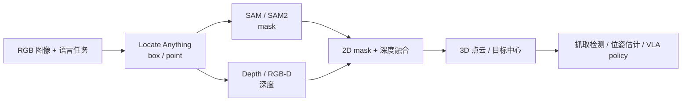
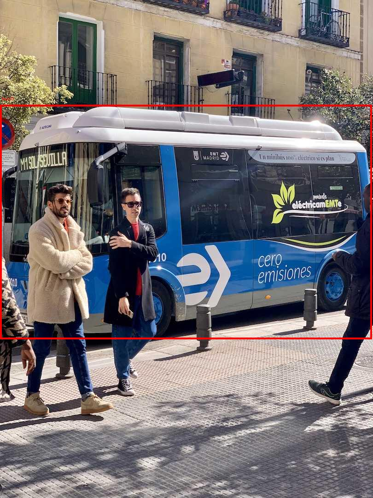
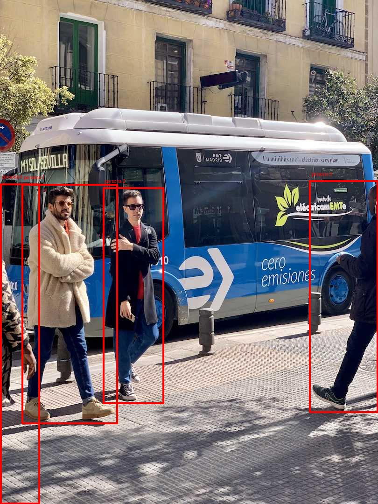
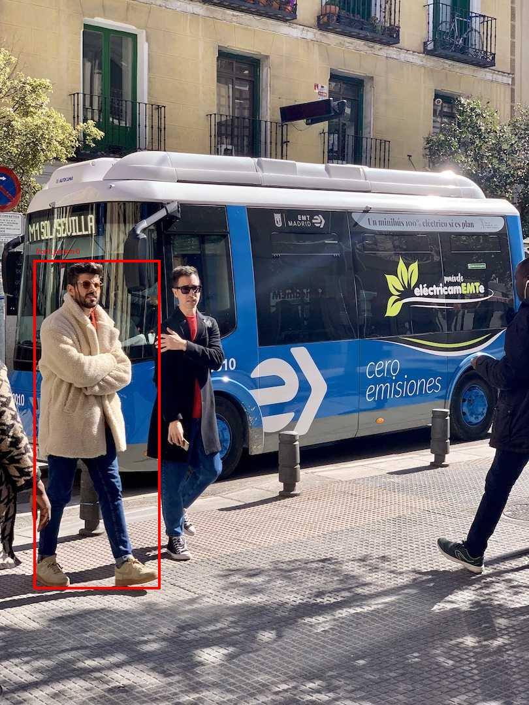
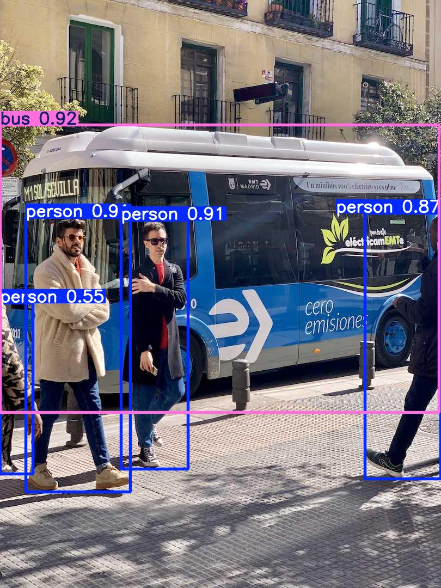

# 04-Locate Anything：把自然语言变成机器人可用的视觉定位框

Locate Anything 是 NVIDIA 发布的视觉语言定位模型。它解决的问题很直接：给一张图和一句自然语言，让模型输出目标的 2D box 或 point。对具身智能来说，它不是 VLA 策略，也不是抓取规划器，而是一个很适合接在 VLA、SAM、深度估计和抓取模块前面的语言条件感知前端。

学完这一章后，大家可以完成三件事：

- 在本地下载并跑通 `nvidia/LocateAnything-3B`。
- 用同一张图对比 Locate Anything 与 YOLO26n 的输出和速度。
- 理解它为什么要做 Parallel Box Decoding，以及它在机器人链路里该放在哪一层。

> 本章把环境、模型权重和运行输出都放到大盘目录 `$DATA_ROOT`，教程仓库只保留 Markdown 和轻量结果图。模型权重、HF cache、pip cache 和运行日志不要提交到仓库。

## 一、它适合放在具身系统的哪一层

Locate Anything 的输入是图像和文本，输出是类似下面的结构化文本：

```text
<ref>bus</ref><box><0><211><997><681></box>
```

坐标是 0 到 1000 的归一化整数，后处理时再映射回原图像素。它适合做：

| 任务 | Locate Anything 的角色 | 后续模块 |
| :--- | :--- | :--- |
| 语言条件目标定位 | 把“穿奶油色外套的人”“抽屉把手”“右上角按钮”变成 2D box | crop、SAM、深度估计 |
| 数据自动标注 | 给真实机器人图像批量生成候选框 | 人工复核、训练集清洗 |
| VLA/VLM 感知增强 | 给策略模型提供任务相关区域 | VLA policy、memory writer |
| GUI/OCR/文档定位 | 定位按钮、文本、表格、标题区域 | 多模态 agent、RPA |

它不直接输出 6D pose、grasp pose、接触状态、路径规划或闭环控制信号。如果大家要把它用于机械臂抓取，更合理的链路是：



## 二、本机验证环境

本章在下面环境中跑通：

| 项目 | 本机验证值 |
| :--- | :--- |
| GPU | NVIDIA RTX PRO 6000 Blackwell Workstation Edition 96GB |
| Driver / CUDA | NVIDIA Driver 580.159.03，`nvidia-smi` 显示 CUDA 13.0 |
| PyTorch | `torch==2.11.0+cu128` |
| Locate Anything | NVlabs/Eagle `Embodied` 目录，`nvidia/LocateAnything-3B` |
| Transformers | `transformers==4.57.1` |
| YOLO 对照 | `ultralytics==8.4.80`，`yolo26n.pt` |

本机 smoke test 没有安装 `flash_attn` 或 `MagiAttention`，日志中可以看到模型自动 fallback 到 PyTorch SDPA：

```text
flash_attn is not available for MoonViT inference; falling back to sdpa.
magi_attention not available, falling back to sdpa.
```

因此，本章速度只是“基础环境可跑通”的记录，不是官方峰值 benchmark。官方 README 报告 Locate Anything-3B 在单张 H100 上 Hybrid Mode 达到 12.7 BPS；本章本机则是在 SDPA fallback、并且 GPU 上还有其他任务时测得。

## 三、环境与模型准备

先定义几个目录。大家可以把 `$DATA_ROOT` 换成自己的大盘路径；不要把模型权重放进教程仓库。

```bash
export DATA_ROOT=/path/to/large_disk/locate-anything
export ENV_ROOT=/path/to/large_disk/envs/locate-anything
export HF_HOME=/path/to/large_disk/cache/huggingface
export PIP_CACHE_DIR=/path/to/large_disk/cache/pip
export UV_CACHE_DIR=/path/to/large_disk/cache/uv
export TORCH_EXTENSIONS_DIR=/path/to/large_disk/cache/torch_extensions

mkdir -p "$DATA_ROOT" "$HF_HOME" "$PIP_CACHE_DIR" "$UV_CACHE_DIR" "$TORCH_EXTENSIONS_DIR"
```

如果和本机一样使用 `/data/Data14TB` 作为大盘，可以这样设置：

```bash
export DATA_ROOT=/data/Data14TB/01Proj/locate-anything
export ENV_ROOT=/data/Data14TB/envs/locate-anything
export HF_HOME=/data/Data14TB/cache/huggingface
export PIP_CACHE_DIR=/data/Data14TB/cache/pip
export UV_CACHE_DIR=/data/Data14TB/cache/uv
export TORCH_EXTENSIONS_DIR=/data/Data14TB/cache/torch_extensions
```

克隆官方仓库：

```bash
cd "$DATA_ROOT"
git clone --depth 1 https://github.com/NVlabs/Eagle.git
cd "$DATA_ROOT/Eagle/Embodied"
```

创建 Python 3.11 环境：

```bash
uv venv "$ENV_ROOT" --python 3.11
"$ENV_ROOT/bin/python" -m ensurepip --upgrade
"$ENV_ROOT/bin/python" -m pip install --upgrade pip wheel setuptools
```

安装 PyTorch CUDA 12.8 轮子。本机 Driver 显示 CUDA 13.0，但 cu128 wheel 可以正常运行：

```bash
"$ENV_ROOT/bin/python" -m pip install torch torchvision \
  --index-url https://download.pytorch.org/whl/cu128
```

验证 CUDA：

```bash
"$ENV_ROOT/bin/python" - <<'PY'
import torch
print("torch", torch.__version__)
print("cuda available", torch.cuda.is_available())
print("cuda version", torch.version.cuda)
if torch.cuda.is_available():
    print("device", torch.cuda.get_device_name(0))
PY
```

本机输出：

```text
torch 2.11.0+cu128
cuda available True
cuda version 12.8
device NVIDIA RTX PRO 6000 Blackwell Workstation Edition
```

安装 Locate Anything 依赖：

```bash
cd "$DATA_ROOT/Eagle/Embodied"
"$ENV_ROOT/bin/python" -m pip install -e .
```

官方项目的关键依赖包括 `transformers==4.57.1`、`tokenizers==0.22.0`、`deepspeed==0.15.4`、`accelerate==1.5.2`、`timm>=1.0.11`、`liger_kernel==0.3.1`、`peft==0.12.0` 和 `decord`。

下载模型：

```bash
export MODEL_DIR="$DATA_ROOT/models/LocateAnything-3B"
mkdir -p "$DATA_ROOT/models"

"$ENV_ROOT/bin/hf" download nvidia/LocateAnything-3B \
  --local-dir "$MODEL_DIR"
```

本机下载后模型目录约 7.3GB，其中两个主要权重文件为：

```text
model-00001-of-00002.safetensors  4.7G
model-00002-of-00002.safetensors  2.6G
```

如果下载中断，重新运行同一条 `hf download` 命令即可断点续传。

## 四、Locate Anything smoke test

我们先用 Ultralytics 官方示例图 `bus.jpg` 做 smoke test，便于后面和 YOLO26 对比。

```bash
export IMAGE_PATH="$DATA_ROOT/bus.jpg"
curl -L https://ultralytics.com/images/bus.jpg -o "$IMAGE_PATH"
```

图 1 是输入图像。


运行 Locate Anything：

```bash
cd "$DATA_ROOT/Eagle/Embodied"

HF_HOME="$HF_HOME" \
TORCH_EXTENSIONS_DIR="$TORCH_EXTENSIONS_DIR" \
PYTORCH_CUDA_ALLOC_CONF=expandable_segments:True \
MODEL_DIR="$MODEL_DIR" \
IMAGE_PATH="$IMAGE_PATH" \
DATA_ROOT="$DATA_ROOT" \
"$ENV_ROOT/bin/python" - <<'PY'
import json, os, time
from pathlib import Path
from PIL import Image, ImageDraw
from locateanything_worker import LocateAnythingWorker

model_path = Path(os.environ["MODEL_DIR"])
image_path = Path(os.environ["IMAGE_PATH"])
out_dir = Path(os.environ["DATA_ROOT"]) / "runs/bus_locateanything"
out_dir.mkdir(parents=True, exist_ok=True)

img = Image.open(image_path).convert("RGB")
worker = LocateAnythingWorker(str(model_path), use_batch_runtime=False)

queries = [
    ("bus", "Locate a single instance that matches the following description: bus."),
    ("persons", "Locate all the instances that matches the following description: person."),
    (
        "front_person",
        "Locate a single instance that matches the following description: "
        "the man in the cream coat standing in front of the bus.",
    ),
]

summary = []
for name, prompt in queries:
    t0 = time.time()
    result = worker.predict(
        img,
        prompt,
        generation_mode="hybrid",
        max_new_tokens=512,
        temperature=0.2,
        top_p=0.9,
        verbose=True,
    )
    wall = time.time() - t0
    boxes = LocateAnythingWorker.parse_boxes(result["answer"], *img.size)

    vis = img.copy()
    draw = ImageDraw.Draw(vis)
    for i, b in enumerate(boxes):
        draw.rectangle([b["x1"], b["y1"], b["x2"], b["y2"]], outline="red", width=4)
        draw.text((b["x1"] + 4, max(0, b["y1"] - 20)), f"{name}-{i}", fill="red")

    vis_path = out_dir / f"{name}_locateanything_result.jpg"
    vis.save(vis_path)
    summary.append(
        {
            "name": name,
            "prompt": prompt,
            "answer": result["answer"],
            "stats": result.get("stats"),
            "wall_infer_seconds": round(wall, 4),
            "boxes": boxes,
            "image": str(vis_path),
        }
    )
    print(name, round(wall, 4), result["answer"])

(out_dir / "summary.json").write_text(
    json.dumps(summary, ensure_ascii=False, indent=2), encoding="utf-8"
)
PY
```

本机三条查询的结果如下：

| Prompt | 输出摘要 | 本机耗时 |
| :--- | :--- | :--- |
| `bus` | 1 个公交车框 | 约 1.00s |
| `person` | 4 个行人框 | 约 0.63s |
| `the man in the cream coat standing in front of the bus` | 1 个被自然语言指代的人 | 约 0.63s |

公交车定位结果：



行人多目标定位结果：



自然语言指代表达定位结果：



大家要重点注意图 4：这里不是简单地检测 `person` 类，而是从多个行人里找“穿奶油色外套、站在公交车前的人”。这正是 Locate Anything 比普通固定类别检测器更有价值的地方。

## 五、和 YOLO26n 做同图对比

YOLO26 是 Ultralytics 发布的实时视觉模型族，官方文档介绍它支持 detection、segmentation、pose、classification、oriented detection 等任务。检测模型在 COCO 上覆盖 80 个预训练类别，并强调端到端、NMS-free 的低延迟部署。

为了不破坏 Locate Anything 的 `numpy<2` 约束，本章在同一个环境里安装 Ultralytics 时使用 `--no-deps`，并手动补齐少量依赖。更干净的做法是给 YOLO 单独建一个小环境。

```bash
"$ENV_ROOT/bin/python" -m pip install --no-deps \
  ultralytics polars polars-runtime-32 nvidia-ml-py ultralytics-thop
```

运行 YOLO26n：

```bash
export YOLO_CONFIG_DIR=/path/to/large_disk/cache/ultralytics
mkdir -p "$YOLO_CONFIG_DIR/Ultralytics"

cd "$DATA_ROOT"

YOLO_CONFIG_DIR="$YOLO_CONFIG_DIR" \
DATA_ROOT="$DATA_ROOT" \
"$ENV_ROOT/bin/python" - <<'PY'
import json, os, time
from pathlib import Path
from PIL import Image as PILImage
from ultralytics import YOLO

data_root = Path(os.environ["DATA_ROOT"])
image = data_root / "bus.jpg"
out_dir = data_root / "runs/bus_yolo26n"
out_dir.mkdir(parents=True, exist_ok=True)

model = YOLO("yolo26n.pt")

# 先跑一次预热，再记录第二次速度。
model.predict(str(image), imgsz=640, conf=0.25, device=0, verbose=False)
t0 = time.time()
results = model.predict(str(image), imgsz=640, conf=0.25, device=0, verbose=False)
wall = time.time() - t0

r = results[0]
items = []
for b in r.boxes:
    cls_id = int(b.cls[0])
    items.append(
        {
            "class": model.names[cls_id],
            "confidence": round(float(b.conf[0]), 4),
            "xyxy": [float(x) for x in b.xyxy[0].cpu().tolist()],
        }
    )

plot = r.plot()
plot_path = out_dir / "bus_yolo26n_result.jpg"
PILImage.fromarray(plot[..., ::-1]).save(plot_path)
(out_dir / "bus_yolo26n_result.json").write_text(
    json.dumps(
        {
            "model": "yolo26n.pt",
            "wall_infer_seconds": round(wall, 4),
            "speed_ms": r.speed,
            "boxes": items,
        },
        ensure_ascii=False,
        indent=2,
    ),
    encoding="utf-8",
)

print("wall seconds", round(wall, 4))
print("speed ms", r.speed)
print("boxes", items)
PY
```

本机 YOLO26n 输出 5 个框：1 个 `bus` 和 4 个 `person`。预热后的模型内部耗时为：

```text
preprocess: 2.38 ms
inference: 4.12 ms
postprocess: 0.80 ms
```



### 对比结论

| 维度 | YOLO26n | Locate Anything-3B |
| :--- | :--- | :--- |
| 核心定位 | 实时固定类别检测器 | 视觉语言 grounding 模型 |
| 输入 | 图像，默认输出 COCO 类别 | 图像 + 自然语言 prompt |
| 输出 | 类别、置信度、box | `<ref>...</ref><box>...</box>` 或 point |
| 本机同图速度 | 约 4.12ms 模型推理 | 约 0.63s 到 1.00s 生成式定位 |
| 参数量级 | YOLO26n 官方表为 2.4M 参数，YOLO26x 为 55.7M | 模型卡写明 3B 参数 |
| 优势任务 | 固定类别、实时视频流、边缘部署 | referring、GUI、OCR、layout、开放词汇定位 |
| 机器人用法 | 快速检测人、车、杯子、瓶子等常见类别 | 按任务语言找目标区域，例如“左边那个红杯子把手” |

如果任务只是“摄像头里有没有人、车、杯子”，YOLO26n 明显更快、更省显存，也更适合实时部署。如果任务是“找到穿奶油色外套、站在公交车前的人”，或者“找到网页右上角下载按钮”“文档摘要标题下方第一段”“桌面上靠近夹爪的透明杯子”，Locate Anything 更贴合问题。

需要补充的是，Ultralytics 也发布了 YOLOE-26，支持 text prompt / visual prompt 的开放词汇检测与分割。YOLOE-26 更接近“实时开放词汇 detector”，但 Locate Anything 的定位范围更偏 VLM grounding，覆盖 GUI、OCR、layout、referring 和 pointing 等结构化场景。写论文相关工作时，不要把它们简单写成互相替代关系；更准确的说法是：

```text
YOLO26 / YOLOE-26：实时检测与分割模型族，重部署速度和检测任务。
Locate Anything：通用视觉语言定位器，重自然语言 grounding 和多域结构化定位。
```

## 六、为什么 PBD / MTP 会更快

传统生成式 grounding 可以把坐标当普通文本 token 输出：

```text
<box> <x1> <y1> <x2> <y2> </box>
```

如果用 NTP，也就是 Next Token Prediction，模型要先生成 `x1`，再生成 `y1`，再生成 `x2`，再生成 `y2`。这有两个问题：

1. 坐标生成步骤多，速度慢。
2. box 的四个坐标本来是一个几何整体，逐 token 生成时容易出现结构不一致。

Locate Anything 的核心思路是 Parallel Box Decoding，简称 PBD。它把一个 box 或 point 当成固定长度的 atomic unit，让完整坐标在一个并行步骤里预测。官方 README 将它描述为 box-aligned 的多 token 预测：Fast Mode 使用 MTP，Slow Mode 使用 NTP，Hybrid Mode 默认走 MTP，如果遇到格式异常或空间歧义，再局部回退到 NTP。

大家可以这样理解：

| 解码方式 | 做法 | 适合场景 |
| :--- | :--- | :--- |
| NTP / Slow | 一个 token 一个 token 生成 | 稳定性优先、离线标注 |
| MTP / Fast | 一次预测多个 token | 速度优先 |
| PBD / Hybrid | 以 box 为几何块并行预测，必要时 fallback | 默认推理 |

本机在 `bus.jpg` 上跑 `person` 多框时，Hybrid Mode 日志显示：

```text
num_tokens=28
generate_time(s)=0.6157
forward_step=9
num_boxes=4
bps=6.4966
switch_to_ar=1
```

这里 `switch_to_ar=1` 说明 Hybrid Mode 中确实触发了一次自回归 fallback。跑单个 `bus` 时：

```text
num_tokens=10
generate_time(s)=0.9805
forward_step=3
num_boxes=1
bps=1.0199
switch_to_ar=0
```

这些数字只说明本机 smoke test 已经走通，不应直接和官方 H100 benchmark 横向比较。

## 七、常见问题

**1. RTX 4090、RTX PRO 6000 这类消费级或工作站卡能跑吗？**

能跑。NVIDIA 模型卡列出的兼容架构包括 Ampere、Hopper、Blackwell 和 Lovelace，其中 Lovelace 示例包含 RTX 4090。本机 RTX PRO 6000 Blackwell 96GB 跑 BF16 单图没有显存压力。24GB 显存的 4090 更适合 batch=1、低并发、离线标注或 demo；4K 高分辨率、密集目标和服务化批处理仍建议使用更大显存。

**2. 为什么本章没有安装 MagiAttention？**

本章目标是先跑通基础推理。官方 README 说明 MagiAttention 面向 Hopper / Blackwell 的长上下文训练和推理；如果大家要跑 16K 到 32K 以上长上下文或追求 batch throughput，再单独安装并验证。基础教程里先保留 SDPA fallback，排障路径更简单。

**3. Locate Anything 返回 `<box>None</box>` 是不是模型坏了？**

不一定。可能是 prompt 不清楚、图像是拼图/表格导致歧义，或目标不在图中。本章尝试在官方 `teaser.jpg` 上找 `car` 时就返回了 None，但同图找 `ship` 和 `crop tool icon` 可以得到合理框。复刻时先用干净图像和明确目标验证，再测试复杂场景。

**4. 它能不能替代 YOLO26？**

不要这样用。如果任务是实时固定类别检测，YOLO26 更合适。如果任务依赖自然语言、GUI/OCR/文档布局、复杂指代表达或机器人任务语义，Locate Anything 更有价值。两者常见的组合方式是：YOLO 负责高速常见类别安全检测，Locate Anything 负责任务语言相关目标定位。

**5. 下一步怎么接到机器人抓取？**

先把 Locate Anything 的 2D box 作为 prompt 给 SAM/SAM2 得到 mask，再把 mask 区域和 RGB-D 深度融合为 3D 点云。后面可以接 GraspNet、6D pose、传统抓取检测或 VLA policy。这样拆开后，每一层都有明确输入输出，排障也更容易。

## 八、参考链接

- NVIDIA Locate Anything 项目页：https://research.nvidia.com/labs/lpr/locate-anything/
- NVlabs/Eagle `Embodied` 代码：https://github.com/NVlabs/Eagle/tree/main/Embodied
- Hugging Face 模型卡：https://huggingface.co/nvidia/LocateAnything-3B
- Ultralytics YOLO26 文档：https://docs.ultralytics.com/models/yolo26/
