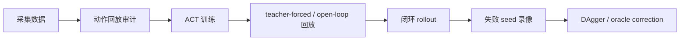

# 策略诊断与物理成功评估

本节面向已经跑通过 ACT、SmolVLA 或 pi_0 基础训练的小伙伴。学完这一节后，大家可以不只看 loss 或环境自带的 `success`，而是用视频、物体状态和分阶段诊断判断策略到底有没有真正完成抓取任务。

这个章节建议作为 `3.train.ipynb`、`4.deploy.ipynb`、`7.pi0.ipynb` 和 `8.smolvla.ipynb` 之后的进阶实验。它不替代原来的训练 Notebook，而是补上“策略复刻后如何判断是否真的成功”的方法。

## 为什么需要额外诊断

在杯子放盘子的 MuJoCo 任务中，环境的几何成功条件有时会把边界情况判成成功。例如杯子没有被夹爪真正夹住，而是被末端挤到盘子附近；或者杯子已经倒下，但位置刚好接近盘子。这类结果对学习者很有迷惑性：日志里显示成功，视频里却明显不是一个可部署的抓取策略。

因此，本节把成功拆成两层：

| 指标 | 含义 | 适合回答的问题 |
| --- | --- | --- |
| `legacy_success` | 环境原始 `check_success()` | 策略是否满足原始几何终止条件 |
| `physical_success` | 目标杯被抬起、放到盘上且最终姿态基本直立 | 策略是否真的完成了抓取-搬运-放置 |

推荐大家在报告模型结果时优先使用 `physical_success`，并保留 `legacy_success` 作为对照。两者不一致时，优先打开视频复核。

## 物理成功的判定口径

当前建议的判定口径如下：

1. 环境原始成功条件为真；
2. 目标杯相对初始高度至少被抬起 `0.03 m`；
3. 抬起状态至少持续若干个控制 tick，避免瞬间碰撞误判；
4. 终态杯子的局部 z 轴仍大致朝上，避免倒杯被判成功。

这个口径不是为了让成功率变低，而是为了让成功率更接近大家在视频里看到的真实行为。调试策略时，大家可以把每个 rollout 分成四类：

| 失败类型 | 常见现象 | 优先检查 |
| --- | --- | --- |
| 未接触 | 夹爪停在杯子旁边或盘子附近 | 图像条件、初始位姿、语言指令、闭环偏移 |
| 抬起不足 | 碰到杯子但没有稳定夹住 | gripper 动作、接近轨迹、动作归一化 |
| 放置偏 | 杯子被抬起但落点远离盘子 | chunk 长度、末端阶段示教、DAgger 纠偏 |
| 倒杯 | 杯子到盘附近但姿态不直立 | release 时序、放置高度、终态稳定性 |

## ACT 诊断主线

ACT 的调试重点不是单纯把训练步数加长，而是区分三个问题：

1. 数据本身能否回放成功；
2. 模型在 teacher-forced/open-loop 条件下是否学到动作；
3. 模型闭环部署时是否因为早期偏差逐步跑飞。

建议的诊断顺序如下：



如果数据动作回放都不成功，先修数据；如果 open-loop 成功但闭环失败，优先考虑 DAgger、reset-aligned 数据或失败状态纠偏；如果只有 gripper release 失败，可以单独检查夹爪标签、尾段释放动作和 gripper head。

## DAgger 与 oracle correction

在这个任务里，DAgger 的核心价值是补齐策略闭环跑偏后的状态。一个可教学的做法是：

1. 先训练一个 reset-start 策略；
2. 用该策略跑前若干步，例如前 40 个控制步；
3. 在策略容易偏的状态上切换到 scripted oracle；
4. 保存 oracle suffix 作为纠偏数据；
5. 合并数据时显式记录 timestamp offset 或 source flag，避免不同相位的数据互相污染；
6. 对 correction 数据做降权采样，避免少量纠偏数据破坏原始 reset-start 行为。

这里特别建议大家记录每一次合并数据的来源、episode 范围和采样权重。DAgger 数据不是越多越好；如果直接把 full-reset failure-bucket 数据混入主训练，可能会让原本会成功的 reset-start 行为退化。

## SmolVLA 诊断主线

SmolVLA 的优势是语言条件和视觉基础更强，但也要警惕颜色或任务分布偏置。在红杯、蓝杯任务中，推荐固定语言指令分别评估：

```bash
python audit_language_policy_physical.py \
  --policy-type smolvla \
  --policy-path ./ckpt/your_smolvla_checkpoint/checkpoints/000500/pretrained_model \
  --instruction "Place the red mug on the plate." \
  --seeds 0 1 2 3 4 5 6 7 8 9 \
  --max-action-steps 600 \
  --output-jsonl outputs/eval_red.jsonl \
  --summary-json outputs/summary_red.json
```

同一批 seeds 应该分别跑红杯和蓝杯，这样才能判断模型是在真正学会任务，还是只偏向某一种颜色或某一类初始位姿。

在我们的迁移实验中，简单复制蓝杯 episode 会显著提高蓝杯成功率，但可能伤害红杯；更稳的做法是用 `WeightedRandomSampler` 对目标任务 frame 加权，而不复制 parquet episode。这个结论适合做成课堂讨论：数据增强不只是“多放几份数据”，还要观察是否破坏了原分布。

## pi_0 迁移前的 smoke test

pi_0 依赖 PaliGemma，首次运行时会涉及 Hugging Face gated model 权限和较大的模型权重下载。建议大家先跑 smoke test，而不是直接启动长训练：

```bash
RUN_SMOKE=1 RUN_FULL_TRAIN=0 ./run_pi0_train_eval_after_hf_ready.sh
```

这个 smoke test 只证明几件事：

1. Hugging Face token 能访问 `google/paligemma-3b-pt-224` 和 `lerobot/pi0`；
2. `demo_data_language` 能被 LeRobot 正确加载；
3. pi_0 policy 能构造并完成 1 step 训练；
4. checkpoint 保存链路正常。

它不证明 pi_0 已经收敛，也不代表最终成功率。正式训练后仍然要用同一套 `physical_success` 评估红杯和蓝杯。

## 建议公开的脚本

为了让本节变成可复现实验，而不是只读文字，建议在教程目录中保留以下脚本的公开版。发布前需要把本机绝对路径、私有 IP、token、远端账号和大文件路径改成变量或占位符。

| 脚本 | 用途 | 发布注意 |
| --- | --- | --- |
| `audit_language_policy_physical.py` | 对 SmolVLA / pi_0 做严格物理成功率评估 | 不写死远端路径；输出 JSONL 和 summary |
| `record_language_policy_video.py` | 录制单个 seed 的成功或失败视频 | 视频不要默认提交到仓库 |
| `train_model_weighted_episode_sampler.py` | 对语言任务做按任务加权采样训练 | 保留原 `train_model.py` 行为，权重用环境变量控制 |
| `run_pi0_train_eval_after_hf_ready.sh` | pi_0 权限检查、1-step smoke、正式训练和评估入口 | token 只从环境变量或交互输入读取 |
| `compare_eval_summaries.py` | 汇总多个 checkpoint 的红/蓝成功率表格 | 输出小 TSV/Markdown 表，不保存大日志 |

## 教程组织建议

这部分内容建议采用“两层结构”：

1. **第 06 章技术正文**：放在当前 MuJoCo ACT / pi_0 / SmolVLA 目录中，作为原教程的进阶章节，解释诊断方法、脚本和实验口径。
2. **专题组队学习入口**：在 `16-专题组队学习` 下做成 4 到 5 个任务，让大家按周完成环境、数据、ACT 诊断、SmolVLA 对照和 pi_0 smoke。

这样既不打断原教程的“采集-训练-部署”主线，又能给组队学习提供完整的任务节奏。
