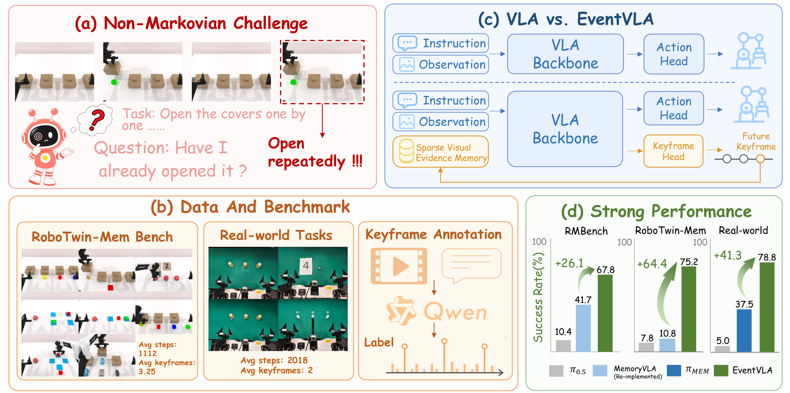
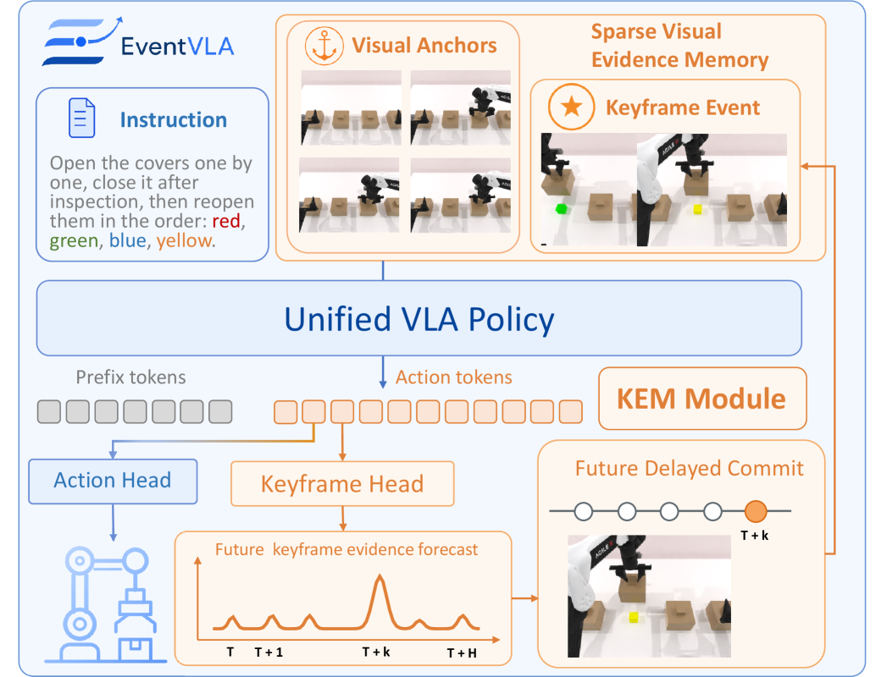
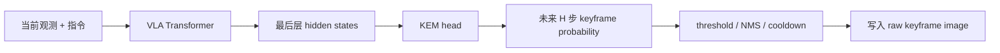
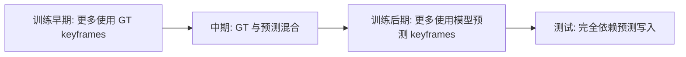
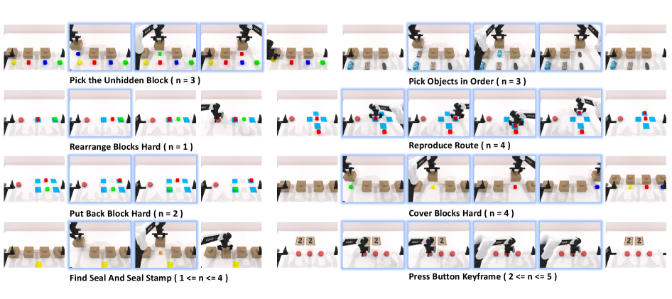
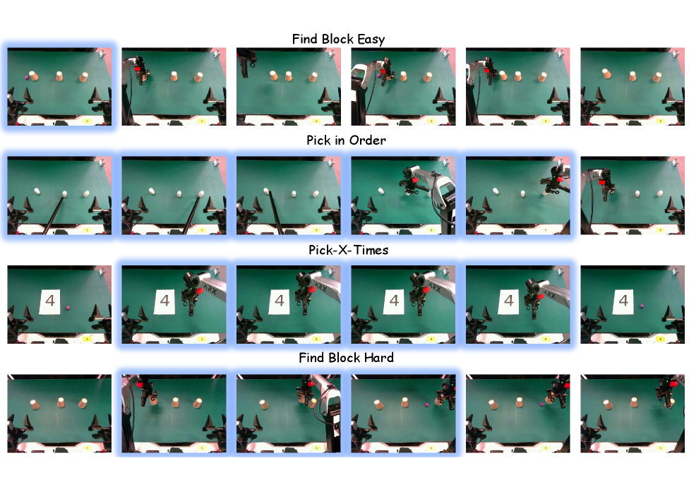

# EventVLA：事件驱动视觉证据记忆

EventVLA 的全名是 **EventVLA: Event-Driven Visual Evidence Memory for Long-Horizon Vision-Language-Action Policies**。它不是传统世界模型，也不预测未来视频。它解决的是另一个非常实际的问题：长时域机器人任务里，关键视觉证据可能只在中途短暂出现，后面又被遮挡、移走或变得不可见，VLA 如果只看当前帧和短历史，就会忘记。

学完这一节后，大家需要抓住一句话：

> EventVLA 的核心不是“让机器人想象未来”，而是“让机器人把未来可能用得上的关键画面存下来，后面动作预测时再看一次”。

## 1. 论文、代码和资源状态

| 项目 | 当前状态 |
| :--- | :--- |
| 论文 | [arXiv:2606.20092](https://arxiv.org/abs/2606.20092) |
| 项目页 | [EventVLA Project Page](https://ganlin-yang.github.io/EventVLA.github.io/) |
| 代码 | [InternRobotics/EventVLA](https://github.com/InternRobotics/EventVLA) |
| 模型权重 | [Hugging Face: ganlinyang/EventVLA](https://huggingface.co/ganlinyang/EventVLA) |
| 数据集 | [Hugging Face: RoboTwin-MeM](https://huggingface.co/datasets/ganlinyang/RoboTwin-MeM) |
| 开源边界 | 仿真训练/评测代码、RoboTwin-MeM 数据和 checkpoint 已放出；README 中 real-world inference/evaluation code 与 real-world fine-tuned model 仍在 Todo |

所以，EventVLA 当前可以作为“能跑仿真评测的开源项目”来看，但不适合直接承诺大家能完整复现实机结果。

## 2. 一张图理解它想解决什么

<p align="center">
  
</p>

**图 1 EventVLA 总览。** 左侧展示的是非马尔可夫长时域任务：任务成功依赖中途出现过的证据，但当前观测已经看不到这些证据。右侧展示 EventVLA 的 sparse visual evidence memory 思路：不是把所有历史帧都塞进模型，而是主动捕获少量关键视觉事件。

来源：[EventVLA 官方项目页](https://ganlin-yang.github.io/EventVLA.github.io/)。

普通 VLA 处理长任务时，一般会遇到三类记忆瓶颈：

| 问题 | 典型表现 |
| :--- | :--- |
| 证据消失 | 机器人短暂看到目标颜色、标签、顺序或路线，后面视角变化后看不到 |
| 历史太长 | 直接把大量历史帧拼进去会带来显存、延迟和冗余问题 |
| 压缩太狠 | 把历史压成一个 latent memory 可能丢掉细节，尤其是多事件任务 |

EventVLA 的选择很朴素：**只存少量 raw keyframe images**。它不是把关键帧编码成一个神经记忆向量，而是把原图形式的关键视觉证据保存下来，后续再作为额外视觉输入喂给 VLA。

## 3. 架构拆解：visual anchors + KEM + raw image memory

<p align="center">
  
</p>

**图 2 EventVLA 框架。** 大家读这张图时要看三块：固定 visual anchors 负责稳定上下文，KEM 负责预测哪些未来步值得写入记忆，memory buffer 以原图关键帧形式回灌给 VLA。

来源：[EventVLA arXiv HTML](https://arxiv.org/html/2606.20092v1)。

EventVLA 的记忆由两部分组成：

```text
M_t = foundational visual anchors + event keyframes
```

### 3.1 Foundational visual anchors

visual anchors 是固定规则，不需要学习。它通常包含：

- 初始帧：保留任务开始时的全局场景布局。
- 短期历史窗口：保留最近运动趋势和当前交互阶段。

这个设计很关键。很多任务并不一定需要动态关键帧，只要初始布局和近期帧就能解决。论文消融显示，去掉 initial frame 或 short-term history 都会让效果明显下降。这说明 EventVLA 不是单纯“挑关键帧”，而是把长期锚点、短期运动和动态证据组合起来。

### 3.2 KEM：Keyframe Evidence Memory

KEM 是 EventVLA 最核心的模块。它不是事后回看整段视频再挑帧，而是在当前 VLA hidden states 上预测：**未来 action horizon 内哪些步会出现任务关键视觉证据**。

可以把它理解成下面这条链：



这个“预测未来写入点”的设计比普通 memory buffer 更强，因为它把动作计划和记忆写入绑在了一起。模型不是看到什么都存，而是判断“接下来哪一刻的视觉证据以后会有用”。

### 3.3 raw image memory

EventVLA 保存的是原始图像关键帧，而不是压缩 latent bank。这点看起来不花哨，但很重要。多事件任务里，不同关键证据可能分别藏在颜色、物体位置、路线、顺序、遮挡关系里，强行压成一个向量很容易形成信息瓶颈。

更接近实际代码逻辑的流程是：

```text
KEM 预测未来 offset
-> 记录 target_step 的 pending request
-> 环境或数据管线推进到 target_step
-> 取回对应原图
-> 选主视角图像
-> append 到 runtime keyframe image bank
-> 去重、按时间排序、只保留最多 max_keyframes 张
-> 下一次 forward 作为 memory_keyframe_images 输入模型
```

因此，EventVLA 的“记忆”不是神经网络内部的隐式状态，而是 Python/runtime 侧维护的一组图像和 metadata。这个选择降低了解释成本，也让调试更直观：大家能直接把模型保存下来的关键帧拿出来看。

## 4. 在线写入控制：为什么需要 NMS、cooldown 和 FIFO

KEM 输出的是未来 horizon 内每个时间步的概率。如果只要概率高就写入，关键帧附近连续多帧都会被写进 buffer，很快被冗余帧填满。因此 EventVLA 需要一套在线写入控制：

| 机制 | 作用 |
| :--- | :--- |
| confidence threshold | 只接受置信度足够高的候选关键帧 |
| 1D NMS | 把连续高概率峰值压成一个稀疏事件 |
| temporal cooldown | 防止短时间内重复写入几乎相同的帧 |
| FIFO buffer | 超过容量后丢弃较旧关键帧 |

这部分是很工程化的设计，但对效果非常重要。没有这些机制，memory buffer 会从“关键证据记忆”退化成“短时间重复截图集合”。

## 5. 自动监督：Qwen3-VL 标注关键帧

KEM 需要知道哪些帧是关键帧。如果完全人工标注，成本会非常高。EventVLA 的做法是用离线 VLM pipeline 从 demonstration videos 和 task descriptions 中自动抽取 task-critical intermediate event timestamps。论文和附录中提到使用 Qwen3-VL 做这件事。

这带来两个影响：

- 优点：可以扩展到较多 demonstration，不需要人为逐帧标注。
- 风险：KEM 的监督质量依赖 VLM 对任务关键证据的判断，如果自动标注错，模型会学到偏的写入策略。

另外，关键帧监督不是单点 hard label。实际物理交互里，一段时间窗口都可能包含有效证据，比如盖子打开后的几帧都能看到内部颜色。EventVLA 用 soft label 缓解时间歧义，这比只标一个 0/1 时间戳更合理。

## 6. 训练课程：从 teacher memory 到 predict memory

如果训练时一开始就完全依赖模型自己预测的关键帧，早期模型很容易写错记忆；如果训练时一直使用 GT keyframes，测试时又没有 GT，会产生 train-test gap。EventVLA 因此使用 teacher-to-student curriculum：



这个训练设计的意义是让模型先学会“有正确记忆时怎么行动”，再逐步学会“自己写入正确记忆”。

## 7. RoboTwin-MeM：专门测非马尔可夫记忆

<p align="center">
  
</p>

**图 3 RoboTwin-MeM benchmark。** 这个 benchmark 专门把任务设计成需要记住中途出现的关键视觉证据，图中蓝框表示需要被保留的 intermediate keyframes。

来源：[EventVLA arXiv HTML](https://arxiv.org/html/2606.20092v1)。

RoboTwin-MeM 的意义在于，它不是普通长时域 manipulation benchmark，而是专门压测“中途证据消失后还能不能完成任务”。官方数据集包含 LeRobot 2.1 和 HDF5 两种格式，任务包括：

```text
cover_blocks_hard
find_seal_and_seal_stamp
pick_objects_in_order
pick_the_unhidden_block
press_button_keyframe
put_back_block_hard
rearrange_blocks_hard
reproduce_route
```

这些任务覆盖了 transient recognition、event counting、in-context imitation、顺序追踪等情况。对长时域 VLA 来说，它们比普通 pick-and-place 更能暴露“忘记中间证据”的问题。

## 8. 真实机器人结果怎么读

<p align="center">
  
</p>

**图 4 EventVLA 真实机器人执行序列。** 蓝框标出的帧是策略自主捕获并写入记忆的关键视觉证据。大家看这张图时要关注：关键帧不是最终动作结果，而是后续决策需要回看的证据。

来源：[EventVLA arXiv HTML](https://arxiv.org/html/2606.20092v1)。

真实机器人部分说明这个方法不是纯仿真概念，但当前开源边界要讲清楚：官方 README 中 real-world inference/evaluation code 和 real-world fine-tuned model 仍在 Todo。因此教程里不建议写“大家可以直接复现实机实验”。更稳妥的表述是：

- 仿真评测可以跟官方代码和 released checkpoints 走。
- 真机实验可以先读论文和视频材料，等待官方补齐部署代码和模型。
- 如果大家自己有双臂平台，可以参考它的 memory 设计，但不应该假设官方真机 pipeline 已经一键可跑。

## 9. 如果大家要复现，建议先怎么做

这里不展开手把手命令，只给复现路线。官方 README 推荐两个环境：

| 环境 | 作用 |
| :--- | :--- |
| RoboTwin-MeM environment | 跑仿真任务和 assets |
| EventVLA environment | 跑模型训练、推理和 policy server |

建议大家按下面顺序走：

1. clone [InternRobotics/EventVLA](https://github.com/InternRobotics/EventVLA)。
2. 准备 RoboTwin-MeM 仿真环境和资产。
3. 准备 EventVLA 环境，安装 `requirements.txt`、`flash-attn` 和 editable package。
4. 从 Hugging Face 下载 EventVLA checkpoints 和 RoboTwin-MeM 数据集。
5. 先跑单任务 evaluation，确认 policy server、仿真环境和 checkpoint 能连通。
6. 再跑 8-task batch evaluation。
7. 如果要训练，再使用 `examples/RoboTwin-Mem/train_files/` 下的训练脚本。

官方 README 中比较关键的配置包括：

```text
memory_ablation_mode: pure_image_keyframe_memory
keyframe_image_memory.enabled: true
keyframe_train_memory_source: teacher_to_predict
keyframe_eval_memory_source: predict
max_keyframes: 4
temporal image anchors: first frame, t-30, t-15, current frame
action horizon: 50
maximum training steps: 100000
```

这些配置比“跑通命令”更值得大家先理解。它们直接对应了 EventVLA 的方法设计：最多存 4 张关键帧，用初始帧和短期历史做 anchors，训练时从 teacher memory 过渡到 predicted memory。

## 10. 和 WALL-WM 的区别

EventVLA 和 WALL-WM 都使用 event 这个词，但核心问题完全不同：

| 对比项 | EventVLA | WALL-WM |
| :--- | :--- | :--- |
| 核心问题 | 关键视觉证据会消失，怎么记住 | 固定 action chunk 切坏语义事件，怎么按事件预演与执行 |
| event 粒度 | 单个或少量关键帧 | 一段语义动作事件 |
| 主要模块 | KEM + raw image memory | multi-view video DiT + action DiT |
| 是否预测未来视频 | 不预测 | 预测未来事件视频 latent |
| 是否更像世界模型 | 不是 | 是 World Action Model |

一句话总结：**EventVLA 是 memory-first，WALL-WM 是 event-world-model-first。**

## 11. 参考资料

- 论文：[EventVLA: Event-Driven Visual Evidence Memory for Long-Horizon Vision-Language-Action Policies](https://arxiv.org/abs/2606.20092)
- 项目页：[EventVLA Project Page](https://ganlin-yang.github.io/EventVLA.github.io/)
- 代码：[InternRobotics/EventVLA](https://github.com/InternRobotics/EventVLA)
- 模型：[Hugging Face: ganlinyang/EventVLA](https://huggingface.co/ganlinyang/EventVLA)
- 数据集：[Hugging Face: RoboTwin-MeM](https://huggingface.co/datasets/ganlinyang/RoboTwin-MeM)
- 依赖项目：[RoboTwin 2.0](https://github.com/robotwin-Platform/RoboTwin)、[RMBench](https://github.com/robotwin-Platform/RMBench)、[StarVLA](https://github.com/starVLA/starVLA)
