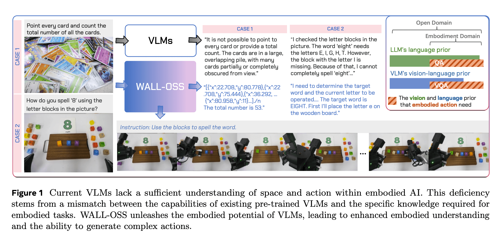
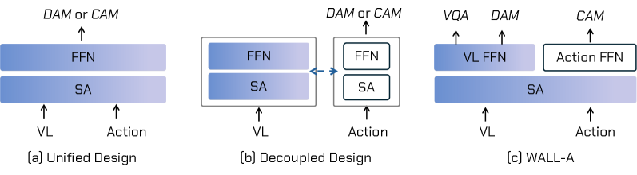
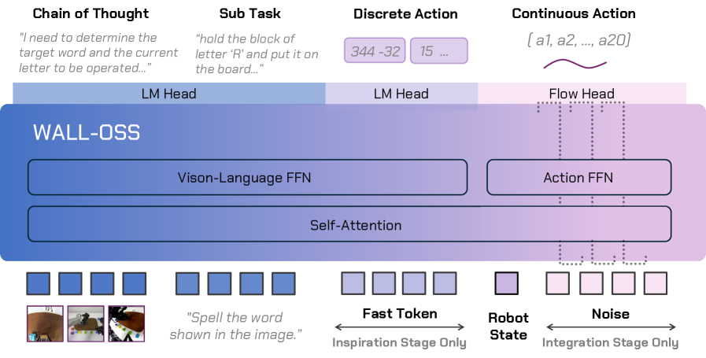
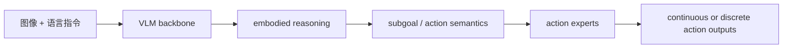
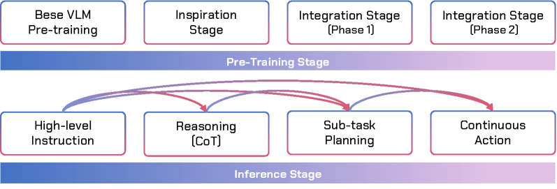
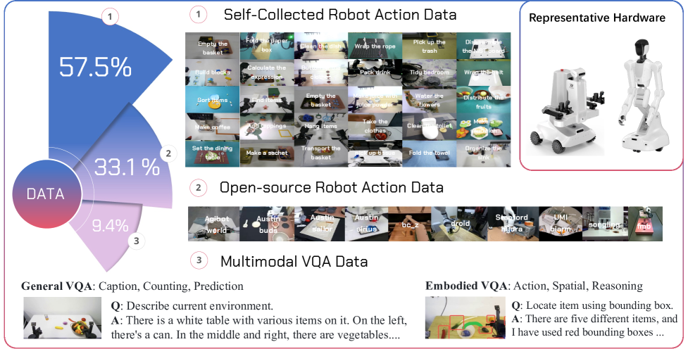

# WALL-OSS：从 VLM 到开源 VLA 模型

WALL-OSS 对应论文 **Igniting VLMs toward the Embodied Space**，是 X Square Robot 发布的开源 VLA 模型系列。大家可以把它理解成 WALL 生态里“真正给大家拿来后训练、评估、部署”的模型层；它不是 WALL-WM 那种世界动作模型论文，也不是 WALL-X 这种工程框架。

学完这一节后，大家需要抓住一个判断：

> WALL-OSS 的重点是把预训练 VLM 的视觉语言理解能力接到机器人动作空间里，让模型既能做 embodied reasoning，又能生成可执行动作。

## 1. 论文、代码和权重入口

| 项目 | 当前状态 |
| :--- | :--- |
| 论文 | [arXiv:2509.11766](https://arxiv.org/abs/2509.11766) |
| 代码框架 | [X-Square-Robot/wall-x](https://github.com/X-Square-Robot/wall-x) |
| Hugging Face 组织页 | [x-square-robot](https://huggingface.co/x-square-robot) |
| LeRobot 文档 | [WALL-OSS in LeRobot](https://huggingface.co/docs/lerobot/en/walloss) |
| 常见模型 | `wall-oss-0.5`、`wall-oss-flow`、`wall-oss-flow-0.1`、`wall-oss-fast` |
| 推荐复现方式 | 不从头预训练；优先下载 checkpoint，用 WALL-X 或 LeRobot 做后训练/评估 |

截至 2026-06-29，WALL-OSS 比 WALL-WM 更适合作为开源复现入口：它有模型权重、训练/推理框架和 LeRobot 集成文档。大家如果只是想“跑一下 WALL 系列”，应该先从 WALL-OSS 或 WALL-OSS-0.5 开始。

## 2. 一张图看懂 WALL-OSS 在做什么

<p align="center">
  
</p>

**图 1 LeRobot 文档中的 WALL-OSS 总览。** 这张图强调 WALL-OSS 已经接入 LeRobot 生态，大家可以把它作为一种 `wall_x` policy 来后训练、评估和部署。

来源：[Hugging Face LeRobot WALL-OSS 文档](https://huggingface.co/docs/lerobot/en/walloss)。

WALL-OSS 的核心矛盾是：预训练 VLM 很会看图和理解语言，但它没有天然掌握机器人动作空间。机器人动作需要满足几件事：

- 空间几何要准，例如夹爪和物体的相对位置。
- 时间节奏要对，例如靠近、闭合、抬起、移动、放下的顺序。
- 动作表示要稳定，例如连续控制、diffusion/flow matching 或 FAST-style action tokens。
- 不能把 VLM 原本的视觉语言能力训练坏。

因此，WALL-OSS 不只是“给 VLM 接一个线性 action head”。它的目标是把 vision-language reasoning、subgoal decomposition 和 fine-grained action synthesis 放到一个统一 VLA 框架里。

## 3. 从 VLM 迁移到动作建模的几种范式

<p align="center">
  
</p>

**图 2 VLM 转 VLA 的不同范式。** 图中蓝色部分表示继承自预训练 VLM 的权重；DAM 和 CAM 分别对应离散动作建模与连续动作建模。大家读这张图时要关注：动作 token 和视觉语言 token 是否共享主干、动作生成是否真正进入 VLM 的推理路径。

来源：[WALL-OSS arXiv HTML](https://arxiv.org/html/2509.11766v1)。

VLA 常见路线大致有三类：

| 路线 | 做法 | 风险 |
| :--- | :--- | :--- |
| 只接 action head | VLM 编码图文，外接小头预测动作 | 动作生成和语言推理耦合弱 |
| 离散 action token | 把连续动作离散成 token，用语言模型方式生成 | 容易牺牲控制精度 |
| 连续动作建模 | 用 diffusion / flow matching 预测连续动作 | 训练稳定性和 VLM prior 保留更难 |

WALL-OSS 的策略是把离散和连续动作建模都纳入考虑，让模型先建立 embodied semantic-action association，再用连续控制分支支撑高频执行。

## 4. 架构拆解：tightly-coupled VLA

<p align="center">
  
</p>

**图 3 WALL-OSS 架构。** 这张图的重点不是某一个 head，而是“视觉、语言、动作 token 如何在同一个体系里交互”。WALL-OSS 想避免动作分支完全游离在 VLM 主干之外。

来源：[WALL-OSS arXiv HTML](https://arxiv.org/html/2509.11766v1)。

LeRobot 文档把 WALL-OSS 的核心创新概括成几块：

| 模块 | 作用 |
| :--- | :--- |
| Embodied perception-enhanced multimodal pretraining | 用视觉-语言-动作数据增强空间、因果和操作理解 |
| Unified Cross-Level CoT / Uni-CoT | 把高层指令理解、子任务分解、细粒度动作合成放到连续链路里 |
| MoE action heads | 根据任务阶段动态激活不同专家，支持离散或连续动作建模 |
| Two-stage training | 先用离散动作先验增强语义-动作对齐，再用 flow matching 做连续控制 |

大家可以把它的训练目标理解成从“理解场景”逐步走到“执行动作”：



这种设计的价值在于，它让动作生成更靠近 VLM 的内部推理过程，而不是只在最后一层后面外接一个动作回归器。

## 5. 训练管线：Inspiration 到 Integration

<p align="center">
  
</p>

**图 4 WALL-OSS 训练与推理管线。** 大家看这张图时可以把它分成两步：先让模型建立 embodied action prior，再把这种 prior 接入连续高频动作生成。

来源：[WALL-OSS arXiv HTML](https://arxiv.org/html/2509.11766v1)。

LeRobot 文档里把训练范式写成两个阶段：

| 阶段 | 作用 | 直观理解 |
| :--- | :--- | :--- |
| Inspiration | 注入离散动作先验，增强空间理解和语义-动作对齐 | 先让模型知道“语言和操作阶段怎么对应” |
| Integration | 使用 flow matching 实现高频连续控制 | 再让模型输出可执行的连续动作 |

这条路线比直接在小数据上微调 action head 更稳，因为它承认 VLM 和机器人控制之间存在分布差异。VLM 的能力不是直接等于动作能力，需要中间桥接。

## 6. 数据来源：为什么它不是只靠机器人数据

<p align="center">
  
</p>

**图 5 WALL-OSS 多源数据概览。** 图中把 self-collected actions、open-source actions 和 multimodal VQA 放在一起，说明 WALL-OSS 不只训练机器人轨迹，也保留了视觉语言理解数据。

来源：[WALL-OSS arXiv HTML](https://arxiv.org/html/2509.11766v1)。

这类 VLA 模型的难点是：如果只用机器人动作数据训练，数据规模通常不够，而且容易把 VLM 原本的图文理解能力冲坏；如果只用图文数据，又学不到可执行动作。因此 WALL-OSS 需要混合：

- 自采机器人动作数据。
- 开源机器人动作数据。
- multimodal VQA / vision-language 数据。
- 长时域操作、推理和指令跟随任务。

这也是大家复现时要降低预期的原因：**从头预训练 WALL-OSS 不是普通教程项目**。更现实的是下载官方 checkpoint，在自己的 LeRobot 数据或 LIBERO 上做后训练。

## 7. WALL-OSS、WALL-OSS-0.5、FLOW、FAST 怎么理解

WALL-X README 当前列出的模型包括：

| 模型 | 推荐理解 |
| :--- | :--- |
| `wall-oss-0.5` | 2026 版更偏 deployment-ready 的 VLA，模型卡称其为 4B VLA，基于 3B VLM backbone 加动作组件 |
| `wall-oss-flow` | 使用 flow/diffusion 风格连续动作生成的版本 |
| `wall-oss-flow-0.1` | flow 版本的早期/升级分支之一 |
| `wall-oss-fast` | 使用 FAST-style action prediction 的版本 |

大家在教程或实验里不要把这些名字混写。最稳妥的方式是：

- 介绍 WALL-OSS 论文方法时，说 “WALL-OSS 系列”。
- 写开源复现入口时，明确指向某个 checkpoint，例如 `x-square-robot/wall-oss-0.5` 或 `x-square-robot/wall-oss-flow`。
- 使用 LeRobot 文档时，按 `policy.type=wall_x` 和 `policy.pretrained_name_or_path=...` 来配置。

## 8. 如果大家要复现，建议先走哪条路

不建议一开始从头复现论文预训练。建议路线是：

1. **快速理解模型**：读 WALL-OSS 论文图 2、图 3、图 4，搞清楚离散动作、连续动作、Uni-CoT 和 MoE action heads 的关系。
2. **下载 checkpoint**：从 [HF x-square-robot](https://huggingface.co/x-square-robot) 选择一个模型，例如 `wall-oss-0.5` 或 `wall-oss-flow`。
3. **选择工程入口**：
   - 想贴近官方 WALL 栈：用 [X-Square-Robot/wall-x](https://github.com/X-Square-Robot/wall-x)。
   - 想贴近社区生态：用 [LeRobot WALL-OSS 文档](https://huggingface.co/docs/lerobot/en/walloss)。
4. **准备数据**：优先使用 LeRobot 格式数据，例如 LIBERO 或自己的机器人采集数据。
5. **跑短后训练或评估**：先证明模型加载、数据读取、action branch 和评估环境能通。

LeRobot 文档中的最小配置思路是：

```bash
lerobot-train \
  --dataset.repo_id=your_dataset \
  --policy.type=wall_x \
  --output_dir=./outputs/wallx_training \
  --job_name=wallx_training \
  --policy.repo_id=your_repo_id \
  --policy.pretrained_name_or_path=x-square-robot/wall-oss-flow \
  --policy.prediction_mode=diffusion \
  --policy.attn_implementation=eager \
  --steps=3000 \
  --policy.device=cuda \
  --batch_size=32
```

这段命令更适合作为“方向指引”，不是本教程承诺的可直接复现结果。真正运行前，大家需要根据自己的 GPU、数据集、LeRobot 版本和 checkpoint 名称调整。

## 9. 它和 WALL-WM 的关系

WALL-OSS 和 WALL-WM 都来自 WALL 生态，但研究问题不同：

| 对比项 | WALL-OSS | WALL-WM |
| :--- | :--- | :--- |
| 目标 | 把 VLM 变成可执行 VLA | 按语义事件做世界动作建模 |
| 输出 | 动作或动作分布 | future video latents + action trajectory |
| 开源成熟度 | 有代码、模型、LeRobot 文档 | 论文公开，完整论文级 checkpoint/数据 recipe 仍需继续跟踪 |
| 推荐实践 | 后训练、评估、部署 | 方法阅读和组会解读 |

所以，如果大家问“我现在能不能复现 WALL 系列”，答案通常是：**可以先复现 WALL-OSS/WALL-X 的后训练或评估；暂时不建议把 WALL-WM 写成完整可复现教程。**

## 10. 参考资料

- WALL-OSS 论文：[Igniting VLMs toward the Embodied Space](https://arxiv.org/abs/2509.11766)
- WALL-X 代码：[X-Square-Robot/wall-x](https://github.com/X-Square-Robot/wall-x)
- LeRobot 文档：[WALL-OSS](https://huggingface.co/docs/lerobot/en/walloss)
- Hugging Face 组织页：[x-square-robot](https://huggingface.co/x-square-robot)
- WALL-OSS-0.5 模型：[x-square-robot/wall-oss-0.5](https://huggingface.co/x-square-robot/wall-oss-0.5)
- WALL-OSS-FLOW 模型：[x-square-robot/wall-oss-flow](https://huggingface.co/x-square-robot/wall-oss-flow)
- WALL-OSS-FAST 模型：[x-square-robot/wall-oss-fast](https://huggingface.co/x-square-robot/wall-oss-fast)
