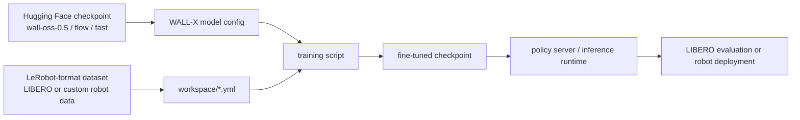
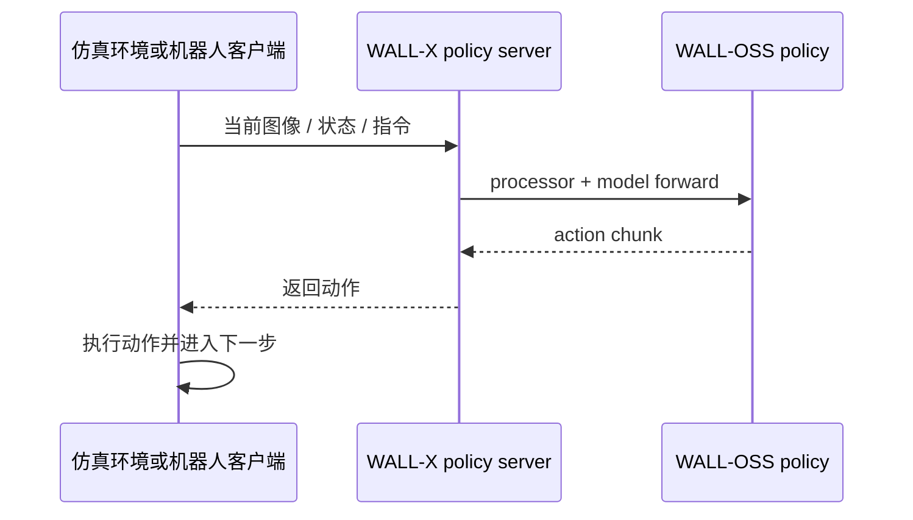

# WALL-X：WALL 系列的开源工程框架

WALL-X 不是一篇单独论文，而是 X Square Robot 给 WALL 系列模型提供的开源工程栈。大家可以把它理解成：**下载 WALL-OSS 模型、准备 LeRobot 数据、配置训练、启动推理服务、做评估和部署的代码入口**。

学完这一节后，大家需要抓住一个判断：

> WALL-X 是复现 WALL-OSS 的主要工程入口，但不能自动等同于 WALL-WM 的完整论文复现包。

## 1. 仓库和资源状态

| 项目 | 当前状态 |
| :--- | :--- |
| 代码仓库 | [X-Square-Robot/wall-x](https://github.com/X-Square-Robot/wall-x) |
| License | 仓库提供 Apache-2.0 license |
| 支持模型 | `wall-oss-0.5`、`wall-oss-flow-0.1`、`wall-oss-flow`、`wall-oss-fast` |
| 主要能力 | LeRobot 数据准备、模型配置、flow/FAST action branches、serving、evaluation、CUDA op 编译 |
| 推荐用途 | WALL-OSS-0.5 后训练、LIBERO/LeRobot 数据评估、服务化推理 |

WALL-X README 的 News 中同时提到 WALL-OSS、WALL-OSS-0.5 和 WALL-WM，这容易让大家误解为“WALL-WM 完整代码也已经能一键复现”。更谨慎的理解是：

- WALL-X 当前明确提供的是 WALL 系列开源模型的训练和推理栈。
- `workspace/README.md` 当前重点写的是 **Wall-OSS-0.5** 的 fine-tune、simulation evaluation 和 real robot deployment。
- WALL-WM 的论文和 PDF 已公开，但完整事件级 world action model 的权重、事件数据和训练 recipe 还不能直接从 WALL-X 模型列表中确认。

## 2. WALL-X 在整个链路中的位置



**图 1 WALL-X 工程链路。** WALL-X 的价值在于把模型、数据、配置、训练和部署串起来。它不是只提供一个模型定义文件，而是提供一套能围绕 WALL-OSS 跑实验的工程框架。

如果大家要做开源教程，WALL-X 这一篇不应该写成“论文方法导读”，而应该写成“如何判断该从哪个入口开始跑”的工程导航。

## 3. 仓库里最值得关注的能力

根据官方 README，WALL-X 覆盖几块能力：

| 能力 | 教程里应该怎么解释 |
| :--- | :--- |
| LeRobot data preparation | 把机器人轨迹组织成 LeRobot 可读格式，降低接入自有数据的成本 |
| model configuration | 用 YAML 指定 checkpoint、processor、动作维度、数据路径和训练超参 |
| flow-matching action branch | 面向连续动作生成，适合高频控制 |
| FAST action branch | 面向更快的 action token / action prediction 路线 |
| serving and evaluation utilities | 将 policy 作为服务启动，再由仿真或机器人客户端调用 |
| CUDA operator sources | 安装时编译自定义 CUDA op，要求 CUDA/PyTorch/flash-attn 环境匹配 |

这也说明复现 WALL-X 的难点主要不在“命令多”，而在环境版本、CUDA 编译、LeRobot 版本、checkpoint 路径和数据格式。

## 4. 推荐从 Wall-OSS-0.5 开始

官方 `workspace/README.md` 明确说明，当前开源 release 面向 **Wall-OSS-0.5**。如果使用 `WALL-OSS-FLOW` 或 `WALL-OSS-FAST`，README 建议切回旧版本代码。

这句话对教程很重要。大家在写复现计划时，不要混用所有 checkpoint。建议：

| 目标 | 推荐选择 |
| :--- | :--- |
| 第一次跑通 WALL-X | `wall-oss-0.5` + 当前 main 分支 |
| 想测试 flow/FAST 老模型 | 按官方说明切到对应历史 commit |
| 想接入 LeRobot 社区工具 | 走 LeRobot 文档中的 `policy.type=wall_x` |
| 想复现 WALL-WM 论文 | 暂不建议，先跟踪官方是否发布单独 checkpoint 和数据 recipe |

## 5. 环境和安装要点

WALL-X 官方环境大致是：

```bash
conda create --name wallx python=3.10
conda activate wallx

pip install -r requirements.txt
pip install "dmuon @ git+https://github.com/X-Square-Robot/dmuon.git"

git clone https://github.com/huggingface/lerobot.git
cd lerobot
git checkout c66cd401767e60baece16e1cf68da2824227e076
pip install --no-deps -e .
cd -

MAX_JOBS=8 pip install --no-build-isolation -e .
```

大家在复现时重点检查：

- Python 版本是否是 3.10。
- CUDA、PyTorch、flash-attn 是否匹配。
- LeRobot 是否 checkout 到官方指定 commit。
- 是否使用 `--no-deps` 安装 LeRobot，避免覆盖 WALL-X 依赖。
- 安装 WALL-X 时是否允许编译 CUDA extension。

这些检查比盲目重跑命令更重要。很多 VLA 工程失败不是模型问题，而是 flash-attn、CUDA extension、LeRobot 依赖或 torch 版本冲突。

## 6. 模型下载和路径配置

WALL-X 推荐先下载两类模型文件：

| 文件 | 作用 |
| :--- | :--- |
| WALL-OSS checkpoint | 模型权重和配置，例如 `x-square-robot/wall-oss-0.5` |
| Qwen2.5-VL processor | tokenizer / processor，供 VLM 输入处理使用 |

示例入口如下：

```bash
huggingface-cli download x-square-robot/wall-oss-0.5 \
  --local-dir /path/to/wall-oss-0.5

huggingface-cli download Qwen/Qwen2.5-VL-3B-Instruct \
  --local-dir /path/to/Qwen2.5-VL-3B-Instruct
```

教程里不应该把 `/path/to/...` 替换成作者自己的机器路径。建议大家统一定义：

```bash
export MODEL_ROOT=/path/to/models
export DATA_ROOT=/path/to/data
export WALLX_ROOT=/path/to/wall-x
```

然后在 YAML 里使用对应路径，方便别人迁移到自己的服务器。

## 7. 数据和训练配置

WALL-X 的训练配置核心是 `workspace/example/*.yml`。大家需要关心几类字段：

| 配置字段 | 作用 |
| :--- | :--- |
| `model.config_path` | 指向 WALL-OSS checkpoint 里的 `config.json` |
| `model.processor_path` | 指向 Qwen2.5-VL processor |
| `model.pretrained_path` | 指向预训练权重 |
| dataset path | 指向 LeRobot 格式数据 |
| robot DOF | 动作维度必须和机器人数据匹配 |
| action branch | flow / FAST / 其他预测模式 |
| batch size / steps | 根据显存调整 |

如果大家只是写开源教程，可以把复现目标设成“smoke test 级别”：

- 模型和 processor 能加载。
- LeRobot 数据能读取。
- 训练 forward/backward 能跑几步。
- 输出 checkpoint 能保存。
- evaluation 或 fake inference 能返回动作。

这类 smoke test 证明的是工程链路通了，不证明模型达到论文性能。

## 8. 推理服务和评估链路

WALL-X 的实践形态通常是 policy server + 环境/机器人客户端：



**图 2 推理服务调用链。** 这种服务化设计方便把模型进程和仿真/机器人控制进程分开，也方便在不同机器上部署 GPU 推理和机器人控制。

评估时最常见的入口是：

- LIBERO simulation evaluation。
- 自有 LeRobot 格式数据上的后训练和 validation。
- fake inference / serving smoke test。
- 真实机器人部署，但这需要额外硬件接口和安全控制，不应在通用教程里默认可用。

## 9. 和 LeRobot 集成的关系

LeRobot 文档中已经把 WALL-OSS 作为一种 policy 暴露出来：

```text
policy.type=wall_x
```

这对开源教程很有价值。因为很多读者已经熟悉 LeRobot 数据格式和训练命令，直接在 LeRobot 里试 WALL-OSS 会比完全按 WALL-X 原生方式配置更容易。

两条路线可以这样选：

| 路线 | 适合人群 |
| :--- | :--- |
| 原生 WALL-X | 想贴近官方 X Square Robot 工程栈，后续可能接入 WALL-OSS-0.5 部署 |
| LeRobot 集成 | 已经有 LeRobot 数据或熟悉 `lerobot-train` 的读者 |

## 10. 本教程为什么暂时不写手把手复现

WALL-X 具备可复现入口，但完整手把手教程需要锁定：

- 具体 checkpoint 版本。
- 具体代码 commit。
- 具体 LeRobot commit。
- 具体 CUDA/PyTorch/flash-attn 组合。
- 数据集大小、下载方式和磁盘布局。
- 要跑 LIBERO、真实机器人还是自有数据。

这些变量没固定时，直接写一篇“从零跑通”很容易变成不可维护的命令堆。当前更好的做法是：先在本章把工程栈、模型选择和复现边界讲清楚；后续如果确定要跑 `wall-oss-0.5 + LIBERO`，再单独写一篇可执行复现教程。

## 11. 参考资料

- WALL-X 代码：[X-Square-Robot/wall-x](https://github.com/X-Square-Robot/wall-x)
- WALL-X workspace guide：[workspace/README.md](https://github.com/X-Square-Robot/wall-x/blob/main/workspace/README.md)
- WALL-OSS-0.5 模型：[x-square-robot/wall-oss-0.5](https://huggingface.co/x-square-robot/wall-oss-0.5)
- WALL-OSS-FLOW 模型：[x-square-robot/wall-oss-flow](https://huggingface.co/x-square-robot/wall-oss-flow)
- WALL-OSS-FAST 模型：[x-square-robot/wall-oss-fast](https://huggingface.co/x-square-robot/wall-oss-fast)
- LeRobot WALL-OSS 文档：[https://huggingface.co/docs/lerobot/en/walloss](https://huggingface.co/docs/lerobot/en/walloss)
- LeRobot：[https://github.com/huggingface/lerobot](https://github.com/huggingface/lerobot)
- LIBERO：[https://github.com/Lifelong-Robot-Learning/LIBERO](https://github.com/Lifelong-Robot-Learning/LIBERO)
