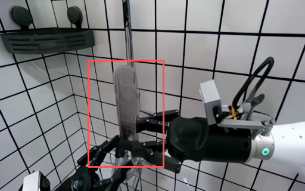
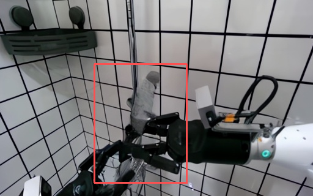
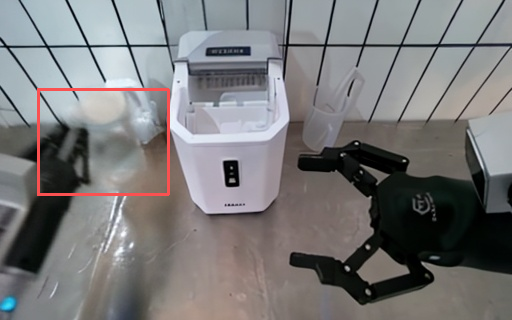
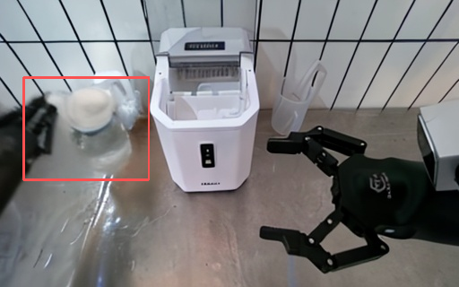
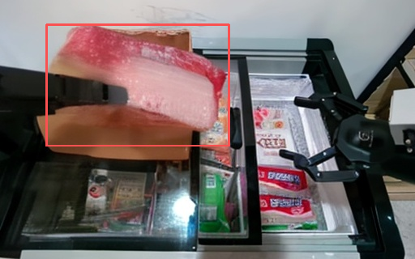
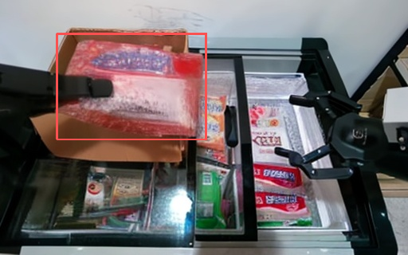
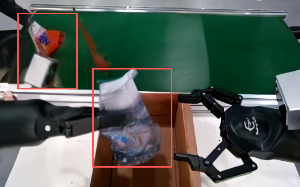
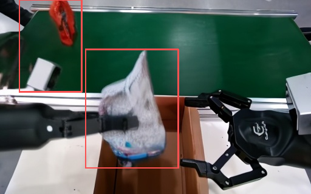
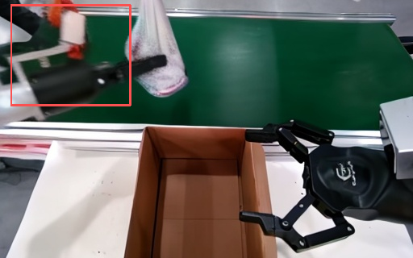
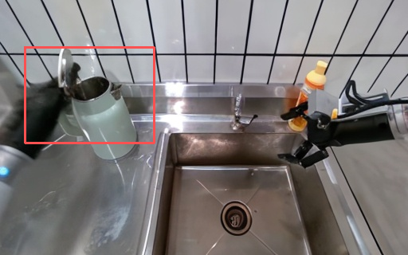

# AgiBot World Model 比赛复现与改进教程

本教程面向 AgiBot World Model 赛道的复现与方法改进说明。教程主要包含安装配置、基础方法、改进方法、推理过程四个部分。基础方法部分讲解 EVAC 动作条件视频扩散模型的原理，改进方法部分对应本项目中已经实现的 LoRA 微调、时序差分损失、Sobel 边缘损失和首帧锚定。期待能够给大家一个良好的学习体验，世界模型正是火热的方向，我们也在逐步探索，与大家一同学习~

## 1. 安装与配置

### 1.1 环境创建

创建 Python 3.10 环境：

```bash
conda create -n enerverse python=3.10.4
conda activate enerverse
```

进入项目目录并安装依赖：

```bash
cd /path/to/project
pip install -r requirements.txt
```

项目中实际会用到 `jsonlines` 和 `fairscale`，若运行时报缺包，直接安装：

```bash
pip install jsonlines
pip install fairscale
```

改进版使用 LoRA，代码中会调用 `peft.LoraConfig` 和 `get_peft_model`，因此还需要安装：

```bash
pip install peft
```

安装 PyTorch3D：

```bash
pip install --no-index --no-cache-dir pytorch3d \
  -f https://dl.fbaipublicfiles.com/pytorch3d/packaging/wheels/py310_cu121_pyt240/download.html
```

如果显卡、CUDA 或 PyTorch 版本与默认 requirements 不匹配，可以优先安装与本机 CUDA 对应的 PyTorch 版本，再安装其它依赖。实际复现中，高版本显卡常见的问题不是代码逻辑错误，而是 `torch`、`torchvision`、`xformers`、CUDA wheel 之间版本不一致。

### 1.2 源代码问题处理

#### 1）xformers 兼容处理

`requirements.txt` 中固定了：

```text
xformers==0.0.27.post2
```

如果 `xformers` 与当前 PyTorch/CUDA 不兼容，推理或训练可能在 attention 处报错。本项目中已经采用了一个保守处理：在 `evac/lvdm/models/vae_models.py` 中将 xformers 关闭，使用普通 attention 路径继续运行。

关键修改代码如下。这段代码保留了原本的 `try import xformers` 思路，但实际运行时强制关闭 `xformers` 快速路径：

```python
logpy = logging.getLogger(__name__)

# try:
#     import xformers
#     import xformers.ops
#
#     XFORMERS_IS_AVAILABLE = True
# except:
#     XFORMERS_IS_AVAILABLE = False
#     logpy.warning("no module 'xformers'. Processing without...")

XFORMERS_IS_AVAILABLE = False
logpy.warning("no module 'xformers'. Processing without...")
```

这样做的代价是推理速度和显存效率会下降，但优点是更容易在不同机器上跑通。对于比赛复现教程，先保证结果可生成，比追求 attention 加速更重要。

#### 2）注意力机制报错

此外，原来的代码可能会出现“注意力机制初始为 none”的报错，修复在 `evac/lvdm/modules/attention.py` 的 attention 前向传播逻辑中。原始问题是：当 `context=None` 时，代码如果仍然直接执行 `self.to_k(context)` 或 `self.to_v(context)`，就会把空上下文传入线性层，导致 attention 计算报错。

本项目的修复方式不是简单修改配置，而是在 `forward()` 中显式区分自注意力和交叉注意力：当 `context is None` 时，`q/k/v` 都来自输入 `x`；当 `context` 存在时，`q` 来自 `x`，`k/v` 来自 `context`。对应完整修改块如下：

```python
def forward(self, x, context=None, mask=None, seq_length=None):
    spatial_self_attn = (context is None)
    k_ip, v_ip, out_ip = None, None, None

    # 核心修复：根据 context 是否为空区分自注意力和交叉注意力
    if context is None:
        # 自注意力：q/k/v 都来自输入 x
        q = self.to_q(x)
        k = self.to_k(x)
        v = self.to_v(x)
    else:
        # 交叉注意力：q 来自输入 x，k/v 来自上下文 context
        q = self.to_q(x)
        k = self.to_k(context)
        v = self.to_v(context)

    k_vpre, v_vpre, out_vpre = None, None, None

    h = self.heads
    q = self.to_q(x)
    context = default(context, x)
```

这段修改的核心意义是让 attention 在没有外部上下文时自动退化为 self-attention，而不是继续把 `None` 当作 cross-attention 的上下文输入。这样可以避免 `context=None` 触发的空对象报错，同时保留有上下文时的图像条件、轨迹条件等 cross-attention 分支。

#### 3）FairScale 与训练策略报错处理

旧版 `FairScale` 可能在训练器策略处报错。这个问题通常发生在 PyTorch Lightning 默认读取 sharded strategy 或 deepspeed strategy 时：本地 `fairscale`、`torch`、`pytorch-lightning` 版本不完全匹配，训练还没进入模型前向就会失败。

本项目采用的处理方式是：不再实例化默认的 sharded strategy，而是在 `trainer/trainer.py` 中直接将训练策略改为 `"ddp"`。对应完整修改块如下：

```python
# strategy_cfg = get_trainer_strategy(lightning_config)
# trainer_kwargs["strategy"] = strategy_cfg if type(strategy_cfg) == str else instantiate_from_config(strategy_cfg)
trainer_kwargs["strategy"] = "ddp"

trainer_kwargs["precision"] = lightning_config.get("precision", 32)
trainer_kwargs["sync_batchnorm"] = False
```

这里有两个关键点。第一，LoRA adapter 必须在基础权重加载之后再应用，否则 adapter 可能绑定到尚未恢复权重的模型结构上。第二，`trainer_kwargs["strategy"] = "ddp"` 是为了绕开旧版 `FairScale` 或 sharded strategy 的兼容问题，优先保证训练流程能够稳定启动。

#### 4）guidance rescale 参数名不一致

源码中写成下面这样：

```python
guidanc_erescale=args.gr
```

需要改成 `guidance_rescale=args.gr`。完整调用片段建议写成：

```python
with torch.cuda.amp.autocast(dtype=torch.bfloat16):
    model.inference(
        config, img, action, delta_action,
        c2w, w2c, intrinsic,
        save_path, n_chunk_to_pred,
        chunk=chunk,
        n_previous=n_previous,
        n_valid=n - n_previous,
        unconditional_guidance_scale=args.cfg,
        guidance_rescale=args.gr,
        ddim_steps=args.ddim_steps,
        saving_tag="",
        saving_video=True,
        video_dir=os.path.join(args.save_root + "_video", task, clip, str(args.gid), "video")
    )
    torch.cuda.empty_cache()
```

否则模型推理函数可能接收不到正确的 guidance rescale 参数，轻则该参数不生效，重则直接出现 unexpected keyword 或参数缺失类报错。

### 1.3 权重与数据路径配置

训练配置文件为：

```text
configs/agibotworld/train_config_challenge_wm.yaml
```

需要重点检查三类路径。

第一，EVAC 预训练权重：

```yaml
model:
  pretrained_checkpoint: /path/to/EnerV_AC_deepspeed_v0.1.pt
```

第二，CLIP 图像编码器权重：

```yaml
model:
  params:
    img_cond_stage_config:
      params:
        abspath: /path/to/open_clip_pytorch_model.bin
```

第三，训练数据根目录：

```yaml
data:
  params:
    train:
      params:
        data_roots: ["/path/to/agibot/world_model/train"]
```

数据目录中的每个 episode 至少需要包含：

```text
episode_x/
  frame.png
  head_intrinsic_params.json
  head_extrinsic_params_aligned.json
  proprio_stats.h5
```

这些文件分别提供初始视觉观测、相机内参、相机外参和机器人本体状态。World Model 的目标不是无条件生成视频，而是在给定初始图像和机器人动作的条件下预测未来视频。

### 1.4 改进版关键配置

本项目的核心改进都在同一个配置文件中打开：

```yaml
model:
  params:
    use_lora: True
    lora_config:
      r: 16
      alpha: 16
      dropout: 0.05
      target_modules: ['to_q', 'to_k', 'to_v', 'to_out.0']
    lora_checkpoint: null

    temporal_loss_weight: 0.05
    edge_loss_weight: 0.02
    anchor_first_frame: True
```

数据采样部分也要打开首帧锚定：

```yaml
data:
  params:
    train:
      params:
        anchor_first_frame: True
```

训练稳定性相关配置如下：

```yaml
data:
  params:
    batch_size: 1

lightning:
  precision: 32
  trainer:
    gradient_clip_val: 0.5
```

这里使用 `batch_size: 1` 是为了降低显存压力；使用 `precision: 32` 是为了让新增的时序差分损失和 Sobel 边缘损失更稳定。若显存充足，可以再尝试增大 batch size；若显存不足，优先保持 batch size 为 1。

### 1.5 训练命令

启动训练：

```bash
bash scripts/train.sh configs/agibotworld/train_config_challenge_wm.yaml
```

如果只使用单张 GPU：

```bash
CUDA_VISIBLE_DEVICES=0 bash scripts/train.sh configs/agibotworld/train_config_challenge_wm.yaml
```

脚本内部会调用 `torchrun`，并根据可见 GPU 数量设置进程数：

```bash
NGPU=`nvidia-smi --list-gpus | wc -l`
torchrun --nnodes=1 \
  --nproc_per_node=$NGPU \
  trainer/trainer.py \
  --base $config_file \
  --train
```

训练过程中建议先观察前 100 到 300 step：

- 是否正常加载 EVAC 预训练权重。
- 是否打印 LoRA 可训练参数量。
- 日志中是否出现 `train/loss_temporal`。
- 日志中是否出现 `train/loss_edge`。
- 总 loss 是否出现 NaN。

### 1.6 推理命令

改进版推理脚本为：

```text
scripts/infer_lora.sh
```

脚本需要配置输入数据、输出目录、基础权重、LoRA checkpoint 和模型配置：

```bash
input_root=/path/to/test/info_dataset
save_root=/path/to/save/results
ckp_path=/path/to/EnerV_AC_deepspeed_v0.1.pt
lora_ckp_path=/path/to/epoch=1-step=30000.ckpt
config_path=/path/to/configs/agibotworld/train_config_challenge_wm.yaml
n_pred=3
```

运行：

```bash
bash scripts/infer_lora.sh
```

脚本核心命令如下：

```bash
python evac/main/infer_all.py \
  -i $input_root \
  -s $save_root \
  --ckp_path $ckp_path \
  --config_path $config_path \
  --lora_ckp_path $lora_ckp_path \
  --n_pred $n_pred
```

`n_pred=3` 表示每个输入 episode 生成 3 个候选结果。代码会循环设置不同随机种子：

```python
for gid in range(args.n_pred):
    args.seed = gid
    args.gid = gid
    model = main(args, model=model)
```

## 2. 官方基线方法讲解：动作条件视频扩散 World Model

### 2.1 任务建模

World Model 赛道可以抽象为条件视频预测问题。给定初始观测帧、机器人动作序列、相机内外参和本体状态，模型需要生成未来一段操作视频。

形式化地，可以写成：

```text
输入：I_0, A_{1:T}, K, E, S
输出：I_{1:T}
```

其中：

- `I_0` 是初始图像。
- `A_{1:T}` 是未来动作序列。
- `K` 是相机内参。
- `E` 是相机外参。
- `S` 是机器人本体状态。
- `I_{1:T}` 是模型要生成的未来视频帧。

这个任务比普通视频生成更难，因为生成结果必须同时满足三类约束：

1. 视觉约束：场景、物体、桌面、容器等外观要保持稳定。
2. 动作约束：物体运动要符合机器人夹爪和末端执行器的动作。
3. 时序约束：相邻帧之间不能跳变，长序列不能逐渐漂移。

### 2.2 数据输入如何进入模型

项目中每个 episode 的输入文件承担不同角色。

| 文件 | 模型使用方式 | 作用 |
|---|---|---|
| `frame.png` | 作为视觉条件输入 | 提供当前场景外观 |
| `head_intrinsic_params.json` | 构造相机几何条件 | 描述相机成像参数 |
| `head_extrinsic_params_aligned.json` | 构造相机位姿条件 | 对齐世界坐标、相机坐标和机器人动作 |
| `proprio_stats.h5` | 提取动作和状态 | 提供夹爪、末端位置、姿态等信息 |

`evac/main/infer_all.py` 会读取 `proprio_stats.h5`，再通过 `get_actions()` 得到动作条件。动作条件通常包括两类：

- 绝对动作或状态：描述当前时刻机器人末端和夹爪状态。
- 相对动作变化量：描述相邻时刻之间机器人运动的变化。

为什么要同时使用动作和相机几何？因为机器人操作视频中，同一个动作在不同相机视角下的像素运动不同。相机参数帮助模型把“机器人在三维空间中怎么动”转换成“画面中应该怎么变化”。

### 2.3 Latent Diffusion 的基本思想

模型不直接在像素空间生成视频，而是先把视频帧编码到 latent 空间，再在 latent 空间做扩散去噪。

流程如下：

```text
真实视频帧
  -> VAE Encoder
  -> latent 表示
  -> 加噪声
  -> 3D UNet 预测去噪方向
  -> 逐步采样得到未来 latent
  -> VAE Decoder
  -> 生成视频帧
```

这样做有两个好处：

1. 计算量更小。latent 空间分辨率低于像素空间。
2. 更适合视频生成。3D UNet 可以同时建模空间纹理和时间变化。

### 2.4 条件注入机制

该模型不是无条件扩散模型。它的去噪网络会接收多个条件源：

| 条件 | 进入方式 | 作用 |
|---|---|---|
| 初始图像 | CLIP 图像编码 + 投影模块 | 提供语义和外观先验 |
| 动作序列 | action / delta action 编码 | 控制未来运动 |
| 轨迹图 | trajectory / ray map 条件 | 提供空间几何引导 |
| 相机参数 | 内外参构造几何输入 | 对齐视角与运动 |
| 历史帧 | memory frames | 维持上下文连续性 |

在配置中可以看到这些设计：

```yaml
first_stage_key: ["video", "traj"]
cond_stage_key: delta_action
conditioning_key: hybrid
use_raymap_dir: True
use_raymap_origin: True
use_cat_mask: True
image_cross_attention: true
traj_cross_attention: true
```

`hybrid` 表示模型会混合使用多种条件，而不只依赖单一图像或单一动作。`image_cross_attention` 和 `traj_cross_attention` 表示图像条件和轨迹条件通过 cross-attention 进入 UNet。

### 2.5 训练目标

扩散训练的核心是：随机选择时间步 `t`，给真实 latent 加噪声，然后让模型预测去噪目标。

在本项目配置中：

```yaml
parameterization: "v"
```

也就是使用 v-prediction。训练目标可以概括为：

```python
if parameterization == "v":
    target = get_v(x_start, noise, t)

loss_simple = mse(model_output, target)
loss = weighted(loss_simple) + original_elbo_weight * loss_vlb
```

这里的 `x_start` 是真实视频 latent，`noise` 是随机噪声，`model_output` 是 UNet 输出。模型学习的不是直接生成图像，而是在任意噪声强度下预测正确的去噪方向。

只对未来预测 chunk 计算主要损失，是这个任务的重要细节。历史帧作为条件输入，未来帧才是模型要学习生成的目标。

### 2.6 自回归分块生成

比赛中的视频可能较长，单次生成全部未来帧会带来显存和时序建模压力。因此模型采用分块预测：

```text
第 1 个 chunk：使用初始 memory 和动作条件生成未来若干帧
第 2 个 chunk：把已生成视频的一部分作为新 memory，再生成下一段
第 3 个 chunk：继续滚动生成
```

这种方法的优点是可以生成更长的视频；缺点是误差会累积。前一段生成结果如果已经模糊，后一段会把模糊结果继续当作条件，导致小物体消失、边缘变软、动作和视觉逐渐不同步。

后面的改进方法正是针对这个问题设计的。

## 3. 比赛中使用的改进方法讲解

改进版方法的目标是解决长序列自回归生成中的三类退化：

1. 物体和夹爪边缘逐渐模糊。
2. 相邻帧运动不连续。
3. 多 chunk 推理后模型遗忘初始外观。

对应的实现包括：

- LoRA 微调。
- Temporal Difference Loss。
- Sobel Edge Loss。
- 首帧锚定。

### 3.1 LoRA 微调

#### 3.1.1 为什么使用 LoRA

直接全量微调视频扩散模型成本很高。UNet 参数量大，显存占用高，且容易破坏预训练模型已有的通用生成能力。LoRA 的思路是在 attention 投影层旁边插入低秩矩阵，只训练少量新增参数。

对于本任务，LoRA 的作用是让模型适配比赛数据中的机器人操作场景，同时保留原模型的视频生成先验。

#### 3.1.2 配置方式

配置文件中开启：

```yaml
use_lora: True
lora_config:
  r: 16
  alpha: 16
  dropout: 0.05
  target_modules: ['to_q', 'to_k', 'to_v', 'to_out.0']
lora_checkpoint: null
```

含义如下：

| 参数 | 含义 |
|---|---|
| `r: 16` | LoRA 低秩矩阵的秩 |
| `alpha: 16` | LoRA 缩放系数 |
| `dropout: 0.05` | LoRA 分支 dropout |
| `target_modules` | 注入 LoRA 的 attention 投影层 |
| `lora_checkpoint` | 推理时加载的 LoRA 权重 |

目标模块选择 `to_q`、`to_k`、`to_v`、`to_out.0`，是因为这些层直接决定 attention 如何从条件和上下文中取信息。对这些层做轻量适配，能改变模型对图像条件、动作条件和时序上下文的使用方式。

#### 3.1.3 代码实现

在 `evac/lvdm/models/ddpm3d.py` 中，模型初始化保存 LoRA 配置：

```python
self.use_lora = use_lora
self._lora_config = lora_config or {}
self._lora_checkpoint = lora_checkpoint
```

加载基础权重后调用 `apply_lora()`。该函数完成三步：

```python
for param in self.model.parameters():
    param.requires_grad = False

peft_config = LoraConfig(
    r=lora_r,
    lora_alpha=lora_alpha,
    lora_dropout=lora_dropout,
    target_modules=target_modules,
    bias="none",
)

self.model.diffusion_model = get_peft_model(
    self.model.diffusion_model, peft_config
)
```

第一步冻结原始 UNet，第二步构造 LoRA 配置，第三步把 LoRA 注入到 diffusion model。

优化器只收集可训练参数：

```python
if self.use_lora:
    params = [p for p in self.model.parameters() if p.requires_grad]
```

因此训练时主要更新 LoRA adapter，而不是全量更新视频扩散模型。

#### 3.1.4 推理时加载 LoRA

`evac/main/infer_all.py` 会把命令行中的 LoRA checkpoint 注入配置：

```python
if hasattr(args, 'lora_ckp_path') and args.lora_ckp_path:
    config.model.params.lora_checkpoint = args.lora_ckp_path
```

然后在模型加载后应用 LoRA：

```python
model = load_checkpoints(model, config.model, ignore_mismatched_sizes=False)
if hasattr(model, 'apply_lora'):
    model.apply_lora()
```

这表示推理阶段由两部分权重组成：

```text
基础 EVAC 权重 + LoRA 微调权重
```

基础权重提供通用生成能力，LoRA 权重提供比赛数据适配。

### 3.2 Temporal Difference Loss

#### 3.2.1 问题动机

原始扩散损失主要约束每一帧的预测 latent 是否接近真实 latent，但机器人操作视频还要求“变化过程”正确。例如夹爪抓住物体后，物体应该跟随夹爪连续移动，而不是在相邻帧之间突然跳变。

Temporal Difference Loss 直接约束相邻帧之间的差分，使模型学习真实视频中的运动趋势。

#### 3.2.2 数学形式

设预测未来 latent 为 `x_pred`，真实未来 latent 为 `x_gt`。相邻帧差分为：

```text
Δx_pred(t) = x_pred(t+1) - x_pred(t)
Δx_gt(t)   = x_gt(t+1) - x_gt(t)
```

时序差分损失为：

```text
L_temporal = MSE(Δx_pred, Δx_gt)
```

总损失中加入：

```text
L = L_diffusion + λ_t L_temporal
```

其中 `λ_t` 对应配置：

```yaml
temporal_loss_weight: 0.05
```

#### 3.2.3 代码实现

在 `p_losses()` 中先从 v-prediction 恢复 `x0_pred`：

```python
x0_pred = self.predict_start_from_z_and_v(x_noisy, t, model_output)
x0_pred_chunk = x0_pred[:, :, -self.chunk:]
x0_gt_chunk = x_start[:, :, -self.chunk:]
```

然后计算相邻帧差分：

```python
pred_diff = x0_pred_chunk[:, :, 1:] - x0_pred_chunk[:, :, :-1]
gt_diff = x0_gt_chunk[:, :, 1:] - x0_gt_chunk[:, :, :-1]
loss_temporal = F.mse_loss(pred_diff, gt_diff)
loss += self.temporal_loss_weight * loss_temporal
```

该损失只作用在预测 chunk 上，不改变历史 memory 的条件角色。

### 3.3 Sobel Edge Loss

#### 3.3.1 问题动机

机器人操作任务中的关键对象往往很小，例如夹爪、方块、瓶口、容器边缘等。普通 MSE 容易让这些高频细节在长序列生成中被平均掉，表现为边界发虚、物体变糊、后半段目标消失。

Sobel Edge Loss 的目标是强化边缘结构，使预测 latent 在空间梯度上接近真实 latent。

#### 3.3.2 方法形式

Sobel 算子分别计算横向和纵向梯度：

```text
Gx = Sobel_x(x)
Gy = Sobel_y(x)
Edge(x) = sqrt(Gx^2 + Gy^2)
```

边缘损失为：

```text
L_edge = MSE(Edge(x_pred), Edge(x_gt))
```

配置权重为：

```yaml
edge_loss_weight: 0.02
```

#### 3.3.3 代码实现

初始化 Sobel kernel：

```python
sobel_x = torch.tensor([[-1, 0, 1], [-2, 0, 2], [-1, 0, 1]])
sobel_y = torch.tensor([[-1, -2, -1], [0, 0, 0], [1, 2, 1]])
self.register_buffer('sobel_x', sobel_x)
self.register_buffer('sobel_y', sobel_y)
```

对 latent 做 depthwise convolution：

```python
edge_x = F.conv2d(x_2d, self.sobel_x, padding=1, groups=c)
edge_y = F.conv2d(x_2d, self.sobel_y, padding=1, groups=c)
edges = torch.sqrt(edge_x ** 2 + edge_y ** 2 + 1e-6)
```

加入总损失：

```python
sobel_pred = self._apply_sobel(x0_pred_chunk)
sobel_gt = self._apply_sobel(x0_gt_chunk)
loss_edge = F.mse_loss(sobel_pred, sobel_gt)
loss += self.edge_loss_weight * loss_edge
```

该方法在 latent 空间中计算边缘。虽然 latent 不是像素，但 VAE 编码器保留了空间结构，latent 的局部梯度仍能近似反映物体边界和纹理变化。

### 3.4 首帧锚定

#### 3.4.1 问题动机

自回归视频生成存在误差累积。模型生成第一段视频后，会把生成结果作为下一段预测的条件。如果第一段已经出现模糊或轻微漂移，第二段会继续放大这些误差。

首帧锚定的核心思想是：无论生成到第几个 chunk，都保留原始第一帧作为固定记忆，让模型持续看到最初的物体外观和场景布局。

#### 3.4.2 训练阶段实现

在 `dataset/agibotworld_challenge_dataset.py` 中增加参数：

```python
anchor_first_frame=False
```

保存到对象：

```python
self.anchor_first_frame = anchor_first_frame
```

采样 memory frame 时，如果开启锚定，就强制第一个 memory index 为 0：

```python
if self.anchor_first_frame and len(mem_indexes) > 0:
    mem_indexes[0] = 0
```

这样训练时模型就会习惯：memory 的第一个位置保存原始第一帧。

#### 3.4.3 推理阶段实现

在 `evac/lvdm/models/ddpm3d.py` 的 `inference()` 中，当 `i_chunk > 0` 时，历史帧索引不再完全均匀采样，而是保留第 0 帧：

```python
if self.anchor_first_frame:
    remaining = n_previous - 2
    if remaining > 0:
        idx_history = [0] + [
            1 + (n_history - 1) * i // remaining
            for i in range(remaining)
        ]
    else:
        idx_history = [0]
```

直观解释：

```text
memory slot 0：永远放原始第一帧
其它 memory slot：从已生成历史中均匀选择
最后一帧：重复最新生成帧，保证 chunk 衔接
```

这一设计主要缓解长序列后半段的外观遗忘问题。

### 3.5 三个主要改进总结

| 问题 | 改进 | 作用 |
|---|---|---|
| 相邻帧跳变 | Temporal Difference Loss | 约束运动连续性 |
| 物体边缘模糊 | Sobel Edge Loss | 强化高频结构 |
| 长序列遗忘初始外观 | 首帧锚定 | 保留原始视觉参照 |

训练时的总目标可以概括为：

```text
L_total = L_diffusion
        + λ_t L_temporal
        + λ_e L_edge
```

其中 Temporal/Sobel 决定“优化什么目标”，首帧锚定决定“给模型什么上下文”。

## 4. 推理过程

本部分只说明如何运行 `infer` 并得到可提交或可查看的生成结果。完成训练并得到 LoRA checkpoint 后，推理流程可以分为四步：准备输入数据、配置推理脚本、执行推理命令、检查输出文件。

### 4.1 准备推理输入

推理输入目录应按任务和 episode 组织。每个 episode 至少需要包含初始图像、相机参数和机器人状态文件：

```text
info_dataset/
  task_x/
    episode_y/
      frame.png
      head_intrinsic_params.json
      head_extrinsic_params_aligned.json
      proprio_stats.h5
```

其中 `frame.png` 提供初始视觉观测，两个 JSON 文件提供相机内外参，`proprio_stats.h5` 提供机器人动作和本体状态。推理入口会读取这些文件，并把动作序列转换为模型需要的 action 与 delta action。

### 4.2 配置推理脚本

推理脚本需要填写五类路径：输入目录、输出目录、基础模型权重、LoRA 权重和配置文件。推荐在 `scripts/infer_lora.sh` 中写成下面的形式：

```bash
input_root=/path/to/test/info_dataset
save_root=/path/to/save/results
ckp_path=/path/to/EnerV_AC_deepspeed_v0.1.pt
lora_ckp_path=/path/to/epoch=1-step=30000.ckpt
config_path=/path/to/configs/agibotworld/train_config_challenge_wm.yaml
n_pred=3
```

这里 `ckp_path` 是基础 World Model 权重，`lora_ckp_path` 是改进训练后得到的 LoRA checkpoint。`n_pred=3` 表示每个 episode 生成 3 个候选结果，对应随机种子 `0、1、2`。

脚本核心命令如下：

```bash
python evac/main/infer_all.py \
  -i $input_root \
  -s $save_root \
  --ckp_path $ckp_path \
  --config_path $config_path \
  --lora_ckp_path $lora_ckp_path \
  --n_pred $n_pred
```

如果只想先快速验证流程，可以先把 `n_pred` 设为 `1`，确认能正常生成图片和视频后，再改回 `3`。

### 4.3 执行推理

进入项目根目录后运行：

```bash
bash scripts/infer_lora.sh
```

推理程序会先加载配置和基础权重，再把命令行中的 LoRA checkpoint 写入模型配置：

```python
config.model.pretrained_checkpoint = args.ckp_path
if hasattr(args, 'lora_ckp_path') and args.lora_ckp_path:
    config.model.params.lora_checkpoint = args.lora_ckp_path
```

随后模型加载 LoRA adapter：

```python
model = instantiate_from_config(config.model)
model = load_checkpoints(model, config.model, ignore_mismatched_sizes=False)
if hasattr(model, 'apply_lora'):
    model.apply_lora()
```

最后，程序会按照 `n_pred` 循环生成多个候选结果：

```python
model = None
for gid in range(args.n_pred):
    args.seed = gid
    args.gid = gid
    model = main(args, model=model)
```

### 4.4 检查推理输出

推理结束后，主要检查两个输出目录：

```text
results/
results_video/
```

`results/` 中保存逐帧图片，常见结构如下：

```text
results/
  task_x/
    episode_y/
      0/video/frame_00000.jpg
      0/video/frame_00001.jpg
      ...
      1/video/frame_00000.jpg
      ...
      2/video/frame_00000.jpg
      ...
```

`results_video/` 中保存合成后的视频，常见结构如下：

```text
results_video/
  task_x/
    episode_y/
      0/video/outputs.mp4
      1/video/outputs.mp4
      2/video/outputs.mp4
```

检查时先确认每个 episode 是否都生成了对应的候选目录，再打开 `outputs.mp4` 查看视频是否能正常播放。如果只生成了图片但没有视频，优先检查视频保存路径和视频编码依赖；如果图片和视频都没有生成，优先检查输入目录结构、权重路径和 `proprio_stats.h5` 是否能被读取。

### 4.5 与官方基线对比

运行推理结果后，左侧为官方基线生成结果，右侧为本文改进方法生成结果，所有结果均为同一输入且都是最后一帧效果，以保证对比实验的准确性和有效性。

| 对比组 | 官方基线结果 | 改进方法结果 |
|---|---|---|
| 1组 |  |  |
| 2组 |  |  |
| 3组 |  |  |
| 4组 |  |  |

可以看出，改进后的方法对于生成的物体更加的清晰，结构更加的完整。

但是目前仍然存在一些问题，从改进的模型生成结果可以看出，虽然改进的方法相比于官方的基线模型效果有所改进，但是整体视觉效果仍然不够好。同时除了视觉效果以外，还有一些其他的问题。



这一张图中可以看出，对于被遮挡后的物体继续生成问题，被遮挡后，物体很容易发生消失和畸变的问题，这个可能需要从模型的记忆能力或者模型结构本身进行改进。



这一张图中显示出，生成模型对于盖上水瓶盖这个操作，对于铰链的物理结构并没有很好的理解，所以机械臂出现了穿模的情况，这个后续我们会对世界模型的物理信息理解进行进一步的改进。

## 5. 总结

本教程围绕改进版代码介绍了一个动作条件视频扩散 World Model 的复现与改进流程。基础方法使用 latent diffusion 预测未来机器人操作视频；改进方法在不全量重训大模型的前提下，加入 LoRA 微调、时序差分损失、Sobel 边缘损失和首帧锚定。

从方法分工看：

- LoRA 负责低成本适配比赛数据。
- Temporal Difference Loss 负责约束运动连续性。
- Sobel Edge Loss 负责强化物体边缘和细节。
- 首帧锚定负责缓解长序列外观遗忘。

最终复现路线可以概括为：

```text
安装依赖
  -> 配置 EVAC 权重、CLIP 权重和数据路径
  -> 开启 LoRA、Temporal Loss、Sobel Loss、首帧锚定
  -> 训练 LoRA checkpoint
  -> 使用 infer_lora.sh 推理
  -> 检查 results 和 results_video 输出
  -> 确认逐帧图片和 outputs.mp4 正常生成
```

希望这个教程能让大家对世界模型有更好的了解，同时，我们也会在机器人世界模型这个领域进行深耕，希望大家能够多多中论文，我们也会继续努力，多多发顶会，期待能够在顶会现场与大家见面。
