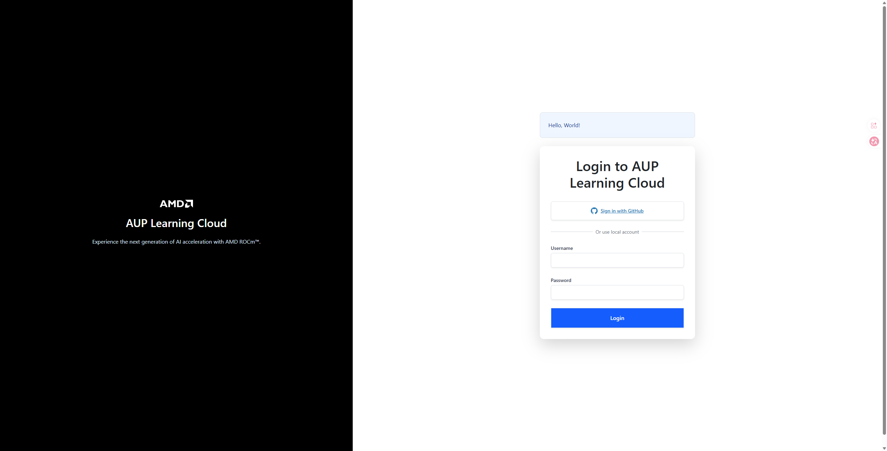
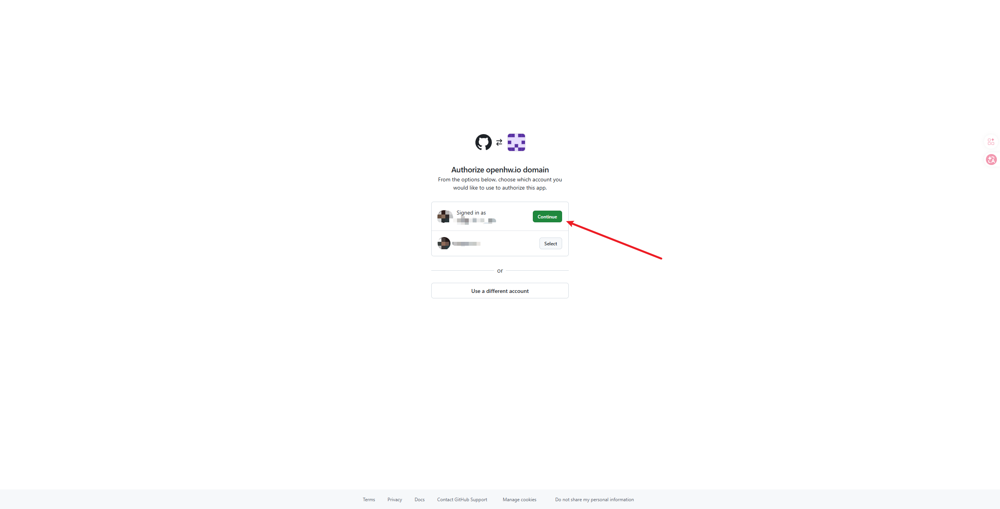
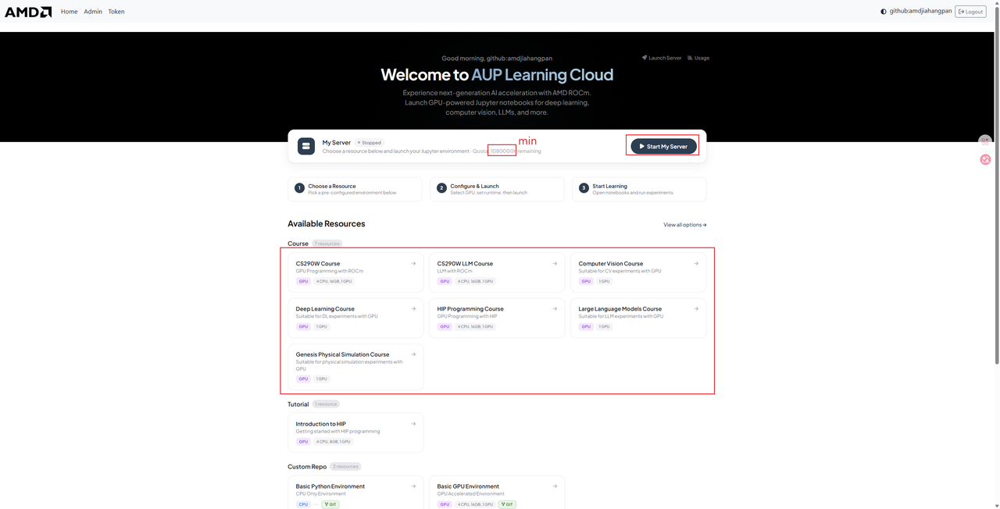
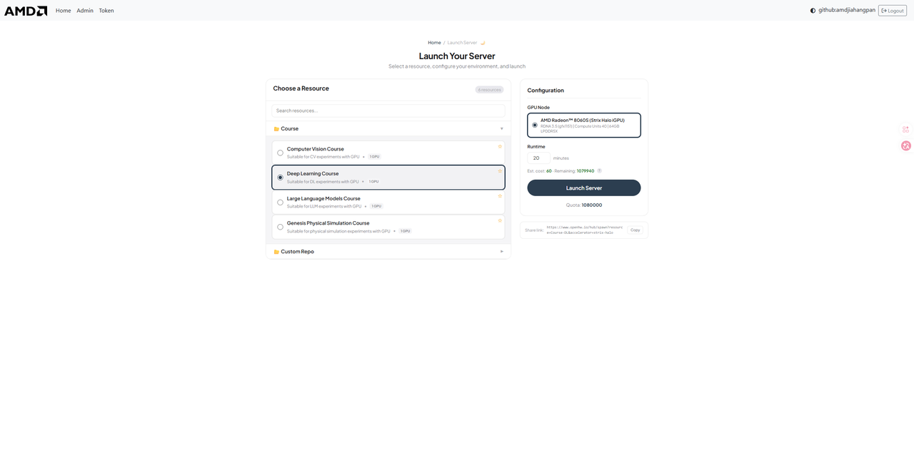
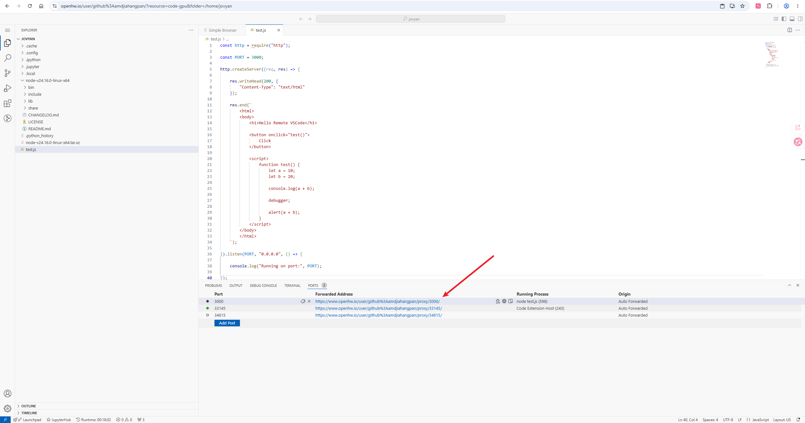
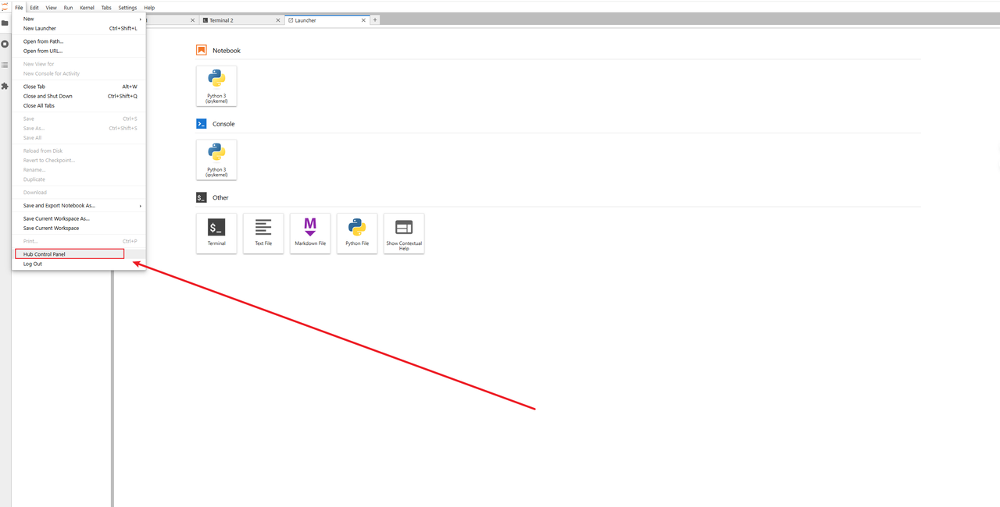
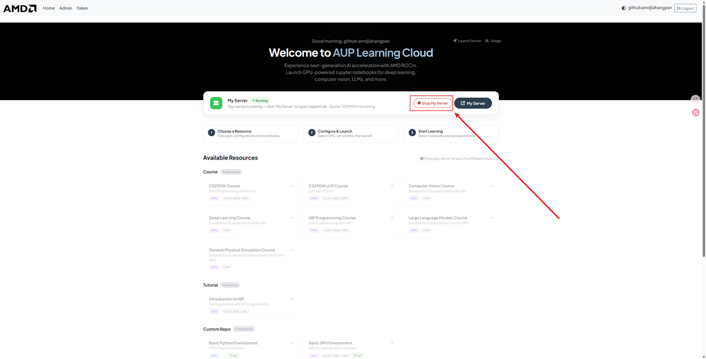

# 📘 远程 JupyterHub/Code Server 使用指南

> 本篇是 AMD / AUP Learning Cloud 免费云平台的远程 JupyterHub / Code Server 使用指南。平台面向课程和学习提供一定免费额度，可用于在没有本地 AMD ROCm 设备时完成浏览器端开发、Notebook 实验和本专题的环境准备；具体额度、镜像和授权方式以平台页面与管理员通知为准。

欢迎使用本课程/实验室提供的 **远程 JupyterHub/Code Server 开发环境**！
本指南将帮助你从 **第一次登录** 到 **日常开发使用**，快速上手远程编程与学习。

## 🌐 什么是 JupyterHub / Code Server？

|||
|---|---|
|**JupyterHub** 是一个基于浏览器的远程开发平台，你可以：  <br>\- ✅ 通过浏览器直接写代码（无需本地配置环境）  <br>\- ✅ 使用 Python / Jupyter Notebook 进行实验和学习  <br>\- ✅ 代码和文件保存在服务器，不怕电脑重装  <br>\- ✅ 在不同电脑上随时继续学习  <br>📌 **你只需要：**<br>\- 一台能上网的电脑  <br>\- 一个现代浏览器（推荐 Chrome / Edge / Firefox）|**Code Server（VSCode Server）** 是一个在浏览器中运行的 **完整 VSCode 编辑器**，你可以把它理解为：  <br>\> 🖥️「在浏览器里打开一个和本地一模一样的 VSCode」  <br>通过 Code Server，你可以：  <br>\- ✅ 使用完整的 VSCode 编辑体验（语法高亮、自动补全、调试）  <br>\- ✅ 在终端中运行程序、脚本和训练任务  <br>\- ✅ 安装 VSCode 插件（Python、Jupyter、GitLens 等）  <br>\- ✅ 使用端口转发预览 Web 应用  <br>\- ✅ 适合需要 IDE 级开发体验的用户|

---

## 🔐 二、登录说明

### 1️⃣ 获取 GitHub Name 授权 / 本地账号密码

#### GitHub 授权登录

- 直接点击授权登录即可

---

#### 本地账号密码登录

- 填写授权登记表

    - [https://zcnijjcepfie\.feishu\.cn/share/base/form/shrcnIZD8Z8pFjFWEj7OEV9IDra](https://zcnijjcepfie.feishu.cn/share/base/form/shrcnIZD8Z8pFjFWEj7OEV9IDra)

- 由管理员开设并发邮件通知

---

### 2️⃣ 打开登录页面（github id/local）

在浏览器地址栏输入：https://tpe\.aupcloud\.io



### 3️⃣ 选择登录方式

JupyterHub 平台提供两种登录方式: **GitHub 账户登录 \(推荐\)** 和 **本地账户登录**

- 本地账户需管理员提供，需要填写申请表


#### 3\.1 方式1: GitHub 账户登录 \(推荐\)

1. 点击 "Use GitHub Login" 按钮

2. 系统将跳转到 GitHub 授权页面，选择已授权的 GitHub 账户



#### 3\.2 方式2: 本地账户登录

从邮件中获取账号密码

1. 在登录框中输入:

    - Username: 您的用户名

    - Password: 您的密码

2. 点击 "Use LocalAccount Login" 按钮，**首次登录需要修改密码，忘记密码请联系管理员**

### 4️⃣ 成功登录后的界面

#### JupyterHub






可用资源目录

- **Course**：课程资料

    - Computer Vision Course

    - Computer Vision Course \(ROCm 7\.13\.0\)

    - Deep Learning Course

    - Deep Learning Course \(ROCm 7\.13\.0\)

    - HIP Programming Course

    - Large Language Models Course

    - Large Language Models Course \(ROCm 7\.13\.0\)

    - Genesis Physical Simulation Course

    - Genesis Physical Simulation Course \(ROCm 7\.13\.0\)

- **Development**：开发环境

    - Code Server CPU Environment

    - Code Server GPU Environment

- **Test**：测试环境

    - HIP and ROCm Notebook Test

- **Tutorial**：教程内容

    - Introduction to HIP

- **Custom Repo**：自定义仓库，提供基础镜像

    - Basic Python Environment

    - Basic GPU Environment

> 注意：选择合适的镜像时间，计时结束时会关闭链接，未放置在用户存储目录 `/home/jovyan` 的内容会被重置
> 
> 

## 🧑‍💻 三、基本使用说明

### ✨ 1\. 新建一个 Notebook

1. 选择 **Python 3**

2. 浏览器会打开一个新的 Notebook 页面

🎉 恭喜，你已经可以开始写代码了！

### ▶️ 2\. 运行代码

- 在代码单元格中输入代码

- 按 **Shift \+ Enter** 运行当前单元

- 运行结果会显示在下方

示例：

```python
print("Hello, JupyterHub!")
```

### 💾 3\. 保存你的工作

- JupyterHub **会自动保存**

- 也可以手动保存：

    - `Ctrl + S`（Windows）

    - `Cmd + S`（Mac）

- 需要注意每次镜像的默认工作目录为 `/ryzers/notebooks` 用户拥有 20G 的使用磁盘目录在 `/home/jovyan` 如果需要保存工作内容，请在镜像结束前将工作内容迁移至 `/home/jovyan`

⚠️ 默认工作目录：`/ryzers/notebooks`

⚠️ 用户存档目录：`/home/jovyan`

```bash
# 切换bash
bash
cp <需要保存的文件> /home/jovyan
```

## 💻 四、Code Server（VSCode Server）使用说明

### 🚀 1\. 启动 Code Server 环境

1. 登录后，在启动页面选择 **Code Server CPU Environment** 或 **Code Server GPU Environment**

2. 选择所需的硬件配置（如 AMD Radeon™ 8060S GPU）


1. 设置运行时长，点击 **Launch Server**

2. 等待几秒后，浏览器将自动打开 VSCode 界面


### 🖥️ 2\. 界面介绍

Code Server 的界面和本地 VSCode **完全一致**：

- **左侧**：文件资源管理器、搜索、源代码管理、调试、扩展

- **中间**：代码编辑区域

- **下方**：集成终端（Terminal）、端口面板（Ports）、输出面板

### 📡 3\. 端口转发（Port Forwarding）

当你在 Code Server 中运行一个 Web 服务（如 Node\.js、Flask、Streamlit 等），系统会 **自动检测并转发端口**。

#### 使用方法：

1. 在终端中启动服务，例如：

```bash
node test.js
# 输出: Running on port: 3000
```

1. 右下角会弹出通知提示端口已转发，点击 **"Open in Browser"** 即可在新标签页中访问


1. 也可以在底部 **PORTS** 面板中查看所有已转发的端口



#### 转发地址格式：

```
https://tpe.aupcloud.io/user/<your-username>/proxy/<port>/
```

例如：`https://``tpe.aupcloud.io``/user/github%3Ausername/proxy/3000/`


#### 注意事项：

- 端口转发是 **自动** 的，无需手动配置

- 支持任何在服务器上监听端口的服务（HTTP/WebSocket）

- 转发地址可以分享给他人访问（在同一网络授权下）

- 如果端口未自动检测，可在 PORTS 面板手动添加

> 📸 **需要截图位置**：这里建议补充一张端口转发弹窗通知的截图
> 
> 

### 🧩 4\. 插件（Extensions）使用

Code Server 支持安装 VSCode 插件来增强开发体验。

#### 已预装的插件：

|插件|用途|
|---|---|
|Python|Python 语言支持、IntelliSense、调试|
|Jupyter|在 VSCode 中运行 Jupyter Notebook|
|GitLens|Git 增强（查看 blame、历史、对比）|
|Python Debugger|Python 断点调试|
|Ruff|Python 代码格式化和 lint|
|YAML|YAML 文件语法支持|

#### 安装新插件：

1. 点击左侧 **扩展图标**（四方块形状）

2. 在搜索框输入插件名称

3. 点击 **Install** 安装


#### 推荐安装的插件：

- **C/C\+\+** — C/C\+\+ 开发支持（配合 HIP 开发）

- **ROCm HIP** — AMD GPU 编程支持

- **Remote \- Containers** — 容器开发支持

- **Thunder Client** — 轻量 API 测试工具

- **Markdown Preview** — Markdown 实时预览

#### 注意事项：

- 插件安装在服务器端，**镜像重启后需要重新安装**

- 建议将常用插件列表记录下来，方便下次快速安装

- 部分插件可能因网络原因安装失败，可尝试刷新页面后重试

### 🔧 5\. 终端（Terminal）使用

在 Code Server 中可以直接使用集成终端：

- 快捷键 `Ctrl + `` 打开/关闭终端

- 支持多终端窗口（点击 \+ 号新建）

- 默认 shell 为 bash

常用操作示例：

```bash
# 查看 GPU 状态
rocm-smi

# 安装 Python 包
pip install torch torchvision

# 运行训练脚本
python train.py

# 启动 Web 服务（会自动端口转发）
python -m http.server 8080
```

## 🚪 五、正确退出方式（很重要）

使用完成后，请 **正确退出**：

1. 关闭 Notebook 页面

⚠️ 不要长时间占用服务器资源！




---

## ❓ 六、常见问题答疑（FAQ）

### Q1：页面打不开 / 加载很慢怎么办？ 🐢

- 检查网络是否正常

- 尝试更换浏览器（推荐 Chrome / Edge）

- 刷新页面或重新登录

---

### Q2：如果已经启用一个镜像，想换另一个镜像，无法启动？

1. 请在选择界面，点击 Stop my server 关闭当前镜像




---

### Q3：代码报错了，是平台的问题吗？ 😵

**大多数情况下不是！**

请先检查：

- 是否有拼写错误

- 是否漏写了括号或冒号

- 是否按顺序运行了所有单元

👉 善用 DeepSeek / ChatGPT / 同学讨论 😉

---

### Q4：Code Server 中端口转发不生效？

- 确认服务确实在监听该端口（终端中能看到 `Running on port: XXXX`）

- 检查 PORTS 面板中是否有对应端口记录

- 尝试手动在 PORTS 面板中添加端口

- 如果仍不生效，刷新浏览器页面

---

### Q5：Code Server 中插件安装失败？

- 检查网络连接是否正常

- 尝试刷新页面后重新安装

- 部分插件可能不兼容 Code Server（web 版），可尝试搜索替代插件

---

## 📌 七、使用小建议（强烈推荐）

- ⭐ 经常保存代码

- ⭐ 文件命名清晰（不要用 `test123.ipynb`）

- ⭐ 不要在一个 Notebook 里写"所有内容"

- ⭐ 遇到问题及时提问，不要憋着

- ⭐ 重要文件记得存到 `/home/jovyan` 目录

- ⭐ Code Server 用户建议记录常用插件列表，方便重装

> (注：内容由 AI 生成，请谨慎参考）
