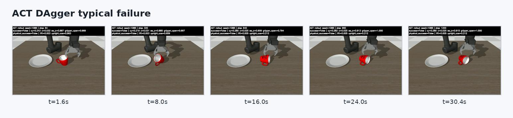
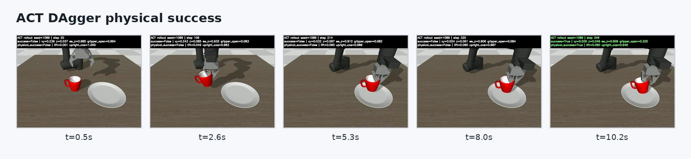

# 02 物理成功评估与视频复核

本任务解决一个核心问题：日志显示成功时，策略是否真的完成了抓取。大家会把环境原始成功率和物理成功率分开统计，并用视频复核典型成功和典型失败。

配套实操 Notebook：[02_physical_success_review.ipynb](./notebooks/02_physical_success_review.ipynb)。

## 为什么不能只看环境 success

在抓杯子放盘子的任务中，原始 `check_success()` 往往更接近几何条件。策略可能没有稳定夹起杯子，只是把杯子推到盘子附近；也可能杯子已经倒下，但位置满足了终止条件。

因此，本专题推荐报告两个指标：

| 指标 | 含义 |
| --- | --- |
| `legacy_success` | 环境原始成功条件 |
| `physical_success` | 目标杯被抬起、放到盘上且最终姿态基本直立 |

当两者不一致时，以视频和物体状态为准。

## 推荐物理口径

建议的最小物理口径：

1. legacy success 为真；
2. 目标杯相对初始高度至少抬起 `0.03 m`；
3. 抬起状态持续至少若干控制 tick；
4. 终态杯子没有明显倒下。

这套指标不要求大家的阈值永远不变。更重要的是：同一组模型对比时必须使用同一口径。

## 批量评估脚本形态

建议把批量评估做成 Python 脚本，而不是手动在 Notebook 中重复运行。脚本入口可以设计成下面这种形态：

```bash
python tools/audit_language_policy_physical.py \
  --policy-type smolvla \
  --policy-path "$MODEL_ROOT/checkpoints/000500/pretrained_model" \
  --instruction "Place the red mug on the plate." \
  --seeds 0 1 2 3 4 5 6 7 8 9 \
  --max-action-steps 600 \
  --output-jsonl outputs/eval_red.jsonl \
  --summary-json outputs/summary_red.json
```

脚本输出建议包含：

- seed；
- instruction；
- legacy success；
- physical success；
- first success step；
- 最大抬升高度；
- 终态杯子到盘子的 xy 距离；
- 终态 upright 指标；
- 失败原因桶。

## 视频复核

每个 checkpoint 至少录两类视频：

1. 一个真实成功视频；
2. 一个典型失败视频。

视频旁边要写清楚它属于哪一种证据：

```html
<video controls muted preload="metadata" width="100%">
  <source src="assets/videos/seed0_blue_success.mp4" type="video/mp4">
</video>
```

图注示例：

> 图 1：SmolVLA 在蓝杯任务上的真实成功 rollout。大家需要观察杯子是否被夹起、是否被放到盘上，以及终态是否保持直立。

不要只放成功视频。失败视频更适合教学，因为它能解释为什么需要更严格的评估口径。

## 示例关键帧序列

下面的关键帧来自同一套物理成功判定流程。大家复核视频时，不要只看最后一帧的杯子位置，而要沿着时间轴观察是否出现了稳定夹取、抬升、搬运和释放。


图 1：SmolVLA baseline 在蓝杯指令下的典型失败。策略反复接近盘子或红杯附近，目标蓝杯没有被稳定夹起，因此不能算作物理成功。


图 2：SmolVLA 使用 blue frame 加权采样后的蓝杯成功案例。大家可以看到蓝杯先被夹起，再被移动到盘子上，终态也满足严格物理口径。



图 3：ACT DAgger 后仍可能出现的典型失败。虽然接触到了杯子，但杯子姿态很快失稳，最终没有满足直立放置的物理成功条件。



图 4：ACT DAgger 的物理成功案例。这个序列展示了从接近、夹取、搬运到盘上释放的完整过程，可作为大家检查自己 rollout 的参考。

## Checkpoint

完成本任务后，大家应当得到：

- 红杯和蓝杯各一份 JSONL 评估文件；
- 一份 summary JSON 或 Markdown 表；
- 至少 1 个成功视频和 1 个失败视频；
- 对失败原因的简短分类。
