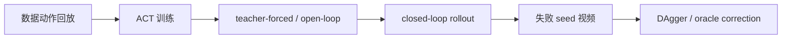

# 03 ACT 在 ROCm 上的迁移与 DAgger 诊断

本任务关注 ACT。大家需要理解：ACT 在训练集上 loss 下降，并不等于闭环部署稳定成功。尤其在 ROCm 设备上复刻时，要先证明失败不是环境、数据、显存或成功判定造成的，再讨论模型结构和数据策略。

配套实操 Notebook：[03_act_dagger_diagnostics.ipynb](./notebooks/03_act_dagger_diagnostics.ipynb)。

## ACT 诊断路线

建议按照下面顺序排查：

每一步回答的问题不同：

| 步骤 | 回答的问题 |
| --- | --- |
| 数据动作回放 | 采集数据本身是否能完成任务 |
| ACT 训练 | 模型是否能学习离线动作分布 |
| open-loop | 模型在数据状态上是否能复现轨迹 |
| closed-loop | 策略自己跑时是否稳定 |
| 失败视频 | 失败发生在接近、夹取、搬运还是释放 |
| DAgger | 如何补闭环跑偏后的状态 |

## 常见 ACT 失败类型

| 失败类型 | 现象 | 可能原因 |
| --- | --- | --- |
| 不接触杯子 | 夹爪停在杯子旁边 | 图像条件不足、初始位姿 OOD、闭环偏移 |
| 能抬起但不释放 | 杯子悬在盘上或被带走 | gripper 标签、尾段 release 太短 |
| 放到盘边但倒杯 | 位置接近但姿态失败 | 末端阶段示教不足、放置高度不稳 |
| open-loop 成功 closed-loop 失败 | 数据状态下会，自己跑不会 | 闭环分布偏移 |

## DAgger 数据怎么采

一个适合教学的 DAgger 流程：

1. 训练 reset-start 基线；
2. 固定一批 seed 做闭环 rollout；
3. 找出失败 seed；
4. 让当前策略先跑前若干步，例如 40 个控制 tick；
5. 从失败附近状态切换到 oracle 或 scripted policy；
6. 保存纠偏 suffix；
7. 合并数据时记录来源、timestamp offset 和采样权重；
8. 重新训练并用同一批 seed 评估。

注意：correction 数据不一定越多越好。直接把 full-reset failure-bucket 数据高权重混入主训练，可能破坏原本已经学会的 reset-start 行为。

## ROCm 上要记录什么

ACT 训练通常显存占用不算高，但仍建议大家记录：

- batch size；
- chunk size；
- `n_action_steps`；
- 是否 no-VAE；
- 是否有 gripper 辅助损失；
- 训练温度；
- VRAM 使用；
- 是否出现 kernel crash / OOM。

如果训练失败，先用设备日志证明是不是硬件或 ROCm 问题；如果训练稳定但策略失败，优先回到数据和闭环诊断。

## 本轮复刻结果示例

本轮 ACT 复刻中，单纯 clean closed-loop 基线几乎不能通过严格物理成功判定。加入 timestamp offset、downweight correction 和更合适的 DAgger 数据后，`physical_success` 逐步提升到 `17/30`。这个结果说明 ACT 已经形成了一个完整的 ROCm 闭环诊断案例，但它还不是“随机泛化已经解决”的状态。

图 1：ACT 闭环物理成功率随诊断步骤的变化。大家需要注意，这里的提升来自数据和闭环状态纠偏，不是简单加长训练时间。

| 阶段 | physical success | 解释 |
| --- | --- | --- |
| clean closed-loop | 0/10 | 模型在闭环状态下无法稳定接触并搬运杯子 |
| timestamp offset | 3/15 | 动作对齐改善了一部分轨迹，但仍不稳定 |
| downweight DAgger | 13/30 | correction 数据开始补上失败附近状态 |
| best DAgger | 17/30 | 当前示例中最好的 ACT ROCm 复刻结果 |

图 2：ACT best DAgger 的物理成功 rollout。大家可以对照抓取、搬运和释放三个阶段检查自己的视频。

图 3：ACT best DAgger 的典型失败 rollout。它提醒大家：即使环境几何条件偶尔接近成功，也要继续检查抬升高度和终态姿态。

## Checkpoint

完成本任务后，大家应当整理：

| 项目 | 内容 |
| --- | --- |
| ACT checkpoint | 路径用变量表示 |
| open-loop 成功率 | 训练集或固定 seed |
| closed-loop 成功率 | 使用 `physical_success` |
| DAgger 数据说明 | prefix 长度、oracle 类型、采样权重 |
| 典型失败视频 | 至少 1 个 |
| 下一步判断 | 继续 DAgger / 修 gripper / 补示教 / 调 chunk |
