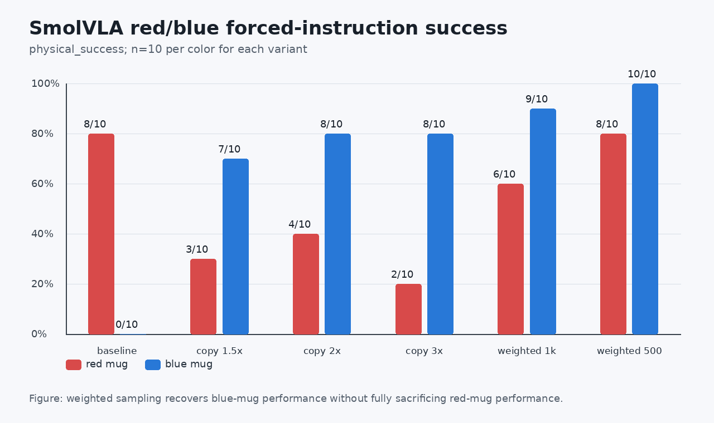
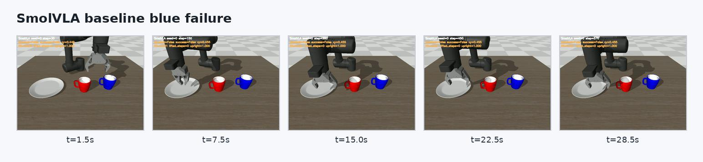
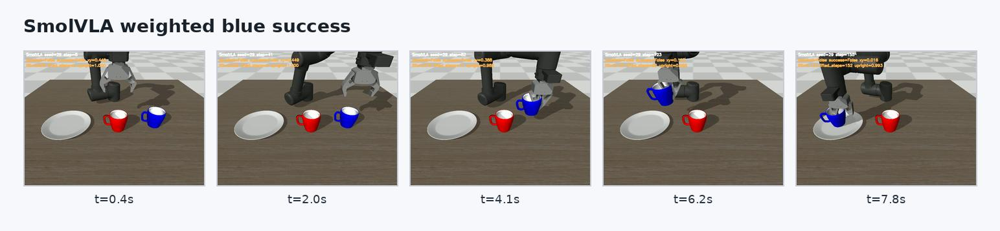

# 04 SmolVLA 在 ROCm 上的迁移与采样加权

本任务关注 SmolVLA。相比 ACT，SmolVLA 更依赖语言条件和视觉特征，因此特别适合用红杯、蓝杯任务检查模型是否真的理解了指令，而不是只记住数据分布。

配套实操 Notebook：[04_smolvla_weighted_sampling.ipynb](./notebooks/04_smolvla_weighted_sampling.ipynb)。

## 固定红杯和蓝杯评估

不要只随机抽任务。建议同一批 seed 分别强制两条指令：

```text
Place the red mug on the plate.
Place the blue mug on the plate.
```

然后比较：

| 模型 | 红杯 physical success | 蓝杯 physical success | 备注 |
| --- | --- | --- | --- |
| baseline step5000 | 8/10 | 0/10 | 原始分布明显偏向红杯 |
| blue copy 1.5x | 3/10 | 7/10 | 蓝杯提升，但红杯受损 |
| blue copy 2x | 4/10 | 8/10 | 仍存在红杯退化 |
| blue copy 3x | 2/10 | 8/10 | 复制过多会加重分布偏移 |
| weighted blue 2.0 step1000 | 6/10 | 9/10 | 更均衡，但不是最佳 checkpoint |
| weighted blue 2.0 step500 | 8/10 | 10/10 | 本轮最适合作为保护基线 |

如果红杯很好、蓝杯很差，说明模型不是完全不会抓，而是任务条件或颜色分布存在偏置。



图 1：SmolVLA 在红杯、蓝杯固定指令上的 `physical_success` 对比。大家需要观察的是“蓝杯提升是否牺牲红杯”，而不是只追求单一颜色最高成功率。

## 为什么不直接复制数据

一种直觉做法是把蓝杯 episode 复制多份。但复制数据会改变数据集统计和 episode 分布，可能让模型向蓝杯过拟合，同时伤害红杯。

更温和的做法是按 frame 或 episode 加权采样。例如使用 `WeightedRandomSampler`，让 blue frame 被更高概率采到，但不修改原始 parquet 文件。

建议对比两类方法：

| 方法 | 优点 | 风险 |
| --- | --- | --- |
| 复制 episode | 实现简单 | 改变数据集统计，容易伤害另一类任务 |
| Weighted sampler | 不改原始数据，便于回滚 | 需要记录采样权重和随机种子 |

## ROCm 训练记录

SmolVLA 在 ROCm 上训练时，大家需要记录：

- 初始 checkpoint；
- 数据根目录；
- 训练 steps；
- batch size；
- task weight substring；
- task weight；
- GPU 利用率；
- 温度区间；
- VRAM 使用；
- 保存 checkpoint 的 step。

结果不要只看 final checkpoint。中间 checkpoint 可能更好，例如 500 step 可能比 1000 step 更均衡。

## 视频和失败 seed 复跑

如果某些 seed 在 batch eval 中失败，可以复跑 3 次检查是否是稳定失败：

| seed | 指令 | batch 结果 | repeat 1 | repeat 2 | repeat 3 | 判断 |
| --- | --- | --- | --- | --- | --- | --- |
|  | red |  |  |  |  | 固定失败 / 偶发失败 |
|  | blue |  |  |  |  | 固定失败 / 偶发失败 |

偶发失败说明策略已经接近边界，下一步应补边界状态示教或做少量 targeted DAgger，而不是盲目长训。

## 本轮复刻结果示例

本教程示例中表现最稳的 SmolVLA checkpoint 是 `weighted blue 2.0 step500`。小批量对比中它达到红杯 `8/10`、蓝杯 `10/10`；扩大到 30 个 seed 后，红杯 `26/30`、蓝杯 `27/30`，总计 `53/60`。这说明 SmolVLA 主线已经在 ROCm 设备上复刻出比较稳定的固定指令抓杯能力。

这里把它称为“保护基线”，意思是后面的新实验都要和它比较。新 checkpoint 只有在同一批 seed、同一 `physical_success` 口径下超过这条基线，才值得替换它。这样可以避免看到某一次训练 loss 更低，就误以为模型真的更好。



图 2：baseline 的蓝杯失败序列。这个失败不是因为环境不能抓杯，而是模型没有稳定执行蓝杯指令。



图 3：加权采样后的蓝杯成功序列。它适合放在教程里说明为什么需要按指令颜色拆开评估。

## Checkpoint

完成本任务后，大家应当得到：

- 红杯和蓝杯固定指令成功率；
- 至少两个采样策略的对照；
- 一个保护基线 checkpoint；
- 一个成功视频和一个失败视频；
- 对失败 seed 是否稳定的复跑结论。
