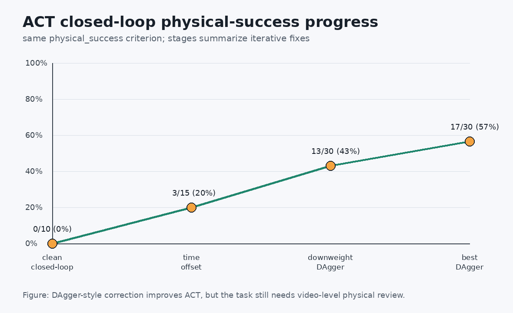
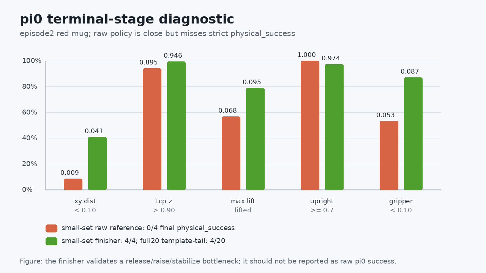

# 06 ROCm 调试复盘与排障案例

本章把 AMD ROCm 设备上复刻 ACT、SmolVLA 和 pi_0 时遇到的关键问题整理成学习案例。它不按时间顺序罗列命令，而是把每个问题拆成一条排障链路：先观察现象，再收集证据，然后确认根因，最后用同一评估口径验证修复是否有效。

配套实操 Notebook：[06_rocm_debug_playbook.ipynb](./notebooks/06_rocm_debug_playbook.ipynb)。

这一章完成几件事：

- 判断“日志成功”和“物理成功”是否一致；
- 知道什么时候应该回到数据采集和回放审计；
- 理解为什么 ACT 要做闭环 DAgger，而不能只看训练 loss；
- 理解 SmolVLA 的颜色任务偏置为什么要用强制红/蓝指令评估；
- 理解 pi_0 raw policy 与脚本收尾器诊断为什么要分开报告；
- 在 ROCm 远端训练时定位常见的进程、显存、路径和依赖问题；
- 安全地处理 Hugging Face gated model、token 和缓存问题。

## 从现象到结论

复刻时不要只保存一段长日志。更有价值的是把每次失败整理成可复盘的“小案例”：问题怎么发现，证据是什么，哪些方向被排除，最后怎样验证修复有效。

建议把每个问题整理成下面的形态：

| 字段 | 写什么 |
| --- | --- |
| 现象 | 能直接观察到的错误、视频行为或指标异常 |
| 证据 | JSONL、summary、视频关键帧、GPU 状态或短日志 |
| 根因 | 被证据支持的真实原因，不写猜测成事实 |
| 修复 | 改了哪个口径、脚本、数据策略或训练参数 |
| 验证 | 修复后用同一评估口径得到什么结果 |
| 学习结论 | 这次问题给后续复刻留下什么经验 |

命令和路径写成可迁移的形式，例如 `$PROJECT_ROOT`、`$DATA_ROOT`、`$OUTPUT_ROOT`。换到自己的工作站、云主机或课堂服务器时，也能照着同一套逻辑复现。

## 案例 1：旧 success 不等于真抓取成功

**现象**：ACT 有一次评估显示成功，但视频里杯子并没有被夹起，而是被末端挤到盘子附近，杯子还出现倾倒。

**证据**：旧 `env.check_success()` 更接近终态几何判断，只要杯子终态靠近盘子、夹爪打开、末端高度满足条件，就可能返回成功。视频复核发现，这种成功并不一定包含“夹起、搬运、释放、直立放置”的完整过程。

**修复**：教程里统一引入 `physical_success`，至少检查：

1. 旧几何成功条件为真；
2. 目标杯被抬起到足够高度，例如 lift 大于 `0.03 m`；
3. 抬起状态持续若干 control tick；
4. 终态杯子基本直立，例如 upright cosine 大于阈值。

**教程经验**：所有模型对比都要优先报告 `physical_success`，旧 success 可以作为辅助指标，但不能单独作为复刻成功证明。

## 案例 2：示教数据本身也要审计

**现象**：早期 ACT 训练容易学成“夹住不放”或末端释放不稳定。只看回放几何 success 时，数据似乎没有问题，但闭环 rollout 失败很多。

**根因**：早期采集脚本中，末尾夹爪 action 的记录方式有问题。它把环境返回的实际夹爪状态当成 action 写入，导致尾段标签更像“保持闭合”，而不是“执行释放”。这种错误会直接教坏策略。

**修复**：

- 修正采集脚本，保存原始控制 action 的 gripper 维度；
- 对已有数据做尾段修复；
- 训练前先对每条 episode 做 open-loop 物理回放审计，确认示教数据确实是真抓取、真放置。

**教程经验**：如果策略总是在末端阶段失败，不要先怀疑模型太弱。先检查数据 action 是否真实表达了释放动作。

## 案例 3：ACT 的 loss 下降不代表闭环稳定

**现象**：ACT 能完成训练，open-loop 或 teacher-forced 诊断也能看到一定学习效果，但 closed-loop rollout 会偏离示教状态，出现不接触杯子、抬起后倒杯、放置偏移等问题。

**排障路线**：

| 阶段 | 物理成功结果 | 学到的结论 |
| --- | --- | --- |
| clean closed-loop | 0/10 | 仅训练离线数据不能证明闭环可用 |
| timestamp offset | 3/15 | 对齐 suffix phase 后，策略开始偶发真抓取 |
| downweight DAgger | 13/30 | 降低 correction 数据权重能保护 reset-start 主分布 |
| best DAgger | 17/30 | ACT 已经形成完整诊断案例，但还不是强泛化 |



图 1：ACT 调试不是“多训几步”就能解决，而是要沿着数据分布、时间对齐、闭环状态纠偏逐步定位问题。

**教程经验**：ACT 的关键不是只把 checkpoint 训出来，而是证明它能在自己产生的状态分布上继续恢复任务。

## 案例 4：不是所有 DAgger 数据都会提升结果

**现象**：追加更多 DAgger 或 failure-bucket 数据后，某些分支反而退化。full-reset failure-bucket 数据直接混入主训练时，闭环成功率明显下降。

**根因**：失败状态数据和 reset-start 主分布不一定兼容。直接高权重混入，可能让模型忘掉原本已经会的起始状态行为。某些 correction suffix 还存在 timestamp/phase 与 reset-start episode 不一致的问题。

**修复策略**：

- 保护当前表现最好的 checkpoint，不让后续实验随手覆盖它；
- 新数据只在同一组 seed、同一 `physical_success` 口径下比较；
- 对 correction episode 使用 timestamp offset；
- 对 correction 数据降采样，例如 sample weight `0.25`；
- 对退化分支保留结论，但不作为主线。

**教程经验**：DAgger 的目标是补闭环跑偏后的状态，不是把所有失败轨迹都扔回训练集。新增数据必须先回答“它补的是哪个状态分布”。

## 案例 5：SmolVLA 不是不会抓，而是存在任务偏置

**现象**：SmolVLA baseline 在随机评估里看起来有一定成功率，但强制红杯和蓝杯指令后，差异非常明显：红杯可以成功，蓝杯几乎失败。

**证据**：同一批 seeds 分别固定两条指令：

```text
Place the red mug on the plate.
Place the blue mug on the plate.
```

baseline 的严格物理结果为红杯 `8/10`、蓝杯 `0/10`。数据集中红/蓝 episode 数量并不失衡，但蓝杯任务更远、更难，导致模型在蓝杯抓取前段不稳定。


图 2：强制红/蓝指令评估能把“模型不会抓”和“模型对某类任务有偏置”区分开。

**教程经验**：语言策略必须按 instruction 拆开评估。只看总体成功率，很容易把颜色、距离和任务难度偏置藏起来。

## 案例 6：复制数据不一定比加权采样好

**现象**：为了修蓝杯失败，直觉做法是复制蓝杯 episode。1.5x、2x、3x 复制确实能提升蓝杯，但红杯成功率明显下降。

**结果对比**：

| 策略 | 红杯 physical success | 蓝杯 physical success | 判断 |
| --- | --- | --- | --- |
| baseline | 8/10 | 0/10 | 红杯好，蓝杯失败 |
| blue copy 1.5x | 3/10 | 7/10 | 蓝杯提升，但红杯退化 |
| blue copy 2x | 4/10 | 8/10 | 仍然偏蓝 |
| blue copy 3x | 2/10 | 8/10 | 过采样更伤红杯 |
| weighted blue 2.0 step1000 | 6/10 | 9/10 | 比复制更均衡 |
| weighted blue 2.0 step500 | 8/10 | 10/10 | 当前保护基线 |

**根因**：复制 episode 会改变数据集 episode 分布和统计，容易把模型推向某个颜色任务。Weighted sampler 不改变原始数据文件，只调整采样概率，因此更容易回滚和比较。

**教程经验**：对小数据集做任务平衡时，优先尝试 sampler/loss 层的平滑加权，再考虑复制数据。中间 checkpoint 也要评估，最终 step 不一定最好。

## 案例 7：视频是证据，但成功率以 batch JSONL 为准

**现象**：某些 seed 在 batch eval 中失败，单独复录视频时又成功；也有 seed 在 batch 中成功，单独复录时失败。

**原因**：MuJoCo rollout、渲染、控制时序和策略采样可能存在边界非确定性。单条视频非常适合教学展示，但不能替代批量 JSONL 统计。

**推荐报告方式**：

- 成功率用固定 seed batch eval；
- 成功/失败视频用于解释行为；
- 对边界失败 seed 复跑 3 次，判断是固定失败还是偶发失败；
- 教程图注要写清楚“视频是代表行为，不是成功率统计本身”。

**教程经验**：不要用一条最好看的视频替代统计表，也不要因为一条失败视频否定整个 checkpoint。二者要一起看。

## 案例 8：ROCm 远端训练要脚本化，不要全靠 Notebook

**现象**：Notebook 适合讲解，但长训练、批量评估和视频录制更容易遇到中断、路径、进程和资源问题。

本轮调试中遇到过几类典型问题：

| 问题 | 表现 | 处理 |
| --- | --- | --- |
| `PYTHONPATH` 缺失 | 临时脚本找不到项目内模块 | 在远端项目根目录设置 `PYTHONPATH=$PWD:${PYTHONPATH:-}` |
| 文件句柄泄露 | 批量 seed eval 后出现资源加载失败 | 每个 env / viewer 用完后显式关闭，必要时分批评估 |
| 训练迭代器缓存 | 长训时 RAM 不断上涨、GPU 空闲 | 不使用会缓存 batch 的无限 `cycle`，改成 iterator 用完后重建 |
| 进程残留 | GPU 或显存占用不符合预期 | 用精确命令和 PID 检查，只停止自己确认的任务 |
| 温度较高 | 长训时 GPU 持续满载 | 记录温度、显存和 fan/performance 模式；只要训练稳定且无 OOM/kernel crash，再继续比较模型结果 |

批量任务适合做成脚本，例如：

```bash
cd "$PROJECT_ROOT"
export PYTHONPATH="$PWD:${PYTHONPATH:-}"
export TOKENIZERS_PARALLELISM=false

./.venv/bin/python eval_policy_success.py \
  --policy act \
  --act-policy-path "$MODEL_ROOT/act_best/step_5000" \
  --physical-success \
  --seed-start 1000 \
  --episodes 10 \
  --output-jsonl "$OUTPUT_ROOT/act_seen_1000_1009.jsonl"
```

**教程经验**：Notebook 用来解释和单步观察，脚本用来产生可比较结果。真正汇报成功率前，必须确认日志、JSONL、视频和 GPU 状态都能互相解释。

## 案例 8.1：ROCm 能看到 GPU，不等于 PyTorch 已经能稳定训练

**现象**：`rocm-smi` 能看到设备，`torch.cuda.is_available()` 也返回 `True`，但一旦执行 `x.to("cuda")` 或加载较大的 pi_0 权重，Python 进程直接崩溃。这类问题很容易被误判为模型代码、显存或温度问题。

**证据**：最小 tensor smoke 就能复现，不需要启动训练：

```python
import torch

print(torch.__version__)
print(torch.cuda.is_available())
x = torch.randn(1024, 1024)
y = x.to("cuda")
print(y.mean())
```

如果这段代码都崩溃，后面的 ACT、SmolVLA、pi_0 训练全部没有诊断意义。先修运行时，再谈模型。

**根因**：Ryzen AI MAX+ 395 对应 `gfx1151`。AMD 的 ROCm 7.13 文档已经把 Ryzen AI Max+ 395 / `gfx1151` 列入支持范围，ROCm 7.13 release notes 也写到新增 Ryzen AI Max 300 系列支持；同时 AMD 的 RDNA3.5 系统优化文档说明，Ryzen AI Max 系列需要特定 Linux kernel / KFD 修复，否则 compute workload 可能初始化失败或行为不可预测。

所以这不是“ROCm 生态不可用”，而是“APU / RDNA3.5 / gfx1151 这一代必须严格对齐 kernel、driver、ROCm 和 PyTorch wheel”。如果装到一个看似更新、但没有正确覆盖 `gfx1151` 的 nightly wheel，就可能出现 `cuda.is_available=True` 但 tensor 上 GPU 即崩的情况。

**修复**：先换到明确支持 `gfx1151` 的 ROCm / PyTorch wheel 组合，再做最小 smoke。示例实验中可用的组合是：

```text
torch 2.11.0+rocm7.13.0a20260425
torchvision 0.26.0+rocm7.13.0a20260425
rocm[libraries] 7.13.0a20260425
triton 3.6.0+rocm7.13.0a20260425
HIP 7.13.26162
```

这里的版本号不是要求所有人照抄，而是说明排障原则：先让 PyTorch 和 ROCm 的硬件目标对上 `gfx1151`，再进入训练。安装后至少跑四个检查：

```python
import torch

for dtype in [torch.float32, torch.float16, torch.bfloat16]:
    x = torch.randn(1024, 1024, dtype=dtype, device="cuda")
    print(dtype, x.mean().item())

big = torch.empty((512 * 1024 * 1024 // 4,), dtype=torch.float32, device="cuda")
print("512 MiB tensor ok", big.numel())
```

**验证**：基础 tensor、float32/float16/bfloat16、512 MiB tensor 都通过后，再跑 pi_0 的 `steps=0` 初始化、1-step expert-only backward 和小 checkpoint 保存。只有这些都过，才能说运行时链路恢复。

**教程经验**：ROCm 现在已经能覆盖 Ryzen AI Max 这类 APU，但“官方支持”不等于“任意 pip wheel 都能跑”。最小 tensor smoke 是第一道门；这道门不过，长训练日志没有价值。

参考资料：

- [ROCm 7.13 compatibility matrix](https://rocm.docs.amd.com/en/7.13.0-preview/compatibility/compatibility-matrix.html)
- [ROCm 7.13 release notes](https://rocm.docs.amd.com/en/7.13.0-preview/about/release-notes.html)
- [AMD RDNA3.5 system optimization](https://rocm.docs.amd.com/en/latest/how-to/system-optimization/rdna3-5.html)

## 案例 8.2：大模型权重加载也可能是 ROCm 崩溃点

**现象**：tensor smoke 已经通过，但加载 pi_0 这类大模型 checkpoint 时仍然崩溃，尤其是在 `safetensors` 直接把权重加载到 GPU 的路径上。

**证据**：`lerobot/pi0` 或本地 pi_0 checkpoint 的 `model.safetensors` 很大，加载时显存会快速上升。如果崩溃发生在训练开始前，而不是 forward/backward 阶段，就要先怀疑权重加载路径。

**修复**：把 safetensors 权重先加载到 CPU，再调用 `policy.to("cuda")` 把模型整体搬到 GPU。这个补丁不改变模型结构，也不改变训练数据，只改变加载顺序：

```text
safetensors -> CPU state_dict -> policy.load_state_dict(...) -> policy.to("cuda")
```

这一步在示例实验中解决了 pi_0 大权重直接 GPU load 的崩溃问题。修复后，本地 20-step checkpoint 可以正常加载到 GPU，显存占用约 7.5 GB。

**验证**：不要只看 import 成功。至少做一次：

1. 从本地 checkpoint 加载 policy；
2. `policy.to("cuda")`；
3. 打印 `torch.cuda.memory_allocated()`；
4. 构造一个最小 batch 或跑 1-step smoke。

**教程经验**：ROCm 适配不总是“改训练代码”。很多时候是把数据、权重、张量移动的顺序拆开，让错误发生在最小可诊断的步骤里。

## 案例 8.3：resume 训练时不要把 checkpoint 路径覆盖回 base model

**现象**：从 pi_0 500-step checkpoint 继续训练时，命令看起来写了 `resume=true`，但训练脚本内部又把 `cfg.policy.pretrained_path` 强行改回 `lerobot/pi0`。这样就可能出现：模型权重从 base policy 重新加载，优化器状态却从本地 checkpoint 恢复，语义上不是“从 500 step 继续训练”。

**根因**：教程代码为了方便新训练，在创建 policy 前写了默认逻辑：

```python
if cfg.policy.type == "pi0":
    cfg.policy.pretrained_path = "lerobot/pi0"
```

这对第一次训练是方便的，但对 resume 是危险的。`cfg.validate()` 已经从 `train_config.json` 找到了本地 checkpoint 的 `pretrained_model` 目录，后面不应该再覆盖。

**修复**：只在非 resume 时设置默认 base model：

```python
if cfg.policy.type == "pi0" and not cfg.resume:
    cfg.policy.pretrained_path = "lerobot/pi0"
elif cfg.policy.type == "smolvla" and not cfg.resume:
    cfg.policy.pretrained_path = "lerobot/smolvla_base"
```

另外，这版旧 LeRobot 的 parser 有一个细节：`config_path` 要用等号形式，`validate()` 才能从原始 CLI 参数中读回路径：

```bash
python train_model.py \
  --config_path="$MODEL_ROOT/checkpoints/000500/pretrained_model/train_config.json" \
  --resume=true \
  --output_dir="$MODEL_ROOT/pi0_resume_1500" \
  --steps=1500
```

如果写成 `--config_path path/to/train_config.json`，主 parser 可能能读到，但 `validate()` 里回看参数时读不到，进而报 “A config_path is expected when resuming a run”。

**验证**：训练日志里应出现：

```text
resume: True
Creating policy
Loading weights from local directory
Start offline training on a fixed dataset
step:550 ...
```

如果从 500-step checkpoint 继续，下一条训练日志应该从 `step:550` 附近开始，而不是 `step:50`。这个细节非常重要，它能确认训练状态、scheduler 和 optimizer 都接上了。

**教程经验**：resume 不是“能启动就算成功”。要检查日志里的 step、学习率、checkpoint 来源和输出目录。尤其是大模型策略，错误 resume 会浪费很长时间，还会让后面的成功率分析失真。

## 案例 8.4：误删和恢复也要写进教程，但不能暴露私有路径

**现象**：一次远端数据合并命令使用了双引号 SSH 字符串，远端变量在本地 shell 被提前展开为空，导致 `fast_merge --overwrite` 的输出路径为空，清理了项目内一批未跟踪的大目录。源码可以从 Git 恢复，但 checkpoint、notebook_runs 和临时数据 root 这类未跟踪资产不会自动回来。

**根因**：远端多行命令中，`$OUT_ROOT` 这类变量必须在远端展开。如果把整段命令放在本地双引号里，变量可能在本地先展开，远端拿到的就是空字符串。

**修复**：

1. 远端复杂命令统一使用 heredoc：

   ```bash
   ssh user@host 'bash -s' <<'REMOTE'
   set -euo pipefail
   OUT_ROOT="/path/to/output"
   echo "OUT_ROOT=$OUT_ROOT"
   # 后续命令
   REMOTE
   ```

2. 所有带 `--overwrite`、`rm -rf`、`shutil.rmtree` 的脚本先做路径保护，拒绝空路径、`.`、项目根目录和父目录。
3. 大 checkpoint、数据集、评估结果不要只存在未跟踪目录里。至少要有一份可重建说明：数据来自哪个 HF repo、用哪个脚本采集、checkpoint 用哪个 config 训练出来。

**验证**：修复后，错误命令应当直接失败，而不是继续执行：

```text
refuse unsafe output_root: .
refuse empty output_root
```

随后重新从公开数据集恢复教学基线：`demo_data_language` 重新下载，20 episodes / 2621 frames，`observation.state` 为 6D，`action` 为 7D；再依次跑 `steps=0`、1-step backward、20-step checkpoint、500-step checkpoint 和固定 red/blue 小面板评估。

**教程经验**：公开教程不要把“事故细节”写成私有流水账，但应该保留可学习的工程教训：远端变量展开、覆盖式脚本保护、公开数据可重建、checkpoint 不进仓库但训练命令和结果要能复盘。

## 案例 9：pi_0 先过权限和 smoke，再谈训练

**现象**：pi_0 不是简单启动训练就能跑通。它依赖 gated model 权限、Hugging Face token、权重下载、缓存和大模型初始化。某些失败发生在训练之前。

**排障顺序**：

1. 确认 token 有效，但不要在命令行和日志里打印 token；
2. 确认账号已接受 PaliGemma 等 gated model 条款；
3. 检查 `lerobot/pi0` 和相关模型能否读取；
4. 确认远端网络或代理能稳定下载权重；
5. 先跑 1-step smoke；
6. smoke 通过后再启动正式训练和强制红/蓝评估。

**阶段性状态**：在本专题示例中，pi_0 已经通过训练前门控，并进入训练后诊断阶段。权限、下载、policy 构造和训练能跑通，只说明链路可用；真正能否复刻成功，仍然要看 fixed seed 的 `physical_success`。

**教程经验**：对于大模型策略，权限、下载和构造 policy 本身就是一层实验门控。没有通过 1-step smoke，就不要启动长训练。

## 案例 10：pi_0 raw 失败集中在尾段，不等于整条轨迹都没学到

**现象**：pi_0 经过小数据集 fine-tune 后，raw policy 在 2 蓝 2 红小集的 reference open-loop replay 中仍然是 `0/4 final_physical_success`；同一设置的 batch rerun 又可能在边界样本上出现 `1/4`。因此这个小集更适合用来定位失败阶段，不适合单独当作泛化成功率。扩大到完整 20 条 open-loop replay 后，当前 raw policy 为 `1/20 final_physical_success`，`3/20 physical_success_ever`；进一步跑 20 seed closed-loop strict 评估后，raw policy 为 `0/20 physical_success`，旧几何口径只有 `2/20`。

**证据**：进一步查看每条轨迹的终态指标后，可以看到 raw policy 往往已经把杯子送到盘子附近，但还差最后的释放、抬高和稳定放置。例如代表 episode2 中，raw policy 的终态 xy 距离只有 `0.0087 m`，杯子保持直立，但 TCP z 只有 `0.8953 m`，没有跨过严格成功阈值。full20 open-loop 里也有 3 条曾经短暂进入过 `physical_success`，但只有 1 条能在终态保持成功；closed-loop strict 中则没有一条能保持严格物理成功，失败桶主要是“抬起后姿态不 upright”和“抬升不足”。这正好说明“接近”和“稳定完成”不是一回事。



图 3：pi_0 raw policy 已经接近目标，但尾段 release / raise / stabilize 没有稳定跨过物理成功条件。绿色柱代表接入脚本收尾器后的同一诊断案例。

**技术背景**：这类失败不是“pi_0 天生只能学中间动作”，更像是小数据、长轨迹和 action chunking 叠在一起后的尾段放大效应。

- [pi_0 论文](https://arxiv.org/html/2410.24164v1)把大规模、多任务、跨机器人数据和 post-training recipe 放在很核心的位置。它特别强调多样数据里包含 corrections 和 recovery behaviors 的价值。我们这里只用小规模抓杯数据 fine-tune，数据覆盖和恢复动作远远不在同一个量级，所以不能指望模型自动补出没有见过的尾段恢复策略。
- [Physical Intelligence 的 Real-Time Action Chunking 说明](https://www.pi.website/research/real_time_chunking)把 pi_0 这类模型描述成一次预测一段动作，而不是一次只预测一个动作；示例里 50 个动作约对应 1 秒控制。action chunking 能让动作更连贯，但 chunk 切换处、推理延迟和训练时没有出现过的暂停都会带来额外问题。
- [Real-Time Execution of Action Chunking Flow Policies](https://arxiv.org/html/2506.07339v1)进一步把问题说得更清楚：action chunking 提升了时间一致性，但 chunk 边界和延迟仍会影响真实执行。小数据 fine-tune 后，前段“接近杯子、移动到盘子附近”还能被平均出来，最后几厘米的释放、抬升和保持却很容易被累积误差击穿。
- [LeRobot 的 Human-in-the-Loop 数据采集文档](https://huggingface.co/docs/lerobot/en/hil_data_collection)专门讨论了 compounding errors 和成功示教之外的状态覆盖问题：只看成功轨迹，策略一旦跑偏就会进入训练数据里没见过的状态；把纠偏和恢复过程录进 episode，模型才有机会学会从偏差里回来。

把这些放回我们的抓杯任务里，就能解释这次现象：raw policy 不是完全不会动，而是会把杯子推到或带到盘子附近，但 release / raise / stabilize 需要非常小的末端误差、正确夹爪时序和足够终态保持。训练 loss 继续下降，不一定自动修好这段，因为它缺的是尾段状态覆盖、阶段边界和物理成功目标，而不只是更多 step。

**修复验证**：为了确认问题是否集中在尾段，我们没有直接宣布 raw policy 成功，而是加入一个诊断用 scripted finisher：从数据集尾段动作中构造平均 release / raise / stabilize 动作，并在达到 `physical_success` 后立即停止。这个混合方案在 2 蓝 2 红小集上得到 `4/4 final_physical_success`。

随后把同样思路扩到完整 `demo_data_language` 20 条 episode：`pi_0 step1500 + all-episode template tail40 + blend20 + stop-on-physical-success` 的 teacher-forced open-loop 结果为 `4/20 final_physical_success`，成功 episode 是 `7, 9, 13, 14`，红杯 `2/10`、蓝杯 `2/10`。这个结果把结论压得更实：固定脚本尾段确实能救一部分接近成功的轨迹，但不是泛化解法。失败样本里大多数仍然 `xy` 偏远、姿态不 upright，少数甚至没有稳定抬起；前段接触、抓稳、搬运和尾段释放是耦合的，不能只靠最后 40 帧平均动作解决。

再往后我们又做了一组更强的因果拆解：不用 pi_0 前缀，而是先让 scripted oracle 跑到不同接管点，再把控制权交给 10eps suffix-only finisher。prefix `120/180/240/300` 在 seeds `1000/1001` 上全部是 `0/2 physical_success`。有些 rollout 已经把杯子抬起并保持直立，但最终 `xy` 距离仍在 `0.22-0.60 m`，杯子被带到远离盘的位置。这个结果说明，失败不只是“接管太早”或“接管太晚”，当前 finisher 的搬运目标和阶段条件本身也没学稳。

随后看的 dense action-target trace 也对上了这个判断：seed `1000` 在 oracle prefix `180` 后接 finisher，前 80 个 finisher control tick 的 phase span 是 `move_pregrasp 28步 -> move_grasp 35步 -> close_gripper 17步`。也就是说，已经抬杯后，finisher 又回到了接近和重新抓取阶段。对应的 TCP target 到盘心平均 `0.481 m`，到杯子平均 `0.147 m`；相对盘心 y 偏差约为 `+0.295 m` 到 `+0.554 m`。这个数字比单纯看视频更有说服力，它直接说明后段策略没有把“盘心相对位姿”学成稳定控制目标。

只把 phase 手工快进也不够。我们把 finisher 的 `move_pregrasp/move_grasp/lift` dwell 压到 1 步，prefix `180`、seeds `1000/1001` 仍然是 `0/2 physical_success`，终态 `xy` 约 `0.534/0.494 m`。所以后续不是简单调 dwell，而是要把 phase offset / phase head 和 plate-relative state 一起放进下一版策略。

再往下拆，schedule-shift 诊断把同一个 finisher 的 `dataset_schedule` 从 `move_preplace` 或 `lower_to_plate` 起点开始播放，不改模型权重。`move_preplace` 起播仍是 `0/2`，但 seed `1000` 的终态 `xy` 改到 `0.140 m`，说明 phase 起点确实有帮助；seed `1001` 仍在 `0.410 m`，并且夹爪过早打开。`lower_to_plate` 起播两个 seed 都在 `0.44-0.45 m`，说明直接跳到下降/释放阶段太晚。再加 `phase-scripted gripper` 仍是 `0/2`，但 seed `1001` 从 `0.410 m` 改到 `0.171 m`。这一步把问题边界画得更清楚：相位和夹爪时序是必要条件，但不是充分条件；Pi0 后段还没有学会稳定的 plate-relative transport target。

于是下一步不是再盲训同一个 19D finisher，而是把 plate-relative target 显式放进 state。新的 22D state 写成：

```text
joint6 + timestamp + phase_index_norm + phase_onehot11 + tcp_to_plate3
```

`tcp_to_plate` 就是当前 TCP 到盘心的相对向量。训练数据里用采集时的 `prefix_end_debug.tcp_pos` 和上一帧 `eef_abs` 目标做近似，闭环评估时直接从 MuJoCo 取真实 `tcp_link - body_obj_plate_11`。这个设计对应前面 trace 里的根因：后段策略的目标还停在杯子侧，那就把“盘子相对我在哪”作为可学习输入，而不是继续让模型从小数据图像里隐式猜。

这轮也踩到了一个很典型的迁移坑：旧 checkpoint 的 `normalize_inputs.buffer_observation_state.mean/std` 是 19 维，新 state 是 22 维，直接加载会 shape mismatch。修复方式不是重训一切，而是复制一份旧 checkpoint，只删除这两个 state normalizer buffer，让 22D 数据集统计重新初始化；Pi0 主体权重继续沿用旧 finisher。随后训练 250 step，loss 在 `0.012-0.019` 附近，ROCm 训练稳定，没有 OOM 或 kernel crash。

验证时继续保持诊断边界：`oracle prefix180` 先跑前缀，再让 22D finisher 从 `move_preplace` schedule 接手。10 个 seeds 的结果从旧设置的 `0/2` 反例跃升到 strict `5/10`、legacy `6/10`。成功 seeds 是 `1000, 1001, 1004, 1005, 1006`；失败 seeds 里，`1002/1007/1008/1009` 都曾经抬起过但没有稳定搬到盘心，`1003` 已经接近盘心但杯子倒了。这组结果把结论推进了一步：plate-relative state 是有效线索，但 gripper 时序、release 后稳定和从 scaffold 回到 raw policy 还没解决。

再做一个很窄的因果对照：EEF/arm 仍然用 Pi0，只有 gripper 改成 phase-scripted open/close。结果 strict 从 `5/10` 提到 `7/10`，成功 seeds 变成 `1000, 1002, 1003, 1004, 1005, 1006, 1008`。这个结果比“感觉夹爪有问题”更可靠：它说明夹爪时序确实能救一批倒杯/滑脱失败，但也不是充分条件。剩余失败 `1001, 1007, 1009` 都是红杯，终态 `xy` 仍在 `0.14-0.24 m`，说明红杯搬运落点和释放高度还要继续补阶段数据或目标表示。

然后把样本量扩大到 unseen seeds `1010-1039`。如果仍按 10 条 schedule 模板循环使用，这个改好版 scaffold 是 strict `21/30`、legacy `23/30`，红杯 `12/18`、蓝杯 `9/12`。这个结果已经说明 22D `tcp_to_plate` 和脚本化夹爪不是偶然有效，但失败还集中得很明显：9 个 strict 失败全部对应 schedule episodes `1, 7, 9`。

回头数每条模板的 phase 长度，根因就出来了。episodes `1, 7, 9` 的 `move_preplace` 只有 `72-75` 帧；长模板 episodes `0, 2, 3, 4, 5, 6, 8` 是 `120-123` 帧。也就是说，失败不是“这个 seed 天生难”，而是搬运阶段太短，杯子还没到盘心上方，schedule 已经进入 lower / release。这个结论和视频行为一致：失败样本常常已经夹起并保持直立，但终态 y 停在盘前，像是还差一段搬运就提前放手。

只改 schedule 模板就能验证这个判断。把上面 9 个失败 seed 统一换成长模板 episode `0`，得到 `9/9 strict`；再把完整 30 个 unseen seed 全部强制使用 episode `0` 的长 `move_preplace` 模板，得到 strict `30/30`、legacy `30/30`，红杯 `18/18`、蓝杯 `12/12`，平均终态 `xy` 约 `0.0281 m`，最大 `xy` 约 `0.0739 m`。这一步没有换模型，也没有重新训练，说明短 `move_preplace` schedule 是这一轮最大的可修复瓶颈。

接着开始拆这个 scaffold。先把两个依赖单独拿掉：不用 scripted gripper、仍保留 oracle prefix 和长 schedule 时，unseen seeds `1010-1019` 只有 strict `5/10`；把 oracle prefix 换成当前 policy prefix，即使保留 scripted gripper 和长 schedule，也只有 strict `3/10`。这两个数字说明，gripper timing 是可以优先处理的局部瓶颈，而 prefix policy 还不能马上替代 oracle prefix。

于是训练一个小的 logistic gripper head，让它只预测 gripper 开闭，EEF/arm 仍然来自 22D finisher。第一版用完整 22D state，训练集准确率 `100%`，但 seed `1010` 上线就失败；它学到的不只是 phase 窗口，还有 joint/TCP 的训练集相关性，闭环一漂移就不稳。第二版改成 phase-only 输入，只看 `timestamp + phase_index_norm + phase_onehot11`，训练集同样 `100%`，但闭环复核通过：seed `1010` smoke 为 `1/1`，unseen seeds `1010-1019` 为 strict `10/10`，完整 `1010-1039` 为 strict `30/30`、legacy `30/30`，红杯 `18/18`、蓝杯 `12/12`，平均终态 `xy` 约 `0.0272 m`，最大 `xy` 约 `0.0735 m`。

这一步很有教学价值：可学习 head 不是越大越好。对于开闭爪这种短事件，phase-only 输入比 full-state 输入更稳，因为它明确表达了“当前应该处于哪个夹爪窗口”，同时避免把闭环会漂移的机械臂状态细节混进去。现在可以说：手写 gripper 规则已经被一个可训练、可保存的小 head 替代了；但这仍不是 raw pi_0 成功，因为 oracle prefix、手动 `move_preplace` 起点、显式 `tcp_to_plate` 和强制长 schedule 还在。

再拆第二层：强制长 schedule episode0。新的 adaptive `move_preplace` gate 仍使用 schedule episodes `0..9`，但不再让短模板一到 `lower_to_plate` 就立刻释放。如果 live `tcp_to_plate_xy` 还太大，就 hold 最后一帧 `move_preplace`；等 TCP 接近盘心，或者达到安全上限，再进入 lower / release。这个改动不换 checkpoint，不改 EEF/arm 输出，也不改 gripper head，只替换“固定长模板”这一层脚手架。

这轮最稳的是 `xy=0.05m,min_steps=20,max_steps=180`：unseen seeds `1010-1019` 为 strict `10/10`，完整 `1010-1039` 为 strict `30/30`、legacy `30/30`，红杯 `18/18`、蓝杯 `12/12`，平均终态 `xy` 约 `0.0281 m`，最大 `xy` 约 `0.0617 m`。这说明不用强制所有样本走长 episode0，也能把短 schedule 的搬运阶段按 live 进度补足。

但它还不是完整 learned transition head。seed `1011` 的 trace 显示，`0.05m` 是到 step `180` 的 max-step fallback 才切入 `lower_to_plate`，切换时 live `tcp_to_plate_xy` 约 `0.0574 m`。把阈值放宽到 `0.09m` 后，seed `1011` 可以在 step `163` 主动切换，看起来更像 progress gate；可一旦扩到 30 seed，就在 seed `1034` 失败，终态 `xy` 到 `3.16 m`。`0.08m` 也不是稳态：它对 seed `1011/1034` 的 probe 成功，但 full-run 前 9 条里 seed `1012` 已经 strict 失败。这个结果说明，transition head 后面必须同时看 xy、z、lift/upright/contact 和 phase elapsed，不能只靠一个过宽的 xy 阈值。

接着把 adaptive gate 换成 logistic transition head。第一版 head 使用 `tcp_to_plate_x/y/z`、`tcp_to_plate_xy`、`abs_z` 和阶段内步数，训练集准确率约 `99.27%`，但 seed `1010` 上线失败。trace 里它在 finisher step `59-60` 就触发切换，当时 live `tcp_to_plate_xy` 还在 `0.35 m` 左右，杯子还没到盘心上方。这类失败很典型：训练集准确率高，不代表闭环可靠；full-state head 把方向和高度相关性当成了释放条件。

第二版 head 只保留 `tcp_to_plate_xy + local_step_norm`。训练集准确率降到约 `95.01%`，但闭环变稳：seed `1010` 从失败变成 strict 成功，触发点在 finisher step `136`，不是 `max_steps` 兜底。随后 unseen seeds `1010-1019` 是 strict `10/10`；完整 `1010-1039` 是 strict `30/30`、legacy `30/30`，红杯 `18/18`、蓝杯 `12/12`，平均终态 `xy` 约 `0.0279 m`，最大 `xy` 约 `0.0741 m`。30 条里 `29/30` 由 transition head 主动触发，只有 seed `1021` 走到 `max_steps=180` 安全兜底，但仍成功。

这一步很关键：第二层脚手架已经从“强制长模板”推进到“可学习 transition head + 安全上限”。它还不是 raw pi_0 成功，也还不是完全无规则的 dynamic phase policy；oracle prefix、显式 `tcp_to_plate`、schedule tail 和 `max_steps` 安全网仍在。但现在可以更准确地说：Pi0 后段 finisher 的 gripper timing 和 `move_preplace -> lower_to_plate` 切换，都已经有了可训练的小 head 版本，而且在 30 个未见 seed 上通过了严格物理评估。

第三层继续拆 contact primitive。最开始的 all-head 反例很有价值：把 `pregrasp_to_descend / descend_to_close / close_to_lift / lift_to_hold` 都按 phase tail 训练，训练集准确率不差，但 smoke seeds `1010/1011` 是 `0/2`。trace 里 `descend_to_close` 在 TCP 还高出抓取 floor 约 `0.08 m` 时就触发，随后 `close_to_lift` 提前，杯子还没进夹爪就开始抬手。这个失败说明 phase tail 不是接触条件，尤其不能用“阶段快结束了”替代“现在可以安全闭爪了”。

修复版只把 `pregrasp_to_descend` 改成几何标签，特征加入 `tcp_to_grasp_xy`、`abs_tcp_to_pregrasp_z`、`tcp_to_floor_z`、`abs_tcp_to_floor_z`；`descend_to_close` 仍学 phase-tail 时序，但部署时加 `descend_floor_guard`，TCP 还没接近 floor 时禁止 close。这样 smoke `1010/1011` 变成 `2/2`，完整 unseen `1010-1039` 是 strict `30/30`、legacy `30/30`。30 条里 `pregrasp->descend`、`descend->close`、`close->lift` 都是 `30/30` 由 head 触发，floor guard 共阻挡 `342` 次高空 close。这个版本比上一版少了 `pregrasp/descend` 手写几何 transition，但仍保留 target-relative contact scaffold、floor safety guard 和后段 finisher。

第四层继续拆 `dataset_schedule` 尾段。新的 `dynamic_timed` finisher 从 `move_preplace` 起步，用在线 phase tracker 生成 timestamp 和 phase one-hot，不再读取数据集 schedule。第一次完整 unseen seeds `1010-1039` 是 strict `27/30`，失败 seeds `1021/1031/1036` 都不是 no-contact：`1021` 抬起后停在盘外，`1031` 被甩飞，`1036` 蓝杯停在盘前。这个现象很像固定 dwell 不合适，但代码复盘发现根因更具体：`--tcpplate-prefix-target-state` 是为 prefix policy 准备的 `tcp_to_target` 状态，却在 dynamic finisher 里也生效了；finisher 模型训练时吃的是 `tcp_to_plate`，上线时却拿到了 `tcp_to_target`。

修复时把 state builder 改成 stage-aware：prefix 阶段用 `tcp_link - target_mug`，finisher 阶段用 `tcp_link - plate`。同时把 contact primitive 限定为 prefix-only，避免动态后段因为没有 `scheduled_states` 又被 contact scaffold 接管。修复后先跑失败 seeds `1021/1031/1036`，从 `0/3` 变成 `3/3`；旧版同一环境连续跑完整 unseen seeds `1010-1039`，strict/physical `30/30`、legacy `30/30`，红杯 `18/18`、蓝杯 `12/12`，mean `xy=0.0244 m`，max `xy=0.0993 m`。当时最大 `xy` 和最低 upright cos 都来自 seed `1036`，它看起来像边界成功样本。

继续 trace 时，真正有意思的 bug 出来了：同一环境连续评估时，后一个 seed 的初始杯子位置偶尔不在该 seed 的采样范围里。seed `1035` 曾出现约 `[0.2679, 0.1625, 0.8441]` 的初始位置，但单独 reset 的正常位置应约为 `[0.2944, 0.1912, 0.8447]`。这说明不是 seed 本身难，而是前一个 episode 的 qvel / ctrl / free-joint 动态残留污染了下一个 episode。`SimpleEnv2.reset(seed)` 会重设物体 qpos，但没有先完整清掉底层 MuJoCo `mjData`。

这里加了两个评估协议开关：`--fresh-env-per-episode` 每个 seed 新建环境，适合小面板复核；`--hard-reset-sim-data` 在复用同一个环境时先调用底层 parser reset，清掉动力学残留，适合完整批量评估。fresh-env 小面板 `1036/1035/1020/1029` 是 `4/4`，但反复新建环境在大面板中偶发资产 provider 报错，所以最终推荐 hard-reset protocol。用 `--hard-reset-sim-data` 重新跑完整 unseen seeds `1010-1039`，结果仍为 strict/physical `30/30`、legacy `30/30`，红杯 `18/18`、蓝杯 `12/12`；mean `xy=0.0219 m`，max `xy=0.0450 m`，最小 lift `0.1093 m`，最小 upright cos `0.9504`。这次 seed `1036` 不再贴边，之前的 `0.0993 m` 更像跨 episode reset 残留造成的评估伪影。

这个案例很适合当排障模板：同一个 wrapper 同时支持 prefix 和 finisher 时，全局开关很容易越界。`tcp_to_target` 对前段抓取是好特征，放到后段就会变成错误特征；`tcp_to_plate` 对后段搬运是好特征，放到前段又不够直接。这样的 bug 不一定导致报错，也不一定在 2 seed smoke 里暴露，但会在完整 seed panel 里表现为“偶发甩飞、偏盘、过搬运”。同样，评估环境的 reset 不干净也可能把“策略边界失败”伪装成“模型能力问题”。所以调试阶段要同时记录 stage、state 语义、reset 协议和成功口径，不能只看 `physical_success` 的最终数字。

这不是 raw pi_0 成功。更准确的说法是：Pi0 的后段 finisher 在加入盘心相对位姿后第一次出现可重复成功；继续把夹爪窗口和搬运阶段时长修正后，工程 scaffold 已经能在 30 个未见 seed 上稳定完成任务；再把 gripper 规则换成 phase-only learned head、把强制长 episode0 换成 learned transition head，最后把 `dataset_schedule` 尾段换成 stage-aware `dynamic_timed` finisher 后，在 hard-reset clean protocol 下 30 个未见 seed 仍然稳定。下一轮要继续把这个 scaffold 一层层拆掉：让 dynamic phase 的退出和 release/stabilize 条件更学习化，再逐步把 policy prefix 从 contact scaffold 里释放出来。

<video controls muted preload="metadata" width="100%">
  <source src="./assets/pi0_ep2_raw_vs_finisher_side_by_side.mp4" type="video/mp4">
</video>

图 4：同一 episode 的 raw-vs-hybrid 视频。左侧 raw pi_0 没有通过严格物理成功，右侧接入 scripted finisher 后通过。这个视频用于定位尾段瓶颈，不是 raw pi_0 成功率证据。

**下一步怎么做**：不要继续盲目加训练步数。先把轨迹拆成前段接近、抓取接触、搬运、释放、抬高手臂和终态稳定几个阶段，再分别验证。对这次 pi_0，更合理的路线是四条并行推进：

1. 把 episode 边界对齐到真实任务完成点。若“开夹爪、抬手、稳定等待、回到安全姿态”希望模型学会，就必须录在 episode 里；如果它只是评估后的 reset，就不要把它混成任务成功的一部分。
2. 补阶段化数据。专门采集或生成 release / raise / stabilize 尾段，包含轻微偏移后的纠偏动作，而不只是从完美轨迹中截一小段。
3. 以 22D `tcp_to_plate` finisher 作为新的后段诊断基线。非脚本夹爪 strict `5/10`，phase-scripted gripper strict `7/10`，更大 unseen 30 seed 中短 schedule 模板为 `21/30`，强制长 `move_preplace` 模板后为 `30/30`；这些数字都要标清 scaffold 条件，不能写成 raw 成功。
4. 保留 phase-only learned gripper head 作为第一层去脚手架结果。full-state head 虽然训练集 `100%`，但闭环 seed `1010` 失败；phase-only head 在 unseen `1010-1039` 上 strict `30/30`，说明短事件 head 的输入要克制。
5. 保留 adaptive `move_preplace` gate 作为第二层去脚手架的工程版。`0.05m + max_steps=180` 在 unseen `1010-1039` 上 strict `30/30`，不再强制长 episode0；但 `0.08/0.09m` 的反例说明固定阈值不能写成完整 learned transition head。
6. 保留 `xy_step` learned transition head 作为第二层去脚手架的可学习版。full-state transition head 训练集更准但 seed `1010` 闭环早放失败；只用 `tcp_to_plate_xy + local_step_norm` 后，unseen `1010-1039` strict `30/30`，且 `29/30` 是 head 主动触发，不靠 max-step 兜底。
7. 保留 pregrasp-geometry/contact transition head 作为第三层去脚手架结果。naive all-head 会高空 close；加入几何标签和 `descend_floor_guard` 后，unseen `1010-1039` strict `30/30`，但它仍是 contact scaffold，不是 raw policy。
8. 保留 stage-aware dynamic finisher 作为第四层去脚手架结果。未修复前 `dynamic_timed` 为 `27/30`，修复 prefix/finisher 的 target/plate state 边界后为 `30/30`；再用 `--hard-reset-sim-data` 排除跨 episode 动力学残留后仍是 `30/30`。这说明接口语义边界、reset 协议和模型能力同样重要。
9. 继续拆 scaffold：下一步不是再用一个更复杂的全局开关，而是把 dynamic phase 的退出条件、release/stabilize 条件继续做成可学习 head 或更干净的数据，再逐步把 policy prefix 从 contact scaffold 里释放出来。
10. 保留 scripted finisher 作为诊断和工程兜底。它能证明尾段是瓶颈之一，但完整 20 条只有 `4/20`，旧 oracle-prefix handoff scan 也只有 `0/2`，所以不能把 `pi_0 + finisher` 写成 raw pi_0 成功，也不能把固定尾段当成泛化方案。

更完整的实验路线写在 [pi_0 权限 smoke 与训练门控](./README_05_pi0_ROCm权限Smoke与训练门控.md) 的“pi_0 成功率怎么往上提”一节。那一节把当前 baseline、已经排除的路线、阶段化 policy、EEF/TCP action、on-policy 纠偏数据和新的评估门槛放在一起，后续实验直接按那张路线图推进。

## 最小排障记录模板

后续遇到新问题，可以直接复制这个模板写实验记录：

```markdown
### 问题名

- 现象：
- 复现命令：
- 关键证据：
- 排除项：
- 根因：
- 修复：
- 修复后验证：
- 学习结论：
```

其中“学习结论”最好写成一句能指导下一次实验的话，例如“旧 success 不能替代物理成功复核”或“复制 episode 会提升蓝杯但可能伤害红杯”。

## Checkpoint

完成本章后，应该能回答：

- 为什么本专题不直接用旧 `success` 报告结果；
- 为什么 ACT 要做 DAgger，但又不能盲目混入所有失败数据；
- 为什么 SmolVLA 要拆成红杯、蓝杯固定指令评估；
- 为什么 weighted sampler 比简单复制 episode 更适合这次蓝杯修复；
- 为什么 pi_0 raw policy 还不能写成成功复刻，而 pi_0 + scripted finisher 只能作为尾段诊断；
- 如何把自己的调试记录整理成可复盘的实验案例，而不是照搬原始流水账。
