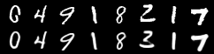
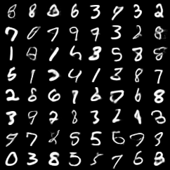
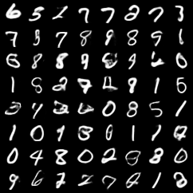

# VAE 详解与 MNIST 图像生成实现

### 本教程从 VAE 的提出动机、概率模型、ELBO 推导、最终训练目标，到 MNIST 图像生成代码实现进行完整讲解。重点是理解 VAE 为什么这样设计，以及训练和生成时应该如何判断模型是否真的学到了可采样的潜空间。

---

## 0. 学习路线

VAE 的主线可以压缩成四步：

1. 普通 Autoencoder 能重建，但潜空间不一定能随机采样。
2. 隐变量生成模型能描述“先采样 $z$，再生成 $x$”，但边缘似然 $\log p_{\theta}(x)$ 难以直接计算。
3. VAE 引入近似后验 $q_{\phi}(z|x)$，用 ELBO 代替不可直接优化的真实似然。
4. 训练目标最终变成“重建损失 + KL 损失”，既要求重建好，又要求潜空间接近标准正态分布。

> VAE 是一个带概率潜空间的生成模型。它把 Autoencoder 的重建能力和变分推断的概率建模结合起来，使模型能够从简单先验 $p(z)=\mathcal{N}(0,I)$ 中采样并生成新数据。

---

## 1. 为什么需要 VAE

### 1.1 生成模型真正想学习什么

给定训练数据：

$$
x_1,x_2,\dots,x_n
$$

生成模型希望学习真实数据分布：

$$
p_{\theta}(x)
$$

其中 $x$ 是数据，$\theta$ 是模型参数。最大似然训练目标为：

$$
\max_{\theta}\sum_{i=1}^{n}\log p_{\theta}(x_i)
$$

这个目标表示：真实样本在模型分布下应该具有较高概率。

训练好以后，生成模型应该能够：

- 判断一个样本是否像真实数据；
- 从模型中随机采样新样本；
- 在潜空间中进行插值和控制；
- 学到数据背后的低维结构。

### 1.2 普通 Autoencoder 的问题

普通 Autoencoder 的结构是：

$$
x \rightarrow Encoder \rightarrow z \rightarrow Decoder \rightarrow \hat{x}
$$

它的目标是让重建结果 $\hat{x}$ 接近原始输入 $x$：

$$
\hat{x}\approx x
$$

普通 AE 适合做压缩、降维、去噪和特征学习，但它不天然是生成模型。原因是普通 AE 的 Encoder 输出的是一个确定点：

$$
z=f_{\phi}(x)
$$

这只保证训练样本能被映射到某些潜变量点附近，并不保证整个潜空间连续、规整、可采样。

因此会出现三个问题：

1. 潜空间可能存在空洞。
2. 随机采样的 $z$ 不一定能生成合理样本。
3. 两个样本之间做潜变量插值时，中间区域可能没有意义。

普通 AE 可以重建，但不能保证生成。

### 1.3 隐变量生成模型的自然想法

为了生成数据，可以假设每个样本背后有一个潜变量 $z$。生成过程为：

$$
z\sim p(z)
$$

$$
x\sim p_{\theta}(x|z)
$$

常见先验为标准正态分布：

$$
p(z)=\mathcal{N}(0,I)
$$

联合分布为：

$$
p_{\theta}(x,z)=p_{\theta}(x|z)p(z)
$$

如果能训练这个模型，生成时只需要先从 $p(z)$ 中采样，再用 Decoder 生成 $x$。

### 1.4 直接训练隐变量模型为什么困难

训练数据中只有 $x$，没有对应的 $z$。因此训练目标需要边缘似然：

$$
p_{\theta}(x)=\int p_{\theta}(x,z)dz
=\int p_{\theta}(x|z)p(z)dz
$$

如果 Decoder 是神经网络，这个积分通常不可解。原因包括：

- $z$ 是高维连续变量；
- $p_{\theta}(x|z)$ 由复杂非线性神经网络定义；
- 积分没有解析解；
- 对每个样本做数值积分代价极高。

真实后验也不可直接计算：

$$
p_{\theta}(z|x)
{=}
\frac{p_{\theta}(x|z)p(z)}{p_{\theta}(x)}
$$

因为分母 $p_{\theta}(x)$ 不可解，所以 $p_{\theta}(z|x)$ 也不可解。

VAE 的关键创造性就在这里：用一个可训练的近似后验 $q_{\phi}(z|x)$ 代替真实后验 $p_{\theta}(z|x)$，再构造一个可优化的下界。

### 1.5 VAE 的基本模型

VAE 包含三个概率对象：

1. 先验分布：

$$
p(z)=\mathcal{N}(0,I)
$$

2. 生成分布：

$$
p_{\theta}(x|z)
$$

3. 近似后验：

$$
q_{\phi}(z|x)
$$

在神经网络实现中：

- Encoder 表示 $q_{\phi}(z|x)$；
- Decoder 表示 $p_{\theta}(x|z)$；
- 标准正态分布表示 $p(z)$。

Encoder 不再输出单个潜变量点，而是输出一个分布：

$$
q_{\phi}(z|x)=
\mathcal{N}\left(
\mu_{\phi}(x),
\mathrm{diag}(\sigma_{\phi}^{2}(x))
\right)
$$

也就是输出均值 $\mu$ 和对数方差 $\log\sigma^2$。然后从该分布采样 $z$，再送入 Decoder 重建或生成。

VAE 与普通 AE 的核心差别是：

$$
\text{AE: } z=f_{\phi}(x)
$$

$$
\text{VAE: } z\sim q_{\phi}(z|x)
$$

这个改变让潜变量从“一个编码点”变成“一个概率分布”，从而为随机生成和潜空间规整化提供了基础。

---

## 2. VAE 的模型推导

本章只讲两条推导路线。它们得到的是同一个 ELBO，但回答的问题不同。

- **路线一：Jensen 不等式路线**  
  回答“为什么可以把不可解的 $\log p_{\theta}(x)$ 变成一个可优化的下界”。

- **路线二：似然分解路线**  
  回答“ELBO 和真实 $\log p_{\theta}(x)$ 之间到底差了什么”。

### 2.1 路线一：从 Jensen 不等式得到可训练下界

这条路线的目标是从训练目标出发，构造一个可以优化的下界。

VAE 原本想最大化边缘对数似然：

$$
\log p_{\theta}(x)
{=}
\log \int p_{\theta}(x,z)dz
$$

这里的问题是积分不可解。因为训练数据只有 $x$，潜变量 $z$ 不可观测，所以要把所有可能的 $z$ 积分掉。

第一步，在积分里乘除一个分布 $q_{\phi}(z|x)$：

$$
\log p_{\theta}(x)
{=}
\log \int
q_{\phi}(z|x)
\frac{p_{\theta}(x,z)}{q_{\phi}(z|x)}
dz
$$

这一步没有改变数值，因为只是同时乘以和除以同一个量。这样做的目的，是把积分改写成关于 $q_{\phi}(z|x)$ 的期望：

$$
\log p_{\theta}(x)
{=}
\log
\mathbb{E}_{q_{\phi}(z|x)}
\left[
\frac{p_{\theta}(x,z)}{q_{\phi}(z|x)}
\right]
$$

第二步，用 Jensen 不等式把 $\log$ 放进期望里面。由于 $\log$ 是凹函数：

$$
\log \mathbb{E}[Y]\geq \mathbb{E}[\log Y]
$$

令：

$$
Y=
\frac{p_{\theta}(x,z)}{q_{\phi}(z|x)}
$$

就得到：

$$
\log p_{\theta}(x)
\geq
\mathbb{E}_{q_{\phi}(z|x)}
\left[
\log
\frac{p_{\theta}(x,z)}{q_{\phi}(z|x)}
\right]
$$

右侧就是 ELBO：

$$
\mathcal{L}(\theta,\phi;x)
{=}
\mathbb{E}_{q_{\phi}(z|x)}
\left[
\log
\frac{p_{\theta}(x,z)}{q_{\phi}(z|x)}
\right]
$$

因此，VAE 不直接优化不可解的 $\log p_{\theta}(x)$，而是优化它的下界：

$$
\log p_{\theta}(x)\geq \mathcal{L}(\theta,\phi;x)
$$

接下来把 ELBO 展开成可实现的 loss。由联合分布：

$$
p_{\theta}(x,z)=p_{\theta}(x|z)p(z)
$$

可得：

$$
\mathcal{L}(\theta,\phi;x)
{=}
\mathbb{E}_{q_{\phi}(z|x)}
\left[
\log p_{\theta}(x|z)+\log p(z)-\log q_{\phi}(z|x)
\right]
$$

把重建项和 KL 项分开：

$$
\mathcal{L}(\theta,\phi;x)
{=}
\mathbb{E}_{q_{\phi}(z|x)}
\left[
\log p_{\theta}(x|z)
\right]
{-}
D_{KL}\left(q_{\phi}(z|x)\|p(z)\right)
$$

这就是路线一的结论：

$$
\boxed{
\mathcal{L}(\theta,\phi;x)
{=}
\mathbb{E}_{q_{\phi}(z|x)}
\left[
\log p_{\theta}(x|z)
\right]
{-}
D_{KL}\left(q_{\phi}(z|x)\|p(z)\right)
}
$$

它有两个部分：

- $\mathbb{E}_{q_{\phi}(z|x)}[\log p_{\theta}(x|z)]$：重建项，鼓励 Decoder 从 $z$ 还原 $x$；
- $D_{KL}(q_{\phi}(z|x)\|p(z))$：先验约束，鼓励 Encoder 输出的分布接近标准正态分布。

训练时通常最小化负 ELBO：

$$
\text{Loss}
{=}
{-}
\mathcal{L}(\theta,\phi;x)
$$

也就是：

$$
\boxed{
\text{VAE Loss}
{=}
\text{Reconstruction Loss}
+
\text{KL Loss}
}
$$

如果：

$$
q_{\phi}(z|x)=
\mathcal{N}
\left(
\mu,
\mathrm{diag}(\sigma^2)
\right)
$$

并且：

$$
p(z)=\mathcal{N}(0,I)
$$

那么 KL 项有解析解：

$$
D_{KL}\left(q_{\phi}(z|x)\|p(z)\right)
{=}
\frac{1}{2}
\sum_j
\left(
\mu_j^2+\sigma_j^2-\log\sigma_j^2-1
\right)
$$

如果网络输出的是 $\log\sigma^2$，记为 `logvar`，则常写成：

$$
D_{KL}
{=}
{-}
\frac{1}{2}
\sum_j
\left(
1+\text{logvar}_j-\mu_j^2-\exp(\text{logvar}_j)
\right)
$$

### 2.2 路线二：从似然分解理解 ELBO 的差距

这条路线不先用 Jensen 不等式，而是直接把真实对数似然拆成两部分。它的目标是解释：ELBO 为什么是下界，以及这个下界离真实目标差在哪里。

因为 $\log p_{\theta}(x)$ 与 $z$ 无关：

$$
\log p_{\theta}(x)
{=}
\mathbb{E}_{q_{\phi}(z|x)}[\log p_{\theta}(x)]
$$

接下来用贝叶斯关系改写 $p_{\theta}(x)$。由：

$$
p_{\theta}(x)=\frac{p_{\theta}(x,z)}{p_{\theta}(z|x)}
$$

可得：

$$
\log p_{\theta}(x)
{=}
\mathbb{E}_{q_{\phi}(z|x)}
\left[
\log
\frac{p_{\theta}(x,z)}{p_{\theta}(z|x)}
\right]
$$

然后在分式中引入 $q_{\phi}(z|x)$：

$$
\log p_{\theta}(x)
{=}
\mathbb{E}_{q_{\phi}(z|x)}
\left[
\log
\left(
\frac{p_{\theta}(x,z)}{q_{\phi}(z|x)}
\cdot
\frac{q_{\phi}(z|x)}{p_{\theta}(z|x)}
\right)
\right]
$$

把对数里的乘法拆成加法：

$$
\log p_{\theta}(x)
{=}
\mathbb{E}_{q_{\phi}(z|x)}
\left[
\log
\frac{p_{\theta}(x,z)}{q_{\phi}(z|x)}
\right]
+
\mathbb{E}_{q_{\phi}(z|x)}
\left[
\log
\frac{q_{\phi}(z|x)}{p_{\theta}(z|x)}
\right]
$$

第一项就是 ELBO：

$$
\mathcal{L}(\theta,\phi;x)
{=}
\mathbb{E}_{q_{\phi}(z|x)}
\left[
\log
\frac{p_{\theta}(x,z)}{q_{\phi}(z|x)}
\right]
$$

第二项是近似后验和真实后验之间的 KL 散度：

$$
D_{KL}
\left(
q_{\phi}(z|x)\|p_{\theta}(z|x)
\right)
$$

所以得到：

$$
\boxed{
\log p_{\theta}(x)
{=}
\mathcal{L}(\theta,\phi;x)
+
D_{KL}
\left(
q_{\phi}(z|x)\|p_{\theta}(z|x)
\right)
}
$$

因为 KL 散度一定非负：

$$
D_{KL}
\left(
q_{\phi}(z|x)\|p_{\theta}(z|x)
\right)
\geq 0
$$

所以：

$$
\mathcal{L}(\theta,\phi;x)\leq \log p_{\theta}(x)
$$

这就是路线二的结论：

> ELBO 之所以是下界，是因为它和真实 $\log p_{\theta}(x)$ 之间差了一个非负的后验 KL。

这条路线还解释了两个 KL 的不同作用：

- $D_{KL}(q_{\phi}(z|x)\|p_{\theta}(z|x))$：理论上的后验差距，用来解释 ELBO 与真实似然的差距，但不能直接训练，因为真实后验不可解；
- $D_{KL}(q_{\phi}(z|x)\|p(z))$：训练 loss 中的先验约束，可以直接计算，用来让潜空间接近标准正态分布。

两条路线得到的是同一个训练目标。最终 VAE 模型为：

- Encoder 输出 $\mu$ 和 $\log\sigma^2$；
- 用重参数化得到 $z$；
- Decoder 从 $z$ 重建或生成图像；
- loss 由重建损失和 KL 损失组成。

---

## 3. VAE代码实现

本节结合代码片段说明实现方式。完整代码位于：

- `code/train_mnist_unet_vae.py`
- `code/generate_mnist_unet_vae.py`

数据集采用mnist数据集，会自动下载，不用担心数据集的问题，需要自行安装好torch。

这里的模型使用 U-Net 风格的卷积下采样和上采样结构。需要注意：生成阶段只有随机潜变量 $z$，没有输入图像，因此不能依赖输入图像的跨层 skip feature。代码采用“U-Net 风格层级卷积结构”，而不是依赖输入 skip 的完整 U-Net。

### 3.1 模型结构

训练脚本中的核心模型是 `UNetVAE`。Encoder 将 $1\times28\times28$ 的 MNIST 图像下采样到高维特征，再输出 `mu` 和 `logvar`：

```python
self.enc1 = nn.Sequential(nn.Conv2d(1, base, 3, padding=1), nn.GroupNorm(4, base), nn.SiLU())
self.enc2 = nn.Sequential(nn.Conv2d(base, base * 2, 4, stride=2, padding=1), nn.GroupNorm(8, base * 2), nn.SiLU())
self.enc3 = nn.Sequential(nn.Conv2d(base * 2, base * 4, 4, stride=2, padding=1), nn.GroupNorm(8, base * 4), nn.SiLU())
self.fc_mu = nn.Linear(base * 4 * 7 * 7, latent_dim)
self.fc_logvar = nn.Linear(base * 4 * 7 * 7, latent_dim)
```

Decoder 将潜变量 $z$ 投影回 $7\times7$ 特征图，再逐步上采样回 $28\times28$：

```python
self.fc_dec = nn.Linear(latent_dim, base * 4 * 7 * 7)
self.dec1 = nn.Sequential(nn.ConvTranspose2d(base * 4, base * 2, 4, stride=2, padding=1), nn.GroupNorm(8, base * 2), nn.SiLU())
self.dec2 = nn.Sequential(nn.ConvTranspose2d(base * 2, base, 4, stride=2, padding=1), nn.GroupNorm(4, base), nn.SiLU())
self.out = nn.Conv2d(base, 1, 3, padding=1)
```

输出层不直接接 `sigmoid`，训练时使用 `binary_cross_entropy_with_logits`。这样数值更稳定。

### 3.2 重参数化

原始采样形式是：

$$
z\sim\mathcal{N}(\mu,\sigma^2)
$$

重参数化写成：

$$
\epsilon\sim\mathcal{N}(0,I)
$$

$$
z=\mu+\sigma\odot\epsilon
$$

代码片段为：

```python
std = torch.exp(0.5 * logvar)
eps = torch.randn_like(std)
z = mu + std * eps
```

这样随机性来自 `eps`，而 `z` 是 `mu` 和 `logvar` 的可导函数，梯度可以从 Decoder 回传到 Encoder。

重参数化之后，模型训练时真正计算的是负 ELBO 的一个可导估计。对一个训练样本 $x$，计算流程可以写成：

$$
q_{\phi}(z|x)
{=}
\mathcal{N}
\left(
\mu_{\phi}(x),
\mathrm{diag}(\sigma_{\phi}^2(x))
\right)
$$

$$
\epsilon\sim\mathcal{N}(0,I),
\quad
z=\mu_{\phi}(x)+\sigma_{\phi}(x)\odot\epsilon
$$

$$
\hat{x}=\mu_{\theta}(z)
$$

因此单个样本的训练目标为：

$$
\mathcal{J}(\theta,\phi;x)
{=}
{-}
\log p_{\theta}(x|z)
+
D_{KL}
\left(
q_{\phi}(z|x)\|p(z)
\right)
$$

如果把 Decoder 的输出分布设为高斯分布：

$$
p_{\theta}(x|z)
{=}
\mathcal{N}
\left(
\mu_{\theta}(z),
\sigma_x^2 I
\right)
$$

忽略与模型参数无关的常数后，重建项等价于均方误差，真正优化的公式可以写成：

$$
\mathcal{J}(\theta,\phi;x)
\propto
\left\|x-\mu_{\theta}(z)\right\|^2
+
\frac{1}{2}
\sum_d
\left(
\mu_{\phi,d}(x)^2
+
\sigma_{\phi,d}(x)^2
{-}
1
{-}
2\log\sigma_{\phi,d}(x)
\right)
$$

这里第一项是重建误差，第二项是 $q_{\phi}(z|x)$ 与标准正态先验 $p(z)=\mathcal{N}(0,I)$ 之间的 KL 散度。实际训练一个 mini-batch 时，通常对 batch 内样本取平均：

$$
\mathcal{J}_{batch}
{=}
\frac{1}{B}
\sum_{i=1}^{B}
\left[
\mathrm{Recon}
\left(
x_i,
\mathrm{Decoder}_{\theta}(z_i)
\right)
+
\beta
D_{KL}
\left(
q_{\phi}(z|x_i)\|p(z)
\right)
\right]
$$

在下面的 MNIST 代码里，Encoder 输出的是 `logvar`，即 $\log\sigma^2$，因此 KL 项写成：

$$
D_{KL}
{=}
{-}
\frac{1}{2}
\sum_d
\left(
1+\text{logvar}_d-\mu_d^2-\exp(\text{logvar}_d)
\right)
$$

如果重建项使用 `binary_cross_entropy_with_logits`，那么代码里的总 loss 就是这个 batch 目标的实现：

$$
\text{loss}
{=}
\text{BCEWithLogits}
\left(
\text{recon\_logits},
x
\right)
+
\beta D_{KL}
$$


### 3.3 训练目标

MNIST 像素被归一化到 $[0,1]$，因此重建项使用二元交叉熵。训练脚本中使用 logits 版本：

```python
recon_loss = F.binary_cross_entropy_with_logits(recon_logits, x, reduction="sum") / x.size(0)
kl_loss = -0.5 * torch.sum(1 + logvar - mu.pow(2) - logvar.exp()) / x.size(0)
loss = recon_loss + beta * kl_loss
```

其中 `beta` 是 KL 权重。训练早期可以使用 KL warm-up：

```python
beta = min(1.0, epoch / max(1, args.warmup_epochs)) * args.beta
```

这样模型先学会基本重建，再逐渐加强潜空间约束，能缓解 KL 消失。

### 3.4 训练脚本的输出

`train_mnist_unet_vae.py` 会保存：

- `checkpoints/mnist_unet_vae.pt`：模型权重和配置；
- `outputs/recon_epoch_XXX.png`：原图和重建图对比；
- `outputs/sample_epoch_XXX.png`：从标准正态先验采样生成的图像。

运行方式：

```bash
python train_mnist_unet_vae.py --epochs 20 --batch-size 128 --latent-dim 32
```

如果机器有 CUDA，脚本会自动使用 GPU。

运行结果如下所示：

（1）原图重建结果



（2）采样生成结果



### 3.5 测试生成脚本

`generate_mnist_unet_vae.py` 只做生成：

1. 加载训练得到的 checkpoint；
2. 从 $z\sim\mathcal{N}(0,I)$ 采样；
3. 送入 Decoder；
4. 保存生成图像网格。

运行方式：

```bash
python generate_mnist_unet_vae.py --checkpoint checkpoints/mnist_unet_vae.pt --num-samples 64
```

生成脚本不需要训练数据，它只依赖训练好的 Decoder。

测试生成结果如下：



### 3.6 实现技巧

1. **优先输出 `logvar`**  
   直接输出方差容易出现负数或数值爆炸。输出 log variance 更稳定。

2. **重建 loss 和 KL loss 要分开记录**  
   只看 total loss 不够。KL 接近 0 可能表示潜变量没有被使用。

3. **保存重建图和采样图**  
   重建图看 Encoder-Decoder 是否学会压缩和还原；采样图看潜空间是否可生成。

4. **U-Net 风格结构要适配生成任务**  
   传统 U-Net 的跨层 skip connection 依赖输入图像。VAE 生成时没有输入图，因此本实现使用层级卷积结构，不使用输入依赖的 skip 拼接。

5. **潜变量维度不要盲目增大**  
   MNIST 可以从 16、32、64 开始试。维度太小会重建差，维度太大可能让部分维度闲置。

---

## 4. 常见问题

### 5.1 VAE 是不是普通 AE 加噪声

不是。VAE 的核心是概率潜变量模型和 ELBO 训练目标。噪声只是从后验分布采样的一部分。

### 5.2 为什么 VAE 可以从随机 $z$ 生成图像

训练时 KL 项让 $q_{\phi}(z|x)$ 接近 $p(z)=\mathcal{N}(0,I)$。因此训练结束后，从标准正态采样的 $z$ 更可能落在 Decoder 熟悉的区域。

### 5.3 为什么训练代码使用 logits

对 MNIST 使用二元交叉熵时，`binary_cross_entropy_with_logits` 比先 `sigmoid` 再 BCE 更稳定。生成和保存图片时再对 logits 做 `sigmoid`。

### 5.4 为什么不用传统 U-Net 的输入 skip

传统 U-Net 的 skip connection 从输入图像提取特征并传给 Decoder。VAE 生成阶段没有输入图像，只有随机 $z$，因此不能依赖这种输入特征。这里使用的是 U-Net 风格的卷积下采样和上采样结构。

---

## 5. 总结

VAE 的最终模型由三部分组成：

$$
q_{\phi}(z|x)
{=}
\mathcal{N}
\left(
\mu_{\phi}(x),
\mathrm{diag}(\sigma_{\phi}^{2}(x))
\right)
$$

$$
z=\mu+\sigma\odot\epsilon,\quad \epsilon\sim\mathcal{N}(0,I)
$$

$$
x\sim p_{\theta}(x|z)
$$

最终训练目标为：

$$
\text{Loss}
{=}
\text{Reconstruction Loss}
+
\text{KL Loss}
$$

其中：

$$
\text{KL Loss}
{=}
D_{KL}\left(q_{\phi}(z|x)\|p(z)\right)
$$

VAE 的价值在于：它不只让模型重建输入，还把数据组织进一个连续、规则、可采样的潜空间。这个潜空间使得随机生成、插值和表示学习成为可能。

---

## 6. 课后习题

1. 普通 AE 为什么不能保证随机采样有效？
2. VAE 为什么让 Encoder 输出分布而不是点？
3. 为什么 $\log p_{\theta}(x)$ 难以直接优化？
4. ELBO 是如何由 Jensen 不等式得到的？
5. $\log p_{\theta}(x)=ELBO+KL(q_{\phi}(z|x)\|p_{\theta}(z|x))$ 说明了什么？
6. 训练 loss 中的 KL 为什么是 $KL(q_{\phi}(z|x)\|p(z))$？
7. 重参数化技巧为什么能让采样过程可训练？
8. KL loss 接近 0 可能意味着什么？
9. 评估 VAE 时为什么要同时看重建图和随机采样图？
