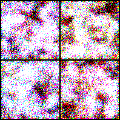
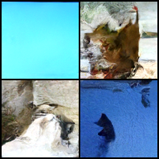

# DDPM 详解与代码实现

### 本教程从 VAE 的局限出发，解释 DDPM 为什么要把“一次生成”改成“多步去噪”，再从前向扩散、反向生成、ELBO、真实后验、噪声预测目标一路推导到最终训练和采样公式。

---

## 0. 学习路线

DDPM 的主线可以压缩成五步：

1. VAE 通过潜变量 $z$ 一步生成图像，但压缩和重建假设容易带来细节损失。
2. DDPM 不急着一步生成完整图像，而是先定义一个固定的加噪过程，把真实图像逐步变成高斯噪声。
3. 生成时从高斯噪声开始，训练神经网络学习每一步如何去掉一点噪声。
4. 严格推导来自最大似然和 ELBO，但最终可以简化成一个很直观的监督学习任务：预测加到图像里的噪声。
5. 实现时的核心不是复杂 loss，而是正确处理噪声日程、时间步、U-Net 输入输出、采样公式和数值范围。

> DDPM 先把图像逐步加噪到接近纯噪声，再训练模型反过来逐步去噪；它把高难度的“一步生成图像”拆成很多个简单的“预测并去掉噪声”问题。

DDPM 最常用的训练目标是：

$$
\mathcal{L}_{\mathrm{simple}}(\theta)
{=}
\mathbb{E}_{t,x_0,\epsilon}
\left[
\left\|
\epsilon-\epsilon_\theta(x_t,t)
\right\|^2
\right]
$$

其中：

$$
x_t
{=}
\sqrt{\bar{\alpha}_t}x_0
+
\sqrt{1-\bar{\alpha}_t}\epsilon,
\quad
\epsilon\sim\mathcal{N}(0,I)
$$

也就是说，训练时我们知道真实噪声 $\epsilon$，网络只需要根据带噪图像 $x_t$ 和时间步 $t$ 把它预测出来。

---

## 1. 为什么需要 DDPM

### 1.1 VAE 存在的几个问题

VAE 很重要，但它也有几个常见问题。

第一，VAE 通常把图像压缩到一个低维潜变量：

$$
x\rightarrow z\rightarrow \hat{x}
$$

如果 $z$ 的容量不足，细节会丢失，生成图像容易偏模糊。

第二，VAE 的重建项常对应像素级似然。以高斯似然为例，最大化 $\log p_\theta(x|z)$ 常等价于最小化均方误差。均方误差会鼓励模型输出“平均答案”，而平均图像往往看起来不锐利。

第三，VAE 一步从 $z$ 生成 $x$：

$$
z\rightarrow x
$$

这要求 Decoder 在一次前向传播中完成从抽象语义到全部像素细节的生成。对复杂图像来说，这个映射压力很大。

所以 VAE 的核心矛盾可以理解为：

> 它想用一个规整、可采样的潜空间生成图像，但这个压缩和一步解码过程可能损失高频细节。

### 1.2 DDPM 怎么换一个思路

DDPM 不再把生成看成：

$$
z\rightarrow x
$$

而是看成：

$$
x_T\rightarrow x_{T-1}\rightarrow\cdots\rightarrow x_1\rightarrow x_0
$$

其中：

- $x_0$ 是真实干净图像；
- $x_1,\dots,x_T$ 是逐步加噪后的图像；
- $x_T$ 接近标准高斯噪声。

生成时先采样：

$$
x_T\sim\mathcal{N}(0,I)
$$

然后每一步只做一件小事：

> 根据当前带噪图像，预测噪声并去掉一点噪声。

DDPM 的好处是：

1. 训练目标稳定，不需要 GAN 那样的对抗训练。
2. 每一步任务简单，只需要学习局部去噪。
3. 图像空间中逐步生成，不需要把所有细节压进一个很小的潜变量。
4. 可以使用 U-Net 保留多尺度空间细节。
5. 数学上可以从 ELBO 推导到简单的噪声预测 MSE。

---

## 2. DDPM 的基本设定

DDPM 有两个过程：

1. 前向扩散过程：固定规则，不需要学习，把真实图像逐步加噪。
2. 反向生成过程：需要学习，从噪声逐步去噪生成图像。

### 2.1 前向扩散过程

前向过程从真实图像 $x_0$ 出发：

$$
x_0\rightarrow x_1\rightarrow x_2\rightarrow\cdots\rightarrow x_T
$$

DDPM 把它定义为 Markov chain：

$$
q(x_{1:T}|x_0)
{=}
\prod_{t=1}^{T}
q(x_t|x_{t-1})
$$

Markov chain 的意思是：如果已经知道 $x_{t-1}$，那么生成 $x_t$ 时不需要再直接看更早的状态。

每一步加噪定义为：

$$
q(x_t|x_{t-1})
{=}
\mathcal{N}
\left(
x_t;
\sqrt{1-\beta_t}x_{t-1},
\beta_t I
\right)
$$

这里：

- $\beta_t$ 是第 $t$ 步的噪声强度；
- $\beta_t I$ 表示每个维度加入方差为 $\beta_t$ 的独立高斯噪声；
- $\sqrt{1-\beta_t}x_{t-1}$ 表示保留一部分上一时刻的图像信号。

通常定义：

$$
\alpha_t=1-\beta_t
$$

于是：

$$
\boxed{
q(x_t|x_{t-1})
{=}
\mathcal{N}
\left(
x_t;
\sqrt{\alpha_t}x_{t-1},
(1-\alpha_t)I
\right)
}
$$

### 2.2 从分布写成采样公式

如果：

$$
x\sim\mathcal{N}(\mu,\sigma^2I)
$$

就可以写成：

$$
x=\mu+\sigma\epsilon,
\quad
\epsilon\sim\mathcal{N}(0,I)
$$

把这个规则用到 DDPM 的一步前向分布：

$$
x_t|x_{t-1}
\sim
\mathcal{N}
\left(
\sqrt{\alpha_t}x_{t-1},
(1-\alpha_t)I
\right)
$$

得到：

$$
\boxed{
x_t
{=}
\sqrt{\alpha_t}x_{t-1}
+
\sqrt{1-\alpha_t}\epsilon_t
}
$$

其中：

$$
\epsilon_t\sim\mathcal{N}(0,I)
$$

这就是一步加噪公式。

### 2.3 为什么系数用平方根

很多初学者会问：为什么是 $\sqrt{1-\beta_t}$，而不是 $1-\beta_t$？

假设 $x_{t-1}$ 的方差大约是 $I$，噪声 $\epsilon_t$ 的方差也是 $I$。如果：

$$
x_t
{=}
\sqrt{1-\beta_t}x_{t-1}
+
\sqrt{\beta_t}\epsilon_t
$$

那么方差大约是：

$$
\mathrm{Var}(x_t)
{=}
(1-\beta_t)I+\beta_t I
{=}
I
$$

也就是说，每一步加噪后，整体尺度不会突然变大或变小。

如果改成：

$$
x_t=(1-\beta_t)x_{t-1}+\sqrt{\beta_t}\epsilon_t
$$

那么方差会变成：

$$
(1-\beta_t)^2I+\beta_t I
$$

它不再正好等于 $I$。所以 DDPM 使用平方根系数，是为了让信号和噪声的方差配比稳定。

---

## 3. 从一步加噪到任意时刻加噪

训练 DDPM 时，如果每次都从 $x_0$ 一步步加噪到 $x_t$，会很慢。幸运的是，前向过程有闭式公式，可以直接从 $x_0$ 得到任意时间步的 $x_t$。

最终公式是：

$$
\boxed{
q(x_t|x_0)
{=}
\mathcal{N}
\left(
x_t;
\sqrt{\bar{\alpha}_t}x_0,
(1-\bar{\alpha}_t)I
\right)
}
$$

其中：

$$
\bar{\alpha}_t
{=}
\prod_{s=1}^{t}\alpha_s
$$

对应采样公式是：

$$
\boxed{
x_t
{=}
\sqrt{\bar{\alpha}_t}x_0
+
\sqrt{1-\bar{\alpha}_t}\epsilon
}
$$

其中：

$$
\epsilon\sim\mathcal{N}(0,I)
$$

这个公式非常重要。它说明训练时可以随机选择一个时间步 $t$，然后一次性构造对应的带噪图像 $x_t$。

### 3.1 两步展开看懂闭式公式

一步加噪是：

$$
x_t
{=}
\sqrt{\alpha_t}x_{t-1}
+
\sqrt{1-\alpha_t}\epsilon_t
$$

再写出上一时刻：

$$
x_{t-1}
{=}
\sqrt{\alpha_{t-1}}x_{t-2}
+
\sqrt{1-\alpha_{t-1}}\epsilon_{t-1}
$$

代入第一式：

$$
x_t
{=}
\sqrt{\alpha_t}
\left(
\sqrt{\alpha_{t-1}}x_{t-2}
+
\sqrt{1-\alpha_{t-1}}\epsilon_{t-1}
\right)
+
\sqrt{1-\alpha_t}\epsilon_t
$$

展开：

$$
x_t
{=}
\sqrt{\alpha_t\alpha_{t-1}}x_{t-2}
+
\sqrt{\alpha_t(1-\alpha_{t-1})}\epsilon_{t-1}
+
\sqrt{1-\alpha_t}\epsilon_t
$$

后两项都是独立高斯噪声的线性组合，所以仍然是高斯噪声。它的方差是：

$$
\alpha_t(1-\alpha_{t-1})+(1-\alpha_t)
{=}
1-\alpha_t\alpha_{t-1}
$$

因此可以合并成一个新的标准高斯噪声 $\epsilon$：

$$
x_t
{=}
\sqrt{\alpha_t\alpha_{t-1}}x_{t-2}
+
\sqrt{1-\alpha_t\alpha_{t-1}}\epsilon
$$

继续递推到 $x_0$，就得到：

$$
x_t
{=}
\sqrt{\alpha_t\alpha_{t-1}\cdots\alpha_1}x_0
+
\sqrt{1-\alpha_t\alpha_{t-1}\cdots\alpha_1}\epsilon
$$

定义：

$$
\bar{\alpha}_t
{=}
\alpha_t\alpha_{t-1}\cdots\alpha_1
$$

就得到任意时刻公式：

$$
x_t
{=}
\sqrt{\bar{\alpha}_t}x_0
+
\sqrt{1-\bar{\alpha}_t}\epsilon
$$

### 3.2 为什么 $x_T$ 会接近标准高斯噪声

因为：

$$
\bar{\alpha}_t
{=}
\prod_{s=1}^{t}\alpha_s
$$

而：

$$
\alpha_s=1-\beta_s<1
$$

当 $t$ 足够大时：

$$
\bar{\alpha}_t\rightarrow 0
$$

代入：

$$
x_t
{=}
\sqrt{\bar{\alpha}_t}x_0
+
\sqrt{1-\bar{\alpha}_t}\epsilon
$$

第一项会消失：

$$
\sqrt{\bar{\alpha}_t}x_0\rightarrow 0
$$

第二项会变成：

$$
\sqrt{1-\bar{\alpha}_t}\epsilon\rightarrow\epsilon
$$

所以：

$$
x_T\approx\epsilon\sim\mathcal{N}(0,I)
$$

这解释了为什么生成时可以从纯高斯噪声开始。

---

## 4. 反向扩散过程

前向过程是人为固定的，不需要学习。真正需要学习的是反向过程：

$$
x_T\rightarrow x_{T-1}\rightarrow\cdots\rightarrow x_0
$$

模型联合分布写成：

$$
p_\theta(x_{0:T})
{=}
p(x_T)
\prod_{t=1}^{T}
p_\theta(x_{t-1}|x_t)
$$

其中：

$$
p(x_T)=\mathcal{N}(0,I)
$$

反向一步通常也设为高斯分布：

$$
\boxed{
p_\theta(x_{t-1}|x_t)
{=}
\mathcal{N}
\left(
x_{t-1};
\mu_\theta(x_t,t),
\sigma_t^2I
\right)
}
$$

这里：

- $\mu_\theta(x_t,t)$ 是神经网络预测出的反向均值；
- $\sigma_t^2I$ 是反向方差，很多基础实现中先固定不学；
- 网络输入是带噪图像 $x_t$ 和时间步 $t$；
- 网络输出可以设计成预测均值、预测原图 $x_0$ 或预测噪声 $\epsilon$。

直觉上，反向一步在做：

> 给定当前噪声图 $x_t$，猜测上一步稍微干净一点的图像 $x_{t-1}$ 应该在哪里。

---

## 5. 训练目标：从最大似然到 ELBO

DDPM 作为生成模型，本来希望最大化真实图像的似然：

$$
\log p_\theta(x_0)
$$

但：

$$
p_\theta(x_0)
{=}
\int p_\theta(x_{0:T})dx_{1:T}
$$

这个积分需要把所有中间变量 $x_1,\dots,x_T$ 都积分掉，直接计算很困难。

因此 DDPM 使用变分下界。训练时最小化负 ELBO：

$$
\mathcal{L}
{=}
\mathbb{E}_{q(x_{1:T}|x_0)}
\left[
{-}
\log
\frac{
p_\theta(x_{0:T})
}{
q(x_{1:T}|x_0)
}
\right]
$$

其中：

$$
p_\theta(x_{0:T})
{=}
p(x_T)
\prod_{t=1}^{T}
p_\theta(x_{t-1}|x_t)
$$

$$
q(x_{1:T}|x_0)
{=}
\prod_{t=1}^{T}
q(x_t|x_{t-1})
$$

详细代数推导放在附录 A。主文只保留结论：

$$
\boxed{
\mathcal{L}
{=}
\mathbb{E}_q
\left[
D_{\mathrm{KL}}
\left(
q(x_T|x_0)\|p(x_T)
\right)
+
\sum_{t>1}
D_{\mathrm{KL}}
\left(
q(x_{t-1}|x_t,x_0)
\|
p_\theta(x_{t-1}|x_t)
\right)
{-}
\log p_\theta(x_0|x_1)
\right]
}
$$

它有三类项。

第一项：

$$
D_{\mathrm{KL}}
\left(
q(x_T|x_0)\|p(x_T)
\right)
$$

表示最终噪声分布要接近标准高斯。因为 $T$ 足够大时 $q(x_T|x_0)\approx\mathcal{N}(0,I)$，这一项通常接近常数。

中间项：

$$
D_{\mathrm{KL}}
\left(
q(x_{t-1}|x_t,x_0)
\|
p_\theta(x_{t-1}|x_t)
\right)
$$

是训练的核心。它要求模型学到的反向一步分布 $p_\theta(x_{t-1}|x_t)$ 接近真实后验 $q(x_{t-1}|x_t,x_0)$。

最后一项：

$$
-\log p_\theta(x_0|x_1)
$$

表示从 $x_1$ 恢复 $x_0$ 的重建误差。

所以 DDPM 的关键问题变成：

> 如何让神经网络学会逼近真实后验 $q(x_{t-1}|x_t,x_0)$？

---

## 6. 真实后验与均值匹配

真实后验是：

$$
q(x_{t-1}|x_t,x_0)
$$

它表示：如果已知原图 $x_0$ 和当前带噪图 $x_t$，那么上一时刻 $x_{t-1}$ 应该是什么分布。

根据贝叶斯公式：

$$
q(x_{t-1}|x_t,x_0)
{=}
\frac{
q(x_t|x_{t-1},x_0)
q(x_{t-1}|x_0)
}{
q(x_t|x_0)
}
$$

由于前向过程是马尔科夫链：

$$
q(x_t|x_{t-1},x_0)
{=}
q(x_t|x_{t-1})
$$

所以：

$$
q(x_{t-1}|x_t,x_0)
{=}
\frac{
q(x_t|x_{t-1})
q(x_{t-1}|x_0)
}{
q(x_t|x_0)
}
$$

右边三个分布都是高斯，所以结果仍然是高斯：

$$
\boxed{
q(x_{t-1}|x_t,x_0)
{=}
\mathcal{N}
\left(
x_{t-1};
\tilde{\mu}_t(x_t,x_0),
\tilde{\beta}_tI
\right)
}
$$

其中：

$$
\boxed{
\tilde{\mu}_t(x_t,x_0)
{=}
\frac{
\sqrt{\bar{\alpha}_{t-1}}\beta_t
}{
1-\bar{\alpha}_t
}
x_0
+
\frac{
\sqrt{\alpha_t}(1-\bar{\alpha}_{t-1})
}{
1-\bar{\alpha}_t
}
x_t
}
$$

以及：

$$
\boxed{
\tilde{\beta}_t
{=}
\frac{
1-\bar{\alpha}_{t-1}
}{
1-\bar{\alpha}_t
}
\beta_t
}
$$

详细配方推导放在附录 B。主文先理解它的含义：

- 真实后验均值 $\tilde{\mu}_t(x_t,x_0)$ 是 $x_0$ 和 $x_t$ 的线性组合；
- 它告诉我们从 $x_t$ 往回走一步时，最合理的中心位置；
- 训练模型时，可以让模型预测的均值 $\mu_\theta(x_t,t)$ 去接近这个真实均值。

模型反向分布是：

$$
p_\theta(x_{t-1}|x_t)
{=}
\mathcal{N}
\left(
x_{t-1};
\mu_\theta(x_t,t),
\sigma_t^2I
\right)
$$

如果固定方差，那么两个高斯分布之间的 KL 与模型有关的部分就是均值 MSE：

$$
L_{t-1}
{=}
\mathbb{E}_q
\left[
\frac{1}{2\sigma_t^2}
\left\|
\tilde{\mu}_t(x_t,x_0)
{-}
\mu_\theta(x_t,t)
\right\|^2
\right]
+
C
$$

其中 $C$ 是与模型参数 $\theta$ 无关的常数。

这一步把复杂的概率匹配问题变成了：

> 让模型预测的反向均值接近真实后验均值。

---

## 7. 从预测均值到预测噪声

理论上，网络可以直接预测：

$$
\mu_\theta(x_t,t)
$$

但 DDPM 实践中更常预测噪声：

$$
\epsilon_\theta(x_t,t)
$$

这一步看起来突然，其实来自公式重写。

### 7.1 先从预测 $x_0$ 开始

真实后验均值可以写成：

$$
\tilde{\mu}_t(x_t,x_0)
{=}
A_tx_0+B_tx_t
$$

其中：

$$
A_t
{=}
\frac{
\sqrt{\bar{\alpha}_{t-1}}\beta_t
}{
1-\bar{\alpha}_t
}
$$

$$
B_t
{=}
\frac{
\sqrt{\alpha_t}(1-\bar{\alpha}_{t-1})
}{
1-\bar{\alpha}_t
}
$$

生成时不知道真实 $x_0$，所以可以让网络预测原图：

$$
x_{0,\theta}(x_t,t)
$$

再构造：

$$
\mu_\theta(x_t,t)
{=}
\tilde{\mu}_t
\left(
x_t,
x_{0,\theta}(x_t,t)
\right)
$$

这说明预测原图 $x_0$ 和预测均值 $\mu_\theta$ 是可以互相转换的。

### 7.2 再从预测 $x_0$ 改成预测噪声

前向加噪公式是：

$$
x_t
{=}
\sqrt{\bar{\alpha}_t}x_0
+
\sqrt{1-\bar{\alpha}_t}\epsilon
$$

把它对 $x_0$ 求解：

$$
x_0
{=}
\frac{
x_t-\sqrt{1-\bar{\alpha}_t}\epsilon
}{
\sqrt{\bar{\alpha}_t}
}
$$

如果网络预测噪声：

$$
\epsilon_\theta(x_t,t)
$$

就可以构造预测原图：

$$
\boxed{
x_{0,\theta}(x_t,t)
{=}
\frac{
x_t-\sqrt{1-\bar{\alpha}_t}\epsilon_\theta(x_t,t)
}{
\sqrt{\bar{\alpha}_t}
}
}
$$

再把 $x_{0,\theta}$ 代入上一节的 $\mu_\theta$，得到 DDPM 最常见的反向均值参数化：

$$
\boxed{
\mu_\theta(x_t,t)
{=}
\frac{1}{\sqrt{\alpha_t}}
\left(
x_t
{-}
\frac{
\beta_t
}{
\sqrt{1-\bar{\alpha}_t}
}
\epsilon_\theta(x_t,t)
\right)
}
$$

这个公式的完整代数化简放在附录 C。

### 7.3 为什么更喜欢预测噪声

预测噪声有三个直观优势。

第一，监督信号天然可得。训练时我们自己采样：

$$
\epsilon\sim\mathcal{N}(0,I)
$$

然后构造：

$$
x_t
{=}
\sqrt{\bar{\alpha}_t}x_0
+
\sqrt{1-\bar{\alpha}_t}\epsilon
$$

所以真实噪声 $\epsilon$ 是已知标签。

第二，目标形式统一。无论图像内容多复杂，噪声始终来自标准高斯：

$$
\epsilon\sim\mathcal{N}(0,I)
$$

第三，采样公式直观。模型预测当前图像中的噪声，然后把它从 $x_t$ 中减掉。

---

## 8. 最终训练目标和采样公式

### 8.1 从均值匹配到噪声预测 MSE

真实后验均值可以写成噪声形式：

$$
\tilde{\mu}_t(x_t,x_0)
{=}
\frac{1}{\sqrt{\alpha_t}}
\left(
x_t
{-}
\frac{
\beta_t
}{
\sqrt{1-\bar{\alpha}_t}
}
\epsilon
\right)
$$

模型均值写成：

$$
\mu_\theta(x_t,t)
{=}
\frac{1}{\sqrt{\alpha_t}}
\left(
x_t
{-}
\frac{
\beta_t
}{
\sqrt{1-\bar{\alpha}_t}
}
\epsilon_\theta(x_t,t)
\right)
$$

两者相减：

$$
\tilde{\mu}_t(x_t,x_0)
{-}
\mu_\theta(x_t,t)
{=}
\frac{
\beta_t
}{
\sqrt{\alpha_t}\sqrt{1-\bar{\alpha}_t}
}
\left(
\epsilon_\theta(x_t,t)-\epsilon
\right)
$$

因此：

$$
\left\|
\tilde{\mu}_t(x_t,x_0)
{-}
\mu_\theta(x_t,t)
\right\|^2
{=}
\frac{
\beta_t^2
}{
\alpha_t(1-\bar{\alpha}_t)
}
\left\|
\epsilon-\epsilon_\theta(x_t,t)
\right\|^2
$$

代入 KL 对应的均值匹配项，会得到一个加权的噪声预测 MSE：

$$
L_{t-1}
{=}
\mathbb{E}
\left[
\frac{
\beta_t^2
}{
2\sigma_t^2\alpha_t(1-\bar{\alpha}_t)
}
\left\|
\epsilon-\epsilon_\theta(x_t,t)
\right\|^2
\right]
+
C
$$

DDPM 实践中常使用简化目标，去掉复杂权重：

$$
\boxed{
\mathcal{L}_{\mathrm{simple}}(\theta)
{=}
\mathbb{E}_{t,x_0,\epsilon}
\left[
\left\|
\epsilon-\epsilon_\theta(x_t,t)
\right\|^2
\right]
}
$$

其中：

$$
\boxed{
x_t
{=}
\sqrt{\bar{\alpha}_t}x_0
+
\sqrt{1-\bar{\alpha}_t}\epsilon
}
$$

这就是 DDPM 最常见的训练目标。

### 8.2 训练流程

一次训练迭代可以理解为：

1. 从数据集中采样真实图像：

$$
x_0\sim q_{\mathrm{data}}(x_0)
$$

2. 随机采样时间步：

$$
t\sim\mathrm{Uniform}(\{1,\dots,T\})
$$

3. 采样高斯噪声：

$$
\epsilon\sim\mathcal{N}(0,I)
$$

4. 构造带噪图像：

$$
x_t
{=}
\sqrt{\bar{\alpha}_t}x_0
+
\sqrt{1-\bar{\alpha}_t}\epsilon
$$

5. 让网络预测噪声：

$$
\epsilon_\theta(x_t,t)
$$

6. 最小化噪声预测误差：

$$
\left\|
\epsilon-\epsilon_\theta(x_t,t)
\right\|^2
$$

### 8.3 采样流程

训练完成后，从纯噪声开始：

$$
x_T\sim\mathcal{N}(0,I)
$$

然后从 $t=T$ 到 $t=1$ 逐步执行：

$$
x_{t-1}
{=}
\mu_\theta(x_t,t)
+
\sigma_tz
$$

其中：

$$
z\sim\mathcal{N}(0,I)
$$

代入噪声预测形式的均值：

$$
\boxed{
x_{t-1}
{=}
\frac{1}{\sqrt{\alpha_t}}
\left(
x_t
{-}
\frac{
\beta_t
}{
\sqrt{1-\bar{\alpha}_t}
}
\epsilon_\theta(x_t,t)
\right)
+
\sigma_tz
}
$$

通常在最后一步 $t=1$ 时不再加入随机噪声，即令：

$$
z=0
$$

这样可以避免最后输出又被额外扰动。

---

## 9. DDPM代码实现

本节结合 STL10 代码说明 DDPM 如何从公式落到 PyTorch 实现。完整代码位于：

- `code/train_stl10_ddpm.py`
- `code/generate_stl10_ddpm.py`

数据集采用 STL10，代码中使用 `split="train"`，图像默认调整为 $96\times96$。第一次运行时会自动下载数据集，需要提前安装好 `torch` 和 `torchvision`。

这份实现采用最基础的 DDPM 配置：线性 beta schedule、噪声预测目标、MSE loss、小型 U-Net 噪声预测器。它的目的不是一次写出最强扩散模型，而是先跑通“训练时加噪、模型预测噪声、采样时逐步去噪”这条闭环。

### 9.1 数据集和图像范围

STL10 是 RGB 图像，因此模型输入形状为：

$$
x_0\in\mathbb{R}^{3\times96\times96}
$$

训练脚本中先把图像 resize 到指定大小，再把像素归一化到 $[-1,1]$：

```python
transform = transforms.Compose(
    [
        transforms.Resize((args.image_size, args.image_size)),
        transforms.ToTensor(),
        transforms.Normalize((0.5, 0.5, 0.5), (0.5, 0.5, 0.5)),
    ]
)
train_set = datasets.STL10(
    root=args.data_dir,
    split="train",
    download=True,
    transform=transform,
)
```

这里的 `Normalize((0.5,0.5,0.5),(0.5,0.5,0.5))` 会把原来的 $[0,1]$ 像素变成 $[-1,1]$：

$$
x_{\text{norm}}=2x-1
$$

这样做的原因是，DDPM 最后会把图像逐渐加到标准高斯噪声附近。图像范围接近 $[-1,1]$ 时，数据尺度和噪声尺度更匹配。生成保存图片时，再把结果映射回 $[0,1]$：

```python
utils.save_image((images + 1) / 2, out_path, nrow=int(num_samples**0.5))
```

### 9.2 时间嵌入

DDPM 的网络不能只看带噪图像 $x_t$，还必须知道当前时间步 $t$。同一张图在 $t=50$ 和 $t=900$ 时噪声强度完全不同，如果不给时间信息，网络不知道应该去掉多少噪声。

代码中使用正弦时间嵌入，把整数时间步转成连续向量：

```python
class SinusoidalTimeEmbedding(nn.Module):
    def __init__(self, dim: int) -> None:
        super().__init__()
        self.dim = dim

    def forward(self, t: torch.Tensor) -> torch.Tensor:
        half = self.dim // 2
        freq = torch.exp(
            -math.log(10000)
            * torch.arange(half, device=t.device, dtype=torch.float32)
            / max(half - 1, 1)
        )
        angles = t.float()[:, None] * freq[None, :]
        emb = torch.cat([angles.sin(), angles.cos()], dim=-1)
        return F.pad(emb, (0, self.dim % 2))
```

得到的时间向量再经过 MLP：

```python
self.time_mlp = nn.Sequential(
    SinusoidalTimeEmbedding(time_dim),
    nn.Linear(time_dim, time_dim),
    nn.SiLU(),
    nn.Linear(time_dim, time_dim),
)
```

这样每个时间步都有一个可供网络使用的条件向量。

### 9.3 残差块如何注入时间信息

U-Net 中的每个残差块都接收两个输入：图像特征 `x` 和时间特征 `time_emb`。时间特征先经过线性层投影到当前通道数，再加到卷积特征图上：

```python
class ResBlock(nn.Module):
    def __init__(self, in_ch: int, out_ch: int, time_dim: int) -> None:
        super().__init__()
        self.conv1 = nn.Conv2d(in_ch, out_ch, 3, padding=1)
        self.norm1 = nn.GroupNorm(norm_groups(out_ch), out_ch)
        self.conv2 = nn.Conv2d(out_ch, out_ch, 3, padding=1)
        self.norm2 = nn.GroupNorm(norm_groups(out_ch), out_ch)
        self.time_proj = nn.Sequential(nn.SiLU(), nn.Linear(time_dim, out_ch))
        self.skip = nn.Conv2d(in_ch, out_ch, 1) if in_ch != out_ch else nn.Identity()

    def forward(self, x: torch.Tensor, time_emb: torch.Tensor) -> torch.Tensor:
        h = F.silu(self.norm1(self.conv1(x)))
        h = h + self.time_proj(time_emb)[:, :, None, None]
        h = F.silu(self.norm2(self.conv2(h)))
        return h + self.skip(x)
```

其中：

- `time_proj(time_emb)` 的形状是 `[B, C]`；
- `[:, :, None, None]` 把它变成 `[B, C, 1, 1]`；
- 加到 `h` 上时会自动 broadcast 到整张特征图。

这一步对应公式中的条件网络：

$$
\epsilon_\theta(x_t,t)
$$

也就是说，模型预测噪声时同时依赖图像状态 $x_t$ 和时间步 $t$。

### 9.4 U-Net 噪声预测器

训练脚本中的核心模型是 `UNet96`。它输入一张 $96\times96$ 的带噪 RGB 图像，输出同样大小的噪声预测：

$$
x_t\in\mathbb{R}^{3\times96\times96}
$$

$$
\epsilon_\theta(x_t,t)\in\mathbb{R}^{3\times96\times96}
$$

模型先下采样提取语义特征，再上采样恢复空间分辨率：

```python
self.in_conv = nn.Conv2d(in_ch, base, 3, padding=1)
self.down1 = ResBlock(base, base, time_dim)
self.down2 = ResBlock(base, base * 2, time_dim)
self.down3 = ResBlock(base * 2, base * 4, time_dim)
self.down4 = ResBlock(base * 4, base * 8, time_dim)
self.mid = ResBlock(base * 8, base * 8, time_dim)

self.up3 = ResBlock(base * 8 + base * 4, base * 4, time_dim)
self.up2 = ResBlock(base * 4 + base * 2, base * 2, time_dim)
self.up1 = ResBlock(base * 2 + base, base, time_dim)
self.out = nn.Sequential(
    nn.GroupNorm(norm_groups(base), base),
    nn.SiLU(),
    nn.Conv2d(base, in_ch, 3, padding=1),
)
```

前向传播时，上采样阶段会把深层特征和下采样阶段保存的特征拼接起来：

```python
x1 = self.down1(self.in_conv(x), time_emb)
x2 = self.down2(self.pool(x1), time_emb)
x3 = self.down3(self.pool(x2), time_emb)
x4 = self.down4(self.pool(x3), time_emb)
h = self.mid(x4, time_emb)

h = F.interpolate(h, scale_factor=2, mode="nearest")
h = self.up3(torch.cat([h, x3], dim=1), time_emb)
h = F.interpolate(h, scale_factor=2, mode="nearest")
h = self.up2(torch.cat([h, x2], dim=1), time_emb)
h = F.interpolate(h, scale_factor=2, mode="nearest")
h = self.up1(torch.cat([h, x1], dim=1), time_emb)
return self.out(h)
```

这里的 skip connection 很重要。DDPM 要做的是逐像素噪声预测，既需要全局语义，也需要局部纹理位置。下采样路径负责扩大感受野，上采样路径负责恢复分辨率，skip connection 负责把浅层细节送回去。

### 9.5 Diffusion 工具类

`Diffusion` 类负责两件事：

1. 预计算前向扩散和反向采样需要的系数；
2. 提供 `q_sample` 和 `sample` 两个核心函数。

初始化时先定义线性 beta schedule：

```python
self.betas = torch.linspace(beta_start, beta_end, timesteps, device=self.device)
self.alphas = 1.0 - self.betas
self.alpha_bars = torch.cumprod(self.alphas, dim=0)
self.sqrt_alpha_bars = torch.sqrt(self.alpha_bars)
self.sqrt_one_minus_alpha_bars = torch.sqrt(1.0 - self.alpha_bars)
```

这对应前面推导过的：

$$
\alpha_t=1-\beta_t
$$

$$
\bar{\alpha}_t=\prod_{s=1}^{t}\alpha_s
$$

因为这些量只和时间步有关，所以应该在初始化时一次算好，而不是每个 batch 重新计算。

`_extract` 的作用是从长度为 `timesteps` 的系数表中取出当前 batch 对应的时间步系数：

```python
def _extract(self, values: torch.Tensor, t: torch.Tensor, x: torch.Tensor) -> torch.Tensor:
    return values.gather(0, t).view(t.size(0), *((1,) * (x.ndim - 1)))
```

例如一个 batch 有 32 张图，每张图随机到不同的时间步，`_extract` 就能取出 32 个对应的 $\sqrt{\bar{\alpha}_t}$，并 reshape 成 `[B,1,1,1]`，方便和图像张量相乘。

### 9.6 训练时如何构造 $x_t$

训练 DDPM 不需要从 $x_0$ 一步步加噪到 $x_t$，而是直接使用闭式公式：

$$
x_t
{=}
\sqrt{\bar{\alpha}_t}x_0
+
\sqrt{1-\bar{\alpha}_t}\epsilon
$$

代码中的 `q_sample` 正是在实现这个公式：

```python
def q_sample(
    self,
    x0: torch.Tensor,
    t: torch.Tensor,
    noise: torch.Tensor | None = None,
) -> torch.Tensor:
    if noise is None:
        noise = torch.randn_like(x0)
    return (
        self._extract(self.sqrt_alpha_bars, t, x0) * x0
        + self._extract(self.sqrt_one_minus_alpha_bars, t, x0) * noise
    )
```

这里的 `noise` 就是训练监督信号 $\epsilon$。因为噪声是我们自己采样出来的，所以训练标签天然已知，不需要人工标注。

### 9.7 训练目标

一次训练迭代可以写成五步：

1. 从数据集中取出真实图像 $x_0$；
2. 随机采样时间步 $t$；
3. 随机采样噪声 $\epsilon$；
4. 用闭式公式得到 $x_t$；
5. 让模型根据 $(x_t,t)$ 预测 $\epsilon$。

训练脚本中的核心代码是：

```python
for x0, _ in train_loader:
    x0 = x0.to(device)
    t = torch.randint(0, args.timesteps, (x0.size(0),), device=device)
    noise = torch.randn_like(x0)
    xt = diffusion.q_sample(x0, t, noise)
    loss = F.mse_loss(model(xt, t), noise)

    optimizer.zero_grad(set_to_none=True)
    loss.backward()
    optimizer.step()
```

这正对应最终简化目标：

$$
\mathcal{L}_{\mathrm{simple}}(\theta)
{=}
\mathbb{E}_{t,x_0,\epsilon}
\left[
\left\|
\epsilon-\epsilon_\theta(x_t,t)
\right\|^2
\right]
$$

注意，模型不是直接预测干净图像 $x_0$，而是预测本次加进去的噪声 $\epsilon$。预测出噪声后，采样阶段就可以根据 DDPM 公式一步步构造反向均值。

### 9.8 训练脚本的输出

`train_stl10_ddpm.py` 会保存：

- `checkpoints/stl10_ddpm.pt`：模型权重和必要配置；
- `outputs/stl10_sample_epoch_XXX.png`：训练过程中从噪声采样得到的 STL10 风格图像。

checkpoint 中保存了：

```python
{
    "model_state": model.state_dict(),
    "base": args.base,
    "timesteps": args.timesteps,
    "image_size": args.image_size,
}
```

这些配置会被生成脚本复用。尤其是 `image_size`，因为 STL10 默认使用 $96\times96$，生成阶段必须和训练阶段保持一致。

运行方式示例：

```bash
python train_stl10_ddpm.py --epochs 200 --batch-size 32 --image-size 96
```

运行结果如下所示，可以看出，一开始训练的时候噪声比较大，当训练到200轮的时候，已经能够重建出一些轮廓，但是效果还是一般，教程为了让大家更好的理解，并没有添加很多的改进技巧，例如注意力机制，类别条件生成等，各位学习完课程之后可以进一步的学习~

<p align="center">
  
  
</p>

### 9.9 采样生成过程

训练结束后，生成阶段从纯高斯噪声开始：

$$
x_T\sim\mathcal{N}(0,I)
$$

然后按照时间步反向循环：

$$
x_T\rightarrow x_{T-1}\rightarrow\cdots\rightarrow x_0
$$

代码中的 `sample` 函数实现了这个过程：

```python
@torch.no_grad()
def sample(self, model: nn.Module, shape: tuple[int, int, int, int]) -> torch.Tensor:
    model.eval()
    x = torch.randn(shape, device=self.device)

    for step in reversed(range(self.timesteps)):
        t = torch.full((shape[0],), step, device=self.device, dtype=torch.long)
        pred_noise = model(x, t)
        beta_t = self._extract(self.betas, t, x)
        alpha_t = self._extract(self.alphas, t, x)
        alpha_bar_t = self._extract(self.alpha_bars, t, x)
        mean = (1.0 / torch.sqrt(alpha_t)) * (
            x - beta_t / torch.sqrt(1.0 - alpha_bar_t) * pred_noise
        )
        x = mean if step == 0 else mean + torch.sqrt(beta_t) * torch.randn_like(x)

    return x.clamp(-1, 1)
```

其中反向均值为：

$$
\mu_\theta(x_t,t)
{=}
\frac{1}{\sqrt{\alpha_t}}
\left(
x_t
{-}
\frac{\beta_t}{\sqrt{1-\bar{\alpha}_t}}
\epsilon_\theta(x_t,t)
\right)
$$

代码中的这一行：

```python
x = mean if step == 0 else mean + torch.sqrt(beta_t) * torch.randn_like(x)
```

表示最后一步不再额外加随机噪声。否则生成出的 $x_0$ 会被最后一次噪声扰动。

### 9.10 测试生成脚本

`generate_stl10_ddpm.py` 只做生成，不再读取训练数据。它的流程是：

1. 加载 `checkpoints/stl10_ddpm.pt`；
2. 根据 checkpoint 里的 `base` 和 `image_size` 重建 `UNet96`；
3. 加载模型权重；
4. 从标准高斯噪声开始反向采样；
5. 保存生成图像。

核心代码为：

```python
checkpoint = torch.load(args.checkpoint, map_location=device)
image_size = int(checkpoint.get("image_size", 96))
model = UNet96(base=int(checkpoint["base"])).to(device)
model.load_state_dict(checkpoint["model_state"])

diffusion = Diffusion(timesteps=int(checkpoint["timesteps"]), device=device)
with torch.no_grad():
    images = diffusion.sample(model, (args.num_samples, 3, image_size, image_size))
    utils.save_image((images + 1) / 2, args.out, nrow=max(1, int(args.num_samples**0.5)))
```

运行方式示例：

```bash
python generate_stl10_ddpm.py --checkpoint checkpoints/stl10_ddpm.pt --out outputs/generated_stl10.png --num-samples 1
```

默认只生成一张 $96\times96$ 图像，方便先检查模型是否真的能从噪声生成可见结构。如果想看多张图，可以调大 `--num-samples`。

运行结果如下所示：


---

## 10. 常见问题

### 10.1 DDPM 的前向过程是学出来的吗

不是。前向过程：

$$
q(x_t|x_{t-1})
{=}
\mathcal{N}
\left(
x_t;
\sqrt{\alpha_t}x_{t-1},
\beta_tI
\right)
$$

是人为固定的加噪规则。需要学习的是反向过程：

$$
p_\theta(x_{t-1}|x_t)
$$

### 10.2 为什么训练时不用一步步加噪

因为有闭式公式：

$$
x_t
{=}
\sqrt{\bar{\alpha}_t}x_0
+
\sqrt{1-\bar{\alpha}_t}\epsilon
$$

它可以直接从 $x_0$ 得到任意时间步的 $x_t$。

### 10.3 为什么目标是预测噪声，而不是预测图像

因为训练时噪声 $\epsilon$ 是我们自己采样出来的，天然就是监督标签。预测噪声后，可以通过公式恢复 $x_0$ 或构造反向均值：

$$
\mu_\theta(x_t,t)
{=}
\frac{1}{\sqrt{\alpha_t}}
\left(
x_t
{-}
\frac{
\beta_t
}{
\sqrt{1-\bar{\alpha}_t}
}
\epsilon_\theta(x_t,t)
\right)
$$

所以预测噪声并不弱，它等价于学习反向去噪步骤。

### 10.4 DDPM 和 VAE 最大区别是什么

VAE 是：

$$
z\sim\mathcal{N}(0,I),
\quad
x\sim p_\theta(x|z)
$$

也就是从潜变量一步生成图像。

DDPM 是：

$$
x_T\sim\mathcal{N}(0,I)
$$

$$
x_T\rightarrow x_{T-1}\rightarrow\cdots\rightarrow x_0
$$

也就是从噪声开始多步去噪生成图像。

### 10.5 DDPM 的缺点是什么

主要缺点是采样慢。因为它通常需要从 $T$ 到 $1$ 逐步反推，基础版本可能需要几百到上千步。后续可以用 DDIM、加速采样器或蒸馏方法减少采样步数。

---

## 11. 总结

DDPM 的核心逻辑是：

1. 固定前向加噪：

$$
q(x_t|x_{t-1})
{=}
\mathcal{N}
\left(
x_t;
\sqrt{\alpha_t}x_{t-1},
\beta_tI
\right)
$$

2. 推出任意时刻加噪：

$$
x_t
{=}
\sqrt{\bar{\alpha}_t}x_0
+
\sqrt{1-\bar{\alpha}_t}\epsilon
$$

3. 学习反向去噪：

$$
p_\theta(x_{t-1}|x_t)
{=}
\mathcal{N}
\left(
x_{t-1};
\mu_\theta(x_t,t),
\sigma_t^2I
\right)
$$

4. 用 ELBO 得到真实后验匹配：

$$
D_{\mathrm{KL}}
\left(
q(x_{t-1}|x_t,x_0)
\|
p_\theta(x_{t-1}|x_t)
\right)
$$

5. 把高斯 KL 转成均值 MSE，再转成噪声预测 MSE：

$$
\boxed{
\mathcal{L}_{\mathrm{simple}}(\theta)
{=}
\mathbb{E}_{t,x_0,\epsilon}
\left[
\left\|
\epsilon-\epsilon_\theta(x_t,t)
\right\|^2
\right]
}
$$

与 VAE 相比，DDPM 不把全部图像信息压缩进一个低维潜变量，而是在图像空间中逐步去噪。它的训练目标来自概率推导，但最终落地成非常简单的监督学习问题。

---

## 12. 课后习题

1. VAE 为什么容易生成模糊图像？
2. DDPM 为什么不直接从潜变量一步生成图像？
3. 前向过程中的 $\beta_t$ 控制什么？
4. 为什么一步加噪公式中要使用平方根系数？
5. 如何从 $x_0$ 直接采样任意时间步的 $x_t$？
6. 为什么 $x_T$ 会接近标准高斯噪声？
7. DDPM 的反向过程为什么要建模为高斯分布？
8. ELBO 分解中的中间 KL 项在约束什么？
9. 为什么真实后验 $q(x_{t-1}|x_t,x_0)$ 有解析解？
10. 预测噪声 $\epsilon$ 为什么等价于学习反向去噪？
11. 采样时为什么最后一步通常不再加噪声？
12. 如果没有时间嵌入，DDPM 网络会遇到什么问题？

---

## 附录 A：DDPM ELBO 分解详细推导

DDPM 最小化负 ELBO：

$$
\mathcal{L}
{=}
\mathbb{E}_{q(x_{1:T}|x_0)}
\left[
{-}
\log
\frac{
p_\theta(x_{0:T})
}{
q(x_{1:T}|x_0)
}
\right]
$$

展开模型联合分布：

$$
p_\theta(x_{0:T})
{=}
p(x_T)
\prod_{t=1}^{T}
p_\theta(x_{t-1}|x_t)
$$

展开前向分布：

$$
q(x_{1:T}|x_0)
{=}
\prod_{t=1}^{T}
q(x_t|x_{t-1})
$$

代入：

$$
\mathcal{L}
{=}
\mathbb{E}_q
\left[
{-}
\log
\frac{
p(x_T)
\prod_{t=1}^{T}
p_\theta(x_{t-1}|x_t)
}{
\prod_{t=1}^{T}
q(x_t|x_{t-1})
}
\right]
$$

拆开对数：

$$
\mathcal{L}
{=}
\mathbb{E}_q
\left[
{-}
\log p(x_T)
{-}
\sum_{t=1}^{T}
\log p_\theta(x_{t-1}|x_t)
+
\sum_{t=1}^{T}
\log q(x_t|x_{t-1})
\right]
$$

对 $t>1$ 使用：

$$
q(x_{t-1}|x_t,x_0)
{=}
\frac{
q(x_t|x_{t-1})q(x_{t-1}|x_0)
}{
q(x_t|x_0)
}
$$

所以：

$$
q(x_t|x_{t-1})
{=}
\frac{
q(x_{t-1}|x_t,x_0)q(x_t|x_0)
}{
q(x_{t-1}|x_0)
}
$$

将这些项代入并整理 telescoping 项，可以得到：

$$
\mathcal{L}
{=}
\mathbb{E}_q
\left[
{-}
\log
\frac{
p(x_T)
}{
q(x_T|x_0)
}
{-}
\sum_{t>1}
\log
\frac{
p_\theta(x_{t-1}|x_t)
}{
q(x_{t-1}|x_t,x_0)
}
{-}
\log p_\theta(x_0|x_1)
\right]
$$

写成 KL 形式：

$$
\boxed{
\mathcal{L}
{=}
\mathbb{E}_q
\left[
D_{\mathrm{KL}}
\left(
q(x_T|x_0)\|p(x_T)
\right)
+
\sum_{t>1}
D_{\mathrm{KL}}
\left(
q(x_{t-1}|x_t,x_0)
\|
p_\theta(x_{t-1}|x_t)
\right)
{-}
\log p_\theta(x_0|x_1)
\right]
}
$$

这个式子说明：训练 DDPM 的核心，就是让模型的反向一步分布匹配前向过程推出来的真实后验。

---

## 附录 B：真实后验 $q(x_{t-1}|x_t,x_0)$ 的详细推导

令：

$$
z=x_{t-1}
$$

我们要求：

$$
q(z|x_t,x_0)
$$

根据贝叶斯公式：

$$
q(z|x_t,x_0)
\propto
q(x_t|z)q(z|x_0)
$$

其中：

$$
q(x_t|z)
{=}
\mathcal{N}
\left(
x_t;
\sqrt{\alpha_t}z,
\beta_tI
\right)
$$

$$
q(z|x_0)
{=}
\mathcal{N}
\left(
z;
\sqrt{\bar{\alpha}_{t-1}}x_0,
(1-\bar{\alpha}_{t-1})I
\right)
$$

只看与 $z$ 有关的指数部分：

$$
q(z|x_t,x_0)
\propto
\exp
\left(
{-}
\frac{1}{2\beta_t}
\left\|
x_t-\sqrt{\alpha_t}z
\right\|^2
{-}
\frac{1}{2(1-\bar{\alpha}_{t-1})}
\left\|
z-\sqrt{\bar{\alpha}_{t-1}}x_0
\right\|^2
\right)
$$

展开第一项：

$$
\left\|
x_t-\sqrt{\alpha_t}z
\right\|^2
{=}
\left\|x_t\right\|^2
{-}
2\sqrt{\alpha_t}x_t^\top z
+
\alpha_t\left\|z\right\|^2
$$

与 $z$ 有关的部分是：

$$
{-}
\frac{\alpha_t}{2\beta_t}
\left\|z\right\|^2
+
\frac{\sqrt{\alpha_t}}{\beta_t}
x_t^\top z
$$

展开第二项：

$$
\left\|
z-\sqrt{\bar{\alpha}_{t-1}}x_0
\right\|^2
{=}
\left\|z\right\|^2
{-}
2\sqrt{\bar{\alpha}_{t-1}}x_0^\top z
+
\bar{\alpha}_{t-1}
\left\|x_0\right\|^2
$$

与 $z$ 有关的部分是：

$$
{-}
\frac{1}{2(1-\bar{\alpha}_{t-1})}
\left\|z\right\|^2
+
\frac{\sqrt{\bar{\alpha}_{t-1}}}{1-\bar{\alpha}_{t-1}}
x_0^\top z
$$

合并：

$$
\log q(z|x_t,x_0)
{=}
{-}
\frac{1}{2}
\left(
\frac{\alpha_t}{\beta_t}
+
\frac{1}{1-\bar{\alpha}_{t-1}}
\right)
\left\|z\right\|^2
+
\left(
\frac{\sqrt{\alpha_t}}{\beta_t}x_t
+
\frac{\sqrt{\bar{\alpha}_{t-1}}}{1-\bar{\alpha}_{t-1}}x_0
\right)^\top z
+
C
$$

高斯分布的标准指数形式是：

$$
\log\mathcal{N}(z;\mu,\Sigma)
{=}
{-}
\frac{1}{2}
z^\top\Sigma^{-1}z
+
z^\top\Sigma^{-1}\mu
+
C
$$

对比二次项系数：

$$
\Sigma^{-1}
{=}
\left(
\frac{\alpha_t}{\beta_t}
+
\frac{1}{1-\bar{\alpha}_{t-1}}
\right)I
$$

所以：

$$
\Sigma
{=}
\left(
\frac{\alpha_t}{\beta_t}
+
\frac{1}{1-\bar{\alpha}_{t-1}}
\right)^{-1}I
$$

通分：

$$
\Sigma
{=}
\frac{
\beta_t(1-\bar{\alpha}_{t-1})
}{
\alpha_t(1-\bar{\alpha}_{t-1})+\beta_t
}
I
$$

因为：

$$
\bar{\alpha}_t=\alpha_t\bar{\alpha}_{t-1}
$$

且：

$$
\alpha_t+\beta_t=1
$$

所以：

$$
\alpha_t(1-\bar{\alpha}_{t-1})+\beta_t
{=}
1-\bar{\alpha}_t
$$

因此：

$$
\Sigma
{=}
\frac{
\beta_t(1-\bar{\alpha}_{t-1})
}{
1-\bar{\alpha}_t
}
I
$$

即：

$$
\boxed{
\tilde{\beta}_t
{=}
\frac{
1-\bar{\alpha}_{t-1}
}{
1-\bar{\alpha}_t
}
\beta_t
}
$$

再求均值。由一次项系数：

$$
\Sigma^{-1}\mu
{=}
\frac{\sqrt{\alpha_t}}{\beta_t}x_t
+
\frac{\sqrt{\bar{\alpha}_{t-1}}}{1-\bar{\alpha}_{t-1}}x_0
$$

所以：

$$
\mu
{=}
\Sigma
\left(
\frac{\sqrt{\alpha_t}}{\beta_t}x_t
+
\frac{\sqrt{\bar{\alpha}_{t-1}}}{1-\bar{\alpha}_{t-1}}x_0
\right)
$$

代入 $\Sigma$：

$$
\mu
{=}
\frac{
\beta_t(1-\bar{\alpha}_{t-1})
}{
1-\bar{\alpha}_t
}
\left(
\frac{\sqrt{\alpha_t}}{\beta_t}x_t
+
\frac{\sqrt{\bar{\alpha}_{t-1}}}{1-\bar{\alpha}_{t-1}}x_0
\right)
$$

得到：

$$
\mu
{=}
\frac{
\sqrt{\alpha_t}(1-\bar{\alpha}_{t-1})
}{
1-\bar{\alpha}_t
}
x_t
+
\frac{
\sqrt{\bar{\alpha}_{t-1}}\beta_t
}{
1-\bar{\alpha}_t
}
x_0
$$

所以：

$$
\boxed{
\tilde{\mu}_t(x_t,x_0)
{=}
\frac{
\sqrt{\bar{\alpha}_{t-1}}\beta_t
}{
1-\bar{\alpha}_t
}
x_0
+
\frac{
\sqrt{\alpha_t}(1-\bar{\alpha}_{t-1})
}{
1-\bar{\alpha}_t
}
x_t
}
$$

---

## 附录 C：从预测噪声推导反向均值公式

已知：

$$
\mu_\theta(x_t,t)
{=}
\frac{
\sqrt{\bar{\alpha}_{t-1}}\beta_t
}{
1-\bar{\alpha}_t
}
x_{0,\theta}(x_t,t)
+
\frac{
\sqrt{\alpha_t}(1-\bar{\alpha}_{t-1})
}{
1-\bar{\alpha}_t
}
x_t
$$

又有：

$$
x_{0,\theta}(x_t,t)
{=}
\frac{
x_t-\sqrt{1-\bar{\alpha}_t}\epsilon_\theta(x_t,t)
}{
\sqrt{\bar{\alpha}_t}
}
$$

代入：

$$
\mu_\theta(x_t,t)
{=}
\frac{
\sqrt{\bar{\alpha}_{t-1}}\beta_t
}{
1-\bar{\alpha}_t
}
\cdot
\frac{
x_t-\sqrt{1-\bar{\alpha}_t}\epsilon_\theta(x_t,t)
}{
\sqrt{\bar{\alpha}_t}
}
+
\frac{
\sqrt{\alpha_t}(1-\bar{\alpha}_{t-1})
}{
1-\bar{\alpha}_t
}
x_t
$$

因为：

$$
\bar{\alpha}_t=\alpha_t\bar{\alpha}_{t-1}
$$

所以：

$$
\frac{
\sqrt{\bar{\alpha}_{t-1}}
}{
\sqrt{\bar{\alpha}_t}
}
{=}
\frac{1}{\sqrt{\alpha_t}}
$$

于是：

$$
\mu_\theta(x_t,t)
{=}
\frac{
\beta_t
}{
\sqrt{\alpha_t}(1-\bar{\alpha}_t)
}
x_t
{-}
\frac{
\beta_t
}{
\sqrt{\alpha_t}\sqrt{1-\bar{\alpha}_t}
}
\epsilon_\theta(x_t,t)
+
\frac{
\sqrt{\alpha_t}(1-\bar{\alpha}_{t-1})
}{
1-\bar{\alpha}_t
}
x_t
$$

合并 $x_t$ 系数：

$$
\frac{
\beta_t
}{
\sqrt{\alpha_t}(1-\bar{\alpha}_t)
}
+
\frac{
\sqrt{\alpha_t}(1-\bar{\alpha}_{t-1})
}{
1-\bar{\alpha}_t
}
$$

通分：

$$
\frac{
\beta_t+\alpha_t(1-\bar{\alpha}_{t-1})
}{
\sqrt{\alpha_t}(1-\bar{\alpha}_t)
}
$$

因为：

$$
\beta_t+\alpha_t=1
$$

且：

$$
\alpha_t\bar{\alpha}_{t-1}=\bar{\alpha}_t
$$

所以：

$$
\beta_t+\alpha_t(1-\bar{\alpha}_{t-1})
{=}
\beta_t+\alpha_t-\alpha_t\bar{\alpha}_{t-1}
{=}
1-\bar{\alpha}_t
$$

因此 $x_t$ 的系数是：

$$
\frac{1}{\sqrt{\alpha_t}}
$$

最终：

$$
\mu_\theta(x_t,t)
{=}
\frac{1}{\sqrt{\alpha_t}}x_t
{-}
\frac{
\beta_t
}{
\sqrt{\alpha_t}\sqrt{1-\bar{\alpha}_t}
}
\epsilon_\theta(x_t,t)
$$

提取 $\frac{1}{\sqrt{\alpha_t}}$：

$$
\boxed{
\mu_\theta(x_t,t)
{=}
\frac{1}{\sqrt{\alpha_t}}
\left(
x_t
{-}
\frac{
\beta_t
}{
\sqrt{1-\bar{\alpha}_t}
}
\epsilon_\theta(x_t,t)
\right)
}
$$
