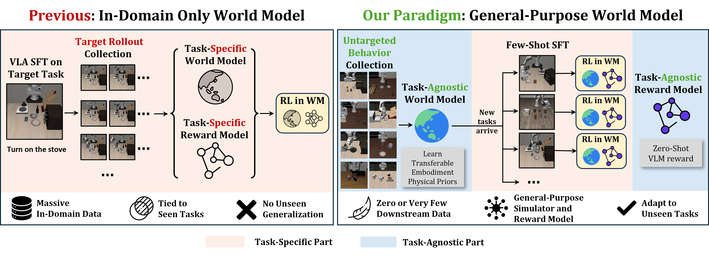
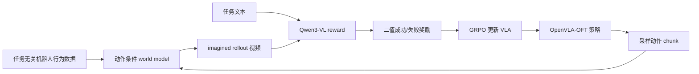
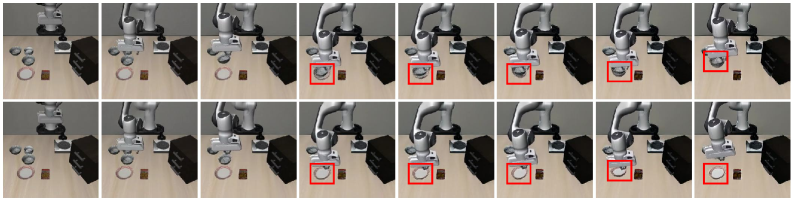
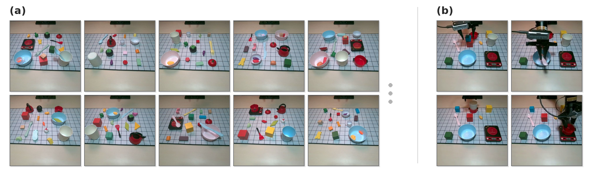
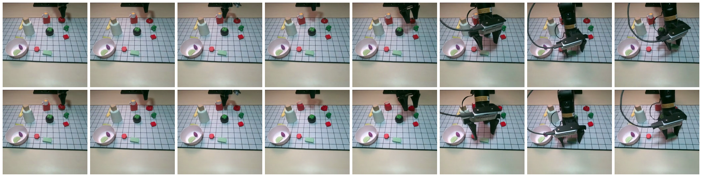

# RAW-Dream：任务无关世界模型强化 VLA 导读

这篇导读对应论文 **Reinforcing VLAs in Task-Agnostic World Models**，方法名是 **RAW-Dream**。它适合放在本仓库的 `17-具身世界模型` 章节里，而不是放成一个完整复现教程：截至 2026-06-27，作者主页和 arXiv 页面还没有给出 RAW-Dream 的官方代码仓库，当前更适合作为“世界模型 + VLA 后训练”的前沿阅读入口。

学完这一节后，大家需要抓住三个判断：

- 它不是以 pi0.5 为基座刷榜的工作，论文中策略基座是 OpenVLA-OFT。
- 它的核心卖点不是新的 VLA 基座，而是用任务无关 world model + 零样本 VLM reward，在想象轨迹里做 VLA 的 RL 后训练。
- 它的仿真评测主要用现成 LIBERO held-out suites，真实机器人评测是作者自己的 AgileX Piper 任务。

## 1. 论文和代码状态

| 项目 | 当前状态 |
| :--- | :--- |
| 论文 | [arXiv:2605.12334](https://arxiv.org/abs/2605.12334)，v1 提交于 2026-05-12，v2 修订于 2026-05-20 |
| 作者主页入口 | [Kaixin Wang 主页](https://kaixin96.github.io/)列出了该论文的 arXiv 链接 |
| 官方项目页 | 暂未看到独立 project page |
| 官方代码 | 暂未看到 RAW-Dream 官方仓库 |
| 推荐阅读方式 | 先读方法图、实验表和附录实现细节，不建议现在投入复现 |

如果后续官方放出代码，建议在这个目录下继续补一篇 `02-RAW-Dream复现.md`，当前这篇先作为论文导读和仓库导航。

## 2. 一张图看懂它想解决什么

  

**图 1 RAW-Dream 的基本立场。** 左边是以往很多 world-model-based RL pipeline：下游任务来了以后，还要为这个任务收 in-domain rollout，再训练或微调 world model 和 reward model。右边是 RAW-Dream：先用任务无关行为数据训练一个可复用 world model，再用现成 VLM 给新任务打成功/失败奖励，让 VLA 在 world model 里做 RL。

来源：[RAW-Dream arXiv HTML](https://arxiv.org/html/2605.12334v2)。

这里的“task-agnostic”不要理解成完全不需要机器人数据。更准确的说法是：world model 和 reward model 不依赖下游目标任务的 rollout；但策略本身仍然会先经过 SFT，world model 也要吃到足够多的任务无关交互数据。

## 3. 它到底用了哪些基座

这篇论文里有三块模型，大家不要混在一起看：

| 模块 | 论文中的选择 | 作用 |
| :--- | :--- | :--- |
| VLA policy | OpenVLA-OFT | 产生动作，后续用 GRPO 更新 |
| World Model | 基于 Wan 2.1-T2V-1.3B DiT 改成动作条件视频模型 | 给定初始观测和动作序列，生成 imagined rollout |
| Reward Model | 冻结 Qwen3-VL | 读取任务文本和 imagined video，判断 Success / Failure |

所以它不是 pi0.5 基座。论文会在 related work 里提到 pi0、pi0.5 等 VLA 工作，但 RAW-Dream 的策略基座写的是 OpenVLA-OFT。附录还说明，他们保留了概率式 categorical action tokenization，以便 GRPO 采样；这和 OpenVLA-OFT 原本更偏确定性的 L1 regression head 不同。

## 4. 训练和后训练流程

可以把 RAW-Dream 理解成下面这条链路：

具体到数据：

- 仿真里，作者用 LIBERO-90 训练基础策略，再给动作加噪声收集成功/失败混杂 rollout，用这些数据训练 world model。
- 真实机器人里，作者先用 Open X-Embodiment 数据，再加入约 4 小时未标注、无任务定义的 teleoperation play data。
- 下游新任务只需要少量 SFT demo；RL 阶段主要在 world model 的 imagined rollout 里完成。

## 5. 最值得记住的技巧

### Dual-Noise Verification

  

**图 2 DNV 的直观例子。** 同一个动作序列、两组 diffusion noise。如果第一遍被 Qwen3-VL 判成功，第二遍换噪声后又失败，就说明第一次成功可能只是 world model 的幻觉，而不是稳定的物理结果。

来源：[RAW-Dream arXiv HTML](https://arxiv.org/html/2605.12334v2)。

DNV 是这篇论文里最有工程味道的技巧。它只对 VLM 已经判成功的 imagined rollout 做第二次 world model 生成，不是对所有轨迹翻倍计算。这样可以过滤“world model 幻想成功 -> reward hacking -> 策略学歪”的问题。

### 零样本 VLM reward

作者没有给每个新任务再训练一个复杂 reward model，而是直接用 Qwen3-VL 做二分类成功判断。论文里的消融很关键：用 10 条 1-shot demo 训练 VideoMAE reward classifier，效果反而很差，作者认为它容易过拟合专家轨迹外观，泛化到 imagined rollout 时不稳。

### first-frame anchoring + progressive noise

视频 world model 做长 rollout 时，第一帧条件太强会带来 ghosting：物体已经被抓走了，但原位置又像残影一样出现。作者的做法是每个自回归 step 都锚定第一帧，同时逐步增加 first-frame noise，让模型慢慢减少对第一帧的死记硬背，更多依赖近期上下文。

## 6. 它在哪些基准上评测

  

**图 3 任务无关 play data 和真实机器人下游任务。** 左侧是 world model 训练用的多样桌面布局，右侧是作者真实机器人实验里的四个下游任务。

来源：[RAW-Dream arXiv HTML](https://arxiv.org/html/2605.12334v2)。

仿真部分用的是现成 LIBERO benchmark，但协议不是直接在训练任务上刷分。作者用 LIBERO-90 训练 world model，然后在 held-out 的 LIBERO-Spatial、LIBERO-Object、LIBERO-Goal、LIBERO-Long 四个 suite 上测。每个 suite 10 个任务。

核心策略成功率如下：

| 方法 | Target data | Spatial | Object | Goal | Long | Avg. |
| :--- | :--- | ---: | ---: | ---: | ---: | ---: |
| 1-shot SFT | 10 | 54.6 | 46.4 | 52.2 | 20.2 | 43.4 |
| Online RL Short | 522 | 58.4 | 60.2 | 55.2 | 17.6 | 47.9 |
| Online RL Long | 2570 | 68.8 | 78.8 | 65.2 | 22.4 | 58.8 |
| Zero-Shot WM + Qwen3-VL | 10 | 65.8 | 47.2 | 60.2 | 35.8 | 52.3 |
| Co-Train WM + Qwen3-VL | 10 | 73.2 | 60.2 | 58.4 | 36.6 | 57.1 |
| ID-FT WM + Qwen3-VL | 510 | 82.0 | 79.8 | 63.4 | 38.6 | 66.0 |

这张表最值得注意的不是单点 SOTA，而是数据预算：Zero-Shot WM 没有额外 target rollout，就能从 1-shot SFT 的 43.4 提到 52.3；给 world model 一些 in-domain fine-tuning 后，ID-FT WM 到 66.0。

真实机器人不是公开标准 benchmark，而是作者自己的 AgileX Piper 实验。每个任务 30 次，3-shot SFT 平均 50.0%，RL 后平均 71.7%。这说明方法有真实机器人验证，但规模还不能说明“大规模通用机器人世界模型”已经解决。

  

**图 4 真实机器人 world model rollout 例子。** 上排是真实执行视频，下排是 world model 在同一初始观测和动作序列下生成的预测。

来源：[RAW-Dream arXiv HTML](https://arxiv.org/html/2605.12334v2)。

## 7. 读这篇论文时可以追哪些仓库

RAW-Dream 自己暂时没有官方代码时，大家可以先看它依赖的公开项目：

| 方向 | 推荐入口 | 为什么看 |
| :--- | :--- | :--- |
| VLA 策略基座 | [moojink/openvla-oft](https://github.com/moojink/openvla-oft) 与 [OpenVLA-OFT project page](https://openvla-oft.github.io/) | 理解 action chunking、LIBERO evaluation 和 OpenVLA-OFT 的训练接口 |
| OpenVLA 基础模型 | [openvla/openvla](https://github.com/openvla/openvla) 与 [OpenVLA project page](https://openvla.github.io/) | 理解 OpenVLA 系列和 Open X-Embodiment 预训练背景 |
| 视频 world model 基座 | [Wan-Video/Wan2.1](https://github.com/Wan-Video/Wan2.1) 与 [Wan2.1-T2V-1.3B](https://huggingface.co/Wan-AI/Wan2.1-T2V-1.3B) | RAW-Dream 的 world model 基于 Wan 2.1-T2V-1.3B DiT 改造 |
| VLM reward | [QwenLM/Qwen3-VL](https://github.com/QwenLM/Qwen3-VL) 与 [Qwen3-VL-8B-Instruct](https://huggingface.co/Qwen/Qwen3-VL-8B-Instruct) | 理解它如何作为 zero-shot success/failure reward |
| 仿真基准 | [Lifelong-Robot-Learning/LIBERO](https://github.com/Lifelong-Robot-Learning/LIBERO) 与 [LIBERO project page](https://libero-project.github.io/main.html) | RAW-Dream 的主要仿真评测来自 LIBERO held-out suites |
| 机器人数据 | [google-deepmind/open_x_embodiment](https://github.com/google-deepmind/open_x_embodiment) 与 [Open X-Embodiment project page](https://robotics-transformer-x.github.io/) | 真实机器人 world model 预训练数据来源之一 |

## 8. 适合怎么放进学习路线

建议大家把它放在 LeWM 之后读：

1. 先看 LeWM，理解“world model 本身如何学预测”和“世界模型如何支持规划”。
2. 再看 RAW-Dream，理解“world model 如何作为 VLA 后训练的虚拟环境”。
3. 最后回到 OpenVLA-OFT / LIBERO，理解策略、基准和动作接口。

如果大家正在做长时域 VLA、接触事件建模、物理记忆或 reward hacking 相关方向，这篇论文最值得借鉴的是 DNV 和“任务无关物理先验”叙事。它不一定适合作为近期复现目标，但很适合作为世界模型章节里承上启下的一篇前沿导读。

## 9. 参考资料

- RAW-Dream 论文：[Reinforcing VLAs in Task-Agnostic World Models](https://arxiv.org/abs/2605.12334)
- arXiv HTML 图文版：[2605.12334v2 HTML](https://arxiv.org/html/2605.12334v2)
- 作者主页入口：[Kaixin Wang](https://kaixin96.github.io/)
- OpenVLA-OFT：[project page](https://openvla-oft.github.io/) / [code](https://github.com/moojink/openvla-oft)
- Wan 2.1：[code](https://github.com/Wan-Video/Wan2.1) / [Wan2.1-T2V-1.3B](https://huggingface.co/Wan-AI/Wan2.1-T2V-1.3B)
- Qwen3-VL：[code](https://github.com/QwenLM/Qwen3-VL)
- LIBERO：[project page](https://libero-project.github.io/main.html) / [code](https://github.com/Lifelong-Robot-Learning/LIBERO)
- Open X-Embodiment：[project page](https://robotics-transformer-x.github.io/) / [code](https://github.com/google-deepmind/open_x_embodiment)
