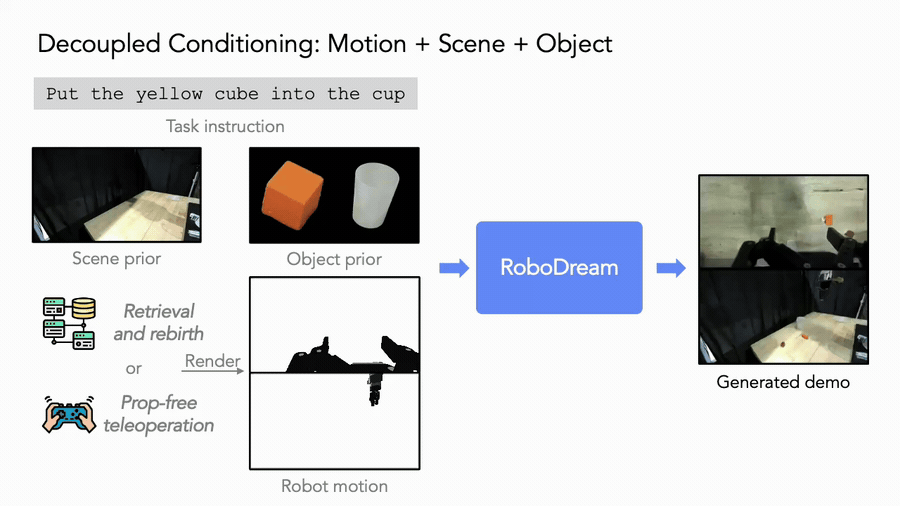
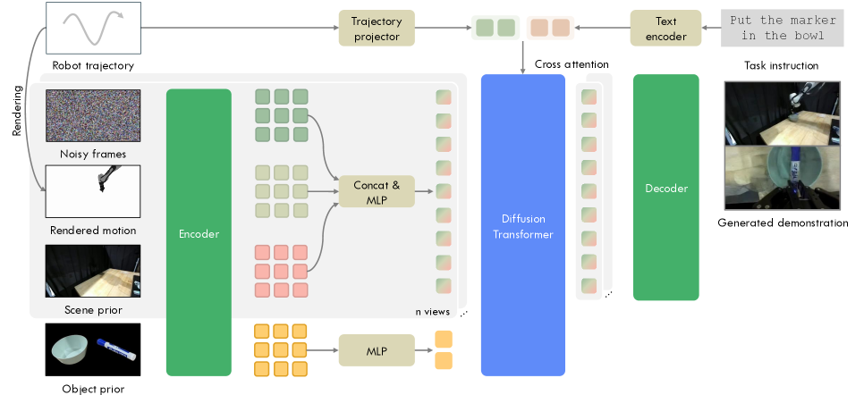
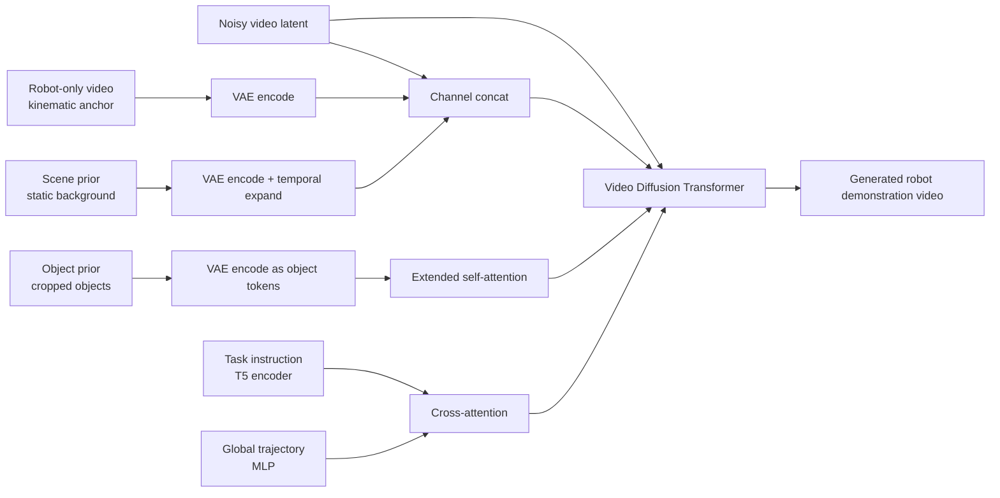
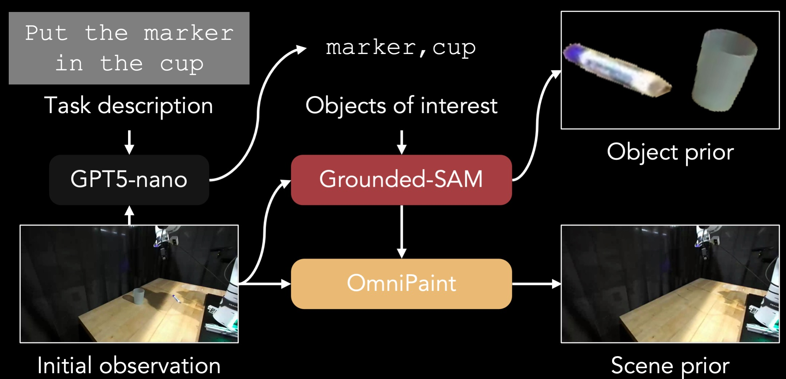
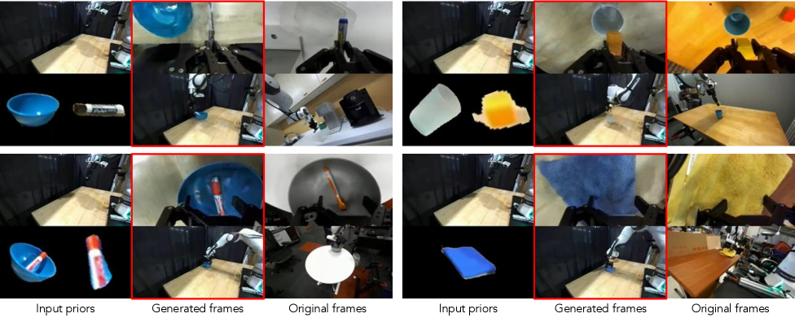
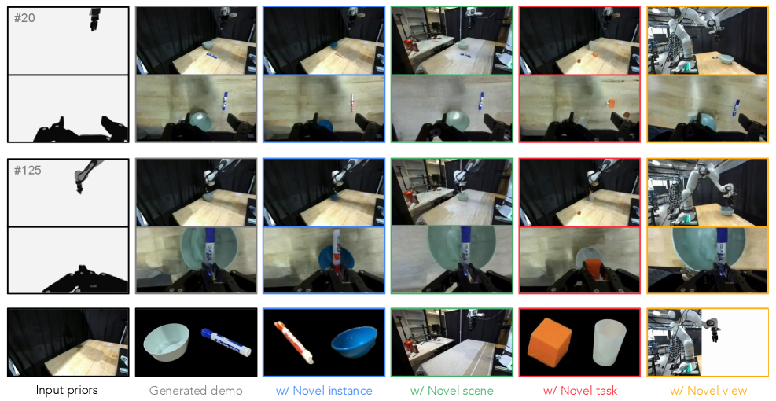
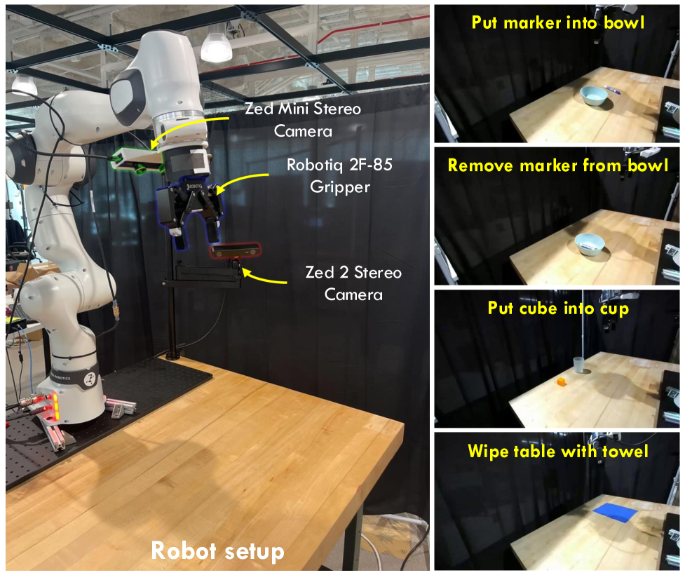

# RoboDream：可组合世界模型数据合成导读

这篇导读对应论文 **RoboDream: Compositional World Models for Scalable Robot Data Synthesis**，arXiv 于 2026-06-01 提交，作者来自 USC Physical Superintelligence Lab 与 Toyota Research Institute。它适合放在本仓库的 `17-具身世界模型` 章节里，作为 WoG、WALL-WM 之后的世界模型前沿导读。

如果按现有目录组织来排，不建议重排 `1、扩散数理基础`、`2、VAE`、`3、DDPM` 这些基础章节。RoboDream 更适合作为世界模型前沿方法里的 **第 6 篇导读**：LeWM 讲 latent world model 的基础问题，RISE 讲用组合世界模型做策略自改进，RAW-Dream 讲在 world model 里强化 VLA，WoG 讲 condition-space world modeling，WALL-WM 讲事件级 world action model，RoboDream 则讲 **用可组合视频世界模型合成机器人示教数据**。

学完这一节后，大家需要抓住一句话：

> RoboDream 不是一个能像 MuJoCo / Isaac 那样实时 `step(action) -> next_state` 的神经仿真器，而是一个以 robot-only 轨迹为骨架、用 scene prior 和 object prior 重新绘制示教视频的数据合成世界模型。

这句话很重要。它既解释了 RoboDream 为什么值得看，也能防止大家被 “world model” 这个词带偏。

## 1. 论文、项目页和代码状态

| 项目 | 当前状态 |
| :--- | :--- |
| 论文 | [arXiv:2606.02577](https://arxiv.org/abs/2606.02577)，提交于 2026-06-01 |
| 项目页 | [RoboDream project page](https://junjieye.com/RoboDream/) |
| 官方仓库 | [Jay-Ye/RoboDream](https://github.com/Jay-Ye/RoboDream) |
| 代码状态 | 截至 2026-07-02，仓库已公开，但 README 写明 **Code coming soon**，训练、数据生成、策略学习 pipeline 尚未完整释放 |
| 许可证 | 官方仓库显示 Apache-2.0 |
| 基础视频模型 | 论文写明从 **Cosmos-Predict2 2B** fine-tune；注意 NVIDIA 的 `cosmos-predict2` 仓库当前页面提示已归档并建议迁移到 Cosmos-Predict2.5，复现实验时应先固定论文对应版本 |
| 训练数据 | 约 4 万条带相机标定的 DROID episode |
| 训练资源 | 论文报告为 2 个节点、每个节点 8 张 NVIDIA A100，训练约 1 周 |
| 下游策略 | Diffusion Policy，用于隔离观察 RoboDream 生成数据对策略学习的影响 |

当前这篇不适合写成“从零跑通论文结果”的复现教程。更合理的学习方式是：先把它的架构图、数据流、实验结论和边界条件吃透；等官方代码补齐后，再按官方训练/生成/策略 pipeline 做复现。

## 2. 它到底在解决什么问题

<p align="center">
  
</p>

**图 1 RoboDream 总览动图。** 它的目标不是凭空生成机器人视频，而是在给定机器人运动骨架的前提下，把旧轨迹重绘到新物体、新场景、新视角中。

来源：[RoboDream 官方 GitHub 仓库](https://github.com/Jay-Ye/RoboDream)。

机器人模仿学习缺数据，这个问题大家都熟。一个任务要收几十到几百条真实遥操作，已经很耗时；如果还要换物体、换背景、换相机视角、换桌面布置，成本会迅速爆炸。直接拿 DROID 这种大规模公开机器人数据当然诱人，但原始 DROID 数据和你的目标实验台通常差异很大：

| 差异 | 对策略训练的影响 |
| :--- | :--- |
| 相机视角不同 | policy 学到的像素位置和真实部署不匹配 |
| 桌面布局不同 | 背景、遮挡和物体相对关系产生 covariate shift |
| 物体实例不同 | 模型可能认不出目标物，或者把抓取 affordance 学偏 |
| 机器人轨迹有用但视觉域不对 | 动作骨架本来可复用，但 observation side 不可直接复用 |

RoboDream 的问题意识是：**旧数据里的动作轨迹可能还有价值，真正难复用的是视觉域。** 所以它不是简单做图像增强，也不是生成完全新动作，而是做一件更具体的事：

```text
已有或新采集的机器人轨迹
        ↓
在 Isaac Lab 里渲染成 robot-only motion video
        ↓
给目标场景背景 scene prior
        ↓
给目标物体外观 object prior
        ↓
视频世界模型合成目标域示教视频
        ↓
沿用原轨迹动作标签训练策略
```

这就是论文标题里 **Compositional World Models** 的含义：机器人运动、物体外观、场景背景、视角不是绑死在一条原始 demonstration 里的，而是可以拆开后重新组合。

## 3. 它是不是“可操作世界模型”

这个问题需要分两层讲。

弱意义上，RoboDream 是可控的。你可以控制：

- robot-only 轨迹：机器人本体怎么移动、夹爪怎么开合；
- scene prior：背景和桌面环境长什么样；
- object prior：目标物体长什么样；
- camera/view：同一条轨迹可以从新相机位重新渲染 robot-only video；
- task instruction：用语言给生成过程加语义约束。

强意义上，它不是可操作仿真器。它没有提供：

```text
当前状态 s_t + 动作 a_t -> 下一状态 s_{t+1}
```

也不能像 Isaac / MuJoCo / Genesis 那样让策略或人类每一步输入动作，然后实时返回下一帧、碰撞结果、reward、done。它更像一个 **离线示教视频合成器**：先给它一条合法轨迹，再让它把目标物体和目标场景“画”到这条轨迹周围。

一个真正强意义的可操作世界模型，至少要具备这些能力：

| 能力 | 强可操作世界模型 | RoboDream 当前定位 |
| :--- | :--- | :--- |
| 闭环 step | 每一步输入动作，返回下一状态/观测 | 不提供实时 step API |
| 状态持久性 | 物体位置、接触、遮挡关系持续演化 | 一次性生成整段视频 |
| 物理反馈 | 能模拟碰撞、滑动、抓取失败 | 依赖视频模型学习到的视觉一致性 |
| 策略评估 | policy 可以在里面 rollout 试错 | 主要用于离线合成训练数据 |
| 动作来源 | policy 在线决定动作 | 动作轨迹预先给定或从数据集检索 |

所以更准确的叫法是：**controllable video world model for robot data synthesis**，而不是 learned physics simulator。

## 4. 总体架构图：三类视觉先验 + 两类语义/运动条件

<p align="center">
  
</p>

**图 2 RoboDream 模型架构。** 读这张图时建议按“什么条件走 channel，什么条件走 attention”来理解：robot-only video 和 scene prior 与 noisy video latent 在通道维拼接；object prior 变成 token 后进入 self-attention；任务语言和全局轨迹进入 cross-attention。

来源：[RoboDream arXiv HTML](https://arxiv.org/html/2606.02577)。

这张图是整篇论文最重要的图。它回答了一个核心问题：如果我们要让视频模型稳定地生成机器人示教，应该把哪些信息显式喂进去？

RoboDream 的条件输入可以分成五类：

| 条件 | 形式 | 作用 |
| :--- | :--- | :--- |
| Noisy video latent | 扩散过程中的待去噪视频 latent | 模型最终要生成的目标视频 |
| Robot-only video | 只渲染机器人、不渲染物体和真实背景的视频 | 锚定机器人本体外形、像素位置和运动轨迹 |
| Scene prior | 去掉任务物体后的背景图 | 指定桌面、背景、环境布局 |
| Object prior | 任务相关物体裁剪后组成的物体图 | 指定目标物体外观 |
| Instruction + trajectory | 语言指令 + 全局轨迹状态 | 约束任务语义和运动结构 |

架构上有三个关键设计。

第一，**robot-only video 是像素级运动锚点**。很多人会以为给机器人关节角或末端位姿就够了，但论文没有只给低维状态，而是先在 Isaac Lab 中把轨迹渲染成视频。这样模型在像素空间里直接看到机械臂每一帧在哪里、如何移动、夹爪何时开合。这个设计很像视频版 ControlNet：不是靠 prompt 让模型猜机器人形态，而是把机器人运动结构明确画给模型看。

第二，**scene prior 通过 channel extension 进入模型**。背景通常在一段短视频里近似静态，所以论文把单张 scene prior 沿时间维展开成静态视频，再和 noisy video latent、robot-only video 的 latent 在通道维拼接。这样每个时间步都能看到同一份环境布局，减少背景漂移。

第三，**object prior 通过 self-attention 注入**。物体不是直接贴到固定坐标，而是编码成 latent object tokens，然后让视频 token 在 self-attention 中访问这些 object tokens。这个细节很关键：模型学到的是“目标物体长什么样”，而不是“目标物体必须在 prior 图上的某个位置”。

用一个简化流程表示就是：



这套设计的价值不是“模型更大”，而是把生成任务拆成几件容易控制的事：机器人怎么动由 robot-only video 管，背景由 scene prior 管，物体外观由 object prior 管，任务语义由 instruction 管。

## 5. 为什么 robot-only video 这么关键

如果直接用文本生成机器人操作视频，模型要同时解决四个难题：

1. 机器人本体不能变形；
2. 机械臂运动要符合关节约束；
3. 夹爪和物体接触要合理；
4. 背景和目标物还要像目标场景。

RoboDream 不让视频模型从零解决这些问题，而是先把机器人运动这件事锁住。它的 robot-only video 有三个作用。

第一，它保证 embodiment consistency。视频生成模型经常会把机器人手臂画弯、夹爪画丢、关节形态画错。robot-only video 把机器人每一帧的形态和位置显式给出，模型主要负责把物体和场景补进去。

第二，它隐式包含相机信息。论文特别强调，robot-only video 在像素域中包含 camera information。同一条轨迹如果从新视角渲染，机械臂在图像中的投影就会变化；再配合对应视角的 scene prior，模型就能生成 novel view demonstration。

第三，它保留动作标签的可用性。很多 text-to-video robot data 方法需要先生成视频，再用 inverse dynamics 反推动作，这非常容易把误差放大。RoboDream 的动作轨迹本来就存在，视频只是 observation side 的目标域重绘。它绕开了“生成视频再猜动作”的坑。

但是这个优点也带来边界：**如果输入轨迹本身不适合目标物体或目标布局，RoboDream 不会自动把它修成一个合理规划。** 它可以把一个抓取轨迹重绘得更像目标域，但不能保证这条轨迹真的适合一个尺寸、质量、位置完全不同的新物体。

## 6. Prior extraction：怎么自动拆出物体和场景

<p align="center">
  
</p>

**图 3 prior extraction 流程。** RoboDream 用 VLM 从指令和首帧中找出任务相关物体，用 Grounded-SAM 分割物体，再用 OmniPaint 把原图中的物体移除，得到干净 scene prior。

来源：[RoboDream 官方项目页](https://junjieye.com/RoboDream/)。

训练 RoboDream 需要把已有机器人数据拆成三份：机器人运动、目标物体、背景场景。论文不要求人工逐帧标注，而是用自动 pipeline 构造训练对。

第一步是 object identification。给定首帧和任务指令，使用 VLM 找出和任务真正相关的物体。例如任务是 “put marker into bowl”，相关物体应该是 marker 和 bowl，而不是桌子、墙、机械臂底座。

第二步是 object prior construction。用 Grounded-SAM 分割这些任务物体，然后把裁剪出来的物体随机旋转、缩放，放到干净画布上。这一步很容易被忽略，但它很重要：随机摆放能迫使模型学习物体外观，而不是记住原始图像里的物体坐标。

第三步是 scene prior construction。把任务物体从首帧中抹掉，再用 OmniPaint 做 inpainting，补成一个干净背景。这样 scene prior 只表达背景和桌面环境，object prior 只表达任务物体。二者分开后，模型才能真正学会“换物体”和“换场景”。

如果不做这一步，模型会遇到一个矛盾：scene prior 里已经有一个杯子，object prior 又给一个杯子，到底哪个才是要操作的目标？RoboDream 通过先把物体从背景里移除，把这个歧义拆掉。

## 7. 两种部署模式：retrieval and rebirth 与 prop-free teleoperation

RoboDream 的方法不是只有一个模型结构，它还提出了两种很实际的数据生产模式。

### 7.1 Retrieval and Rebirth：旧轨迹在新场景里“重生”

<p align="center">
  
</p>

**图 4 zero-shot demonstration rebirth。** 右侧是从 DROID 中检索到的原始轨迹，中间是 RoboDream 根据目标 object prior 和 scene prior 重绘出的目标域示教视频。

来源：[RoboDream arXiv HTML](https://arxiv.org/html/2606.02577)。

Retrieval and Rebirth 可以理解为“找相似动作骨架，然后换成目标域外观”。流程是：

1. 输入一个新任务指令；
2. 用 T5 encoder 把任务指令和数据集里每条轨迹的指令编码；
3. 按 cosine similarity 检索语义相近的 DROID 轨迹；
4. 在 Isaac Lab 中 replay 轨迹，渲染 robot-only video；
5. 准备目标场景的 scene prior 和目标物体的 object prior；
6. RoboDream 生成目标域 demonstration video；
7. 使用生成视频和原始动作标签训练下游 policy。

这个模式最适合的场景是：公开数据里已经有类似动作，比如靠近、夹取、抬起、放入、擦拭；你的目标环境和物体不同，但动作骨架可以复用。

它不适合的场景是：新任务需要完全不同的动力学或接触策略。例如从夹取方块迁移到拧瓶盖、拉拉链、插 USB，这时旧轨迹的动作结构可能根本不兼容。RoboDream 可以换皮，但不能凭空创造一个正确的接触策略。

### 7.2 Prop-free teleoperation：对空气操作，再把物体画进去

Prop-free teleoperation 是论文里很有启发的一点。它借用了影视里的 “prop-free” 概念：演员先对空气表演，后期再加道具。在机器人里，就是操作者不需要每次摆好真实物体，可以在空桌面或仿真器里做一段“假装操作”的机器人运动，只记录合法轨迹。之后 RoboDream 再把目标物体和场景合成进去。

这件事有两个好处：

- 不需要反复 reset 物体位置，遥操作采集更快；
- 一条通用 pick-and-place 动作轨迹可以通过不同 object prior 变成多个任务的数据。

但它也有一个明显风险：真实抓取里的微小接触调整、碰撞反馈、物体滑动，在 prop-free 轨迹里并不存在。RoboDream 需要把这些视觉现象“补出来”。如果补得不对，生成视频虽然像，但动作标签和视觉接触可能错位。

所以 Prop-free 的合理定位是：**降低数据采集成本的近似方案**，不是完全替代真实遥操作。

## 8. Compositional generation：这篇真正精妙的地方

<p align="center">
  
</p>

**图 5 RoboDream 的可组合生成能力。** 同一条基础轨迹可以通过更换 object prior、scene prior、task context 和 camera view，生成 novel instance、novel scene、novel task、novel viewpoint。

来源：[RoboDream arXiv HTML](https://arxiv.org/html/2606.02577)。

这张图展示的是论文最核心的“组合性”。

| 可变因素 | RoboDream 怎么控制 | 本质含义 |
| :--- | :--- | :--- |
| Novel instances | 换 object prior | 同类物体外观变化，例如不同 marker |
| Novel scenes | 换 scene prior | 同一动作迁移到不同桌面/背景 |
| Novel tasks | 换 object prior 和任务上下文 | 在 affordance 兼容时，把同一动作骨架解释成新任务 |
| Novel viewpoints | 从新相机位重新渲染 robot-only video，并提供对应 scene prior | 用同一轨迹生成多视角训练数据 |

这里要注意 “zero-shot” 的边界。RoboDream 的 zero-shot 主要是 **视觉组合 zero-shot**，不是 **动作规划 zero-shot**。它不是看到一个全新任务后自己想出新动作，而是在已有或新采集的兼容轨迹基础上，把视觉上下文换成未见过的物体、场景和视角。

这也是它比普通图像增强强的地方。普通增强往往只改颜色、纹理、背景扰动，底层交互布局还是原来的。RoboDream 可以把一个动作轨迹重生到新目标域里，让旧轨迹在视觉上变成更接近目标环境的 demonstration。

## 9. 实验结果应该怎么读

<p align="center">
  
</p>

**图 6 真实机器人评测任务。** 论文使用 DROID 风格的 Franka Panda 平台，在四个真实操作任务上评测：Put Marker into Bowl、Remove Marker from Bowl、Put Cube into Cup、Wipe Table with Towel。

来源：[RoboDream arXiv HTML](https://arxiv.org/html/2606.02577)。

论文评测的重点不是“视频像不像”，而是“生成数据能不能帮下游策略”。它用 Diffusion Policy 训练策略，并在真实机器人上评估。

### 9.1 Retrieval and Rebirth 的结果

| Task | Real-50 | Orig-100 | Orig-Mix | Gen-100 | Gen-Mix |
| :--- | ---: | ---: | ---: | ---: | ---: |
| Put Cube into Cup | 35 | 0 | 55 | 20 | 65 |
| Put Marker into Bowl | 30 | 0 | 35 | 15 | 55 |
| Remove Marker from Bowl | 20 | 0 | 20 | 5 | 35 |
| Wipe Table with Towel | 60 | 0 | 70 | 20 | 95 |
| Average | 36.3 | 0 | 45.0 | 15.0 | 62.5 |

这张表不能只看最高的 Gen-Mix。更正确的读法是：

第一，Orig-100 是 0%。直接把检索到的 DROID 原始数据拿来训练目标域 policy 完全失败，说明 domain shift 很严重。旧数据不是没动作价值，而是视觉域不匹配。

第二，Gen-100 平均只有 15.0%。纯生成数据并不强，明显低于 Real-50 的 36.3%。这说明 RoboDream 还不能替代真实数据。

第三，Gen-Mix 平均 62.5%，高于 Real-50 和 Orig-Mix。最可信的结论是：**少量真实数据打底，再混入 RoboDream 生成的目标域数据，可以显著增强策略训练。**

所以这篇论文真正证明的是“生成数据作为 real data augmentation 有用”，不是“纯合成数据已经解决机器人学习”。

### 9.2 Prop-free 的结果

| Task | Real-50 | Real w/ Gen Obs | Prop-Free |
| :--- | ---: | ---: | ---: |
| Put Cube into Cup | 35 | 25 | 30 |
| Put Marker into Bowl | 30 | 20 | 20 |
| Remove Marker from Bowl | 20 | 15 | 20 |
| Wipe Table with Towel | 60 | 60 | 60 |
| Average | 36.3 | 30.0 | 32.5 |

Prop-free 平均 32.5%，略低于 Real-50 的 36.3%，但论文报告采集 50 条真实遥操作约 2 小时，采集 50 条 prop-free 轨迹约 55 分钟，约 2.2 倍更快。

这个结果的意义也要说清楚：Prop-free 不是效果超过真实数据，而是用较低成本得到接近真实数据的效果。对于需要快速试任务、快速扩充动作骨架的场景，它很有启发；但如果任务对接触物理极其敏感，真实数据仍然不可替代。

### 9.3 scaling with generated data

| Task | Real-50 | Mix-100 | Mix-200 | Mix-300 | Mix-400 |
| :--- | ---: | ---: | ---: | ---: | ---: |
| Put Cube into Cup | 35 | 65 | 75 | 80 | 75 |
| Put Marker into Bowl | 30 | 55 | 70 | 70 | 70 |
| Remove Marker from Bowl | 20 | 35 | 45 | 50 | 50 |
| Wipe Table with Towel | 60 | 95 | 100 | 95 | 100 |
| Average | 36.3 | 62.5 | 72.5 | 73.75 | 73.75 |

这张表说明加生成数据确实有 scaling benefit，但收益在 Mix-200 左右开始饱和。可能原因包括：检索轨迹多样性有限、生成质量有限、生成数据和真实部署之间仍有残余 gap。

## 10. 和普通视频生成、传统仿真、其他世界模型的区别

| 方法类型 | 输入 | 输出 | 是否闭环 | 主要用途 | RoboDream 相对位置 |
| :--- | :--- | :--- | :--- | :--- | :--- |
| 普通 text-to-video | 文本 prompt | 完整视频 | 否 | 视觉内容生成 | RoboDream 多了 robot motion / scene / object 强条件 |
| 图像增强 | 原图 + mask / prompt | 增强图像或视频 | 否 | 域随机化、背景替换 | RoboDream 不只换纹理，还重绘目标域示教 |
| 传统物理仿真 | 状态 + action + 物理引擎 | 下一状态/观测 | 是 | 训练、规划、评估 | RoboDream 没有显式物理 step |
| 动作条件视频世界模型 | 当前观测 + action sequence | 未来视频 | 可离线 rollout | policy imagination / evaluation | RoboDream 更偏离线数据重绘 |
| WoG | 当前观测 + 语言 | 动作相关 latent condition | 否 | 增强 VLA 动作生成 | WoG 不生成视频，RoboDream 生成示教视频 |
| RAW-Dream | 初始观测 + action rollout | imagined rollout + VLM reward | 离线 RL | VLA 后训练 | RAW-Dream 用 world model 训练策略，RoboDream 用 world model 合成数据 |
| WALL-WM | 当前多视角观测 + 下一事件 | 事件视频 latent + 动作 | 分事件执行 | 世界动作建模 | WALL-WM 更接近 action generation，RoboDream 更接近 data engine |

从这个表可以看出，RoboDream 的位置很明确：它不是 VLA 基座，也不是完整交互式世界模拟器，而是面向 imitation learning 数据瓶颈的 **trajectory-conditioned visual rebirth engine**。

## 11. 这篇文章真正值得学的细节

第一，问题降维很漂亮。它没有让视频模型凭空发明机器人动作，而是把动作轨迹固定住，再让模型学习视觉上下文。这比 text-to-video robot demo 稳很多。

第二，它绕开了 inverse dynamics。动作标签来自原始轨迹，生成模型主要负责 observation side。这样比“先生成视频再反推动作”更适合 policy learning。

第三，object prior 和 scene prior 的拆分很细。object prior 通过随机摆放避免位置泄漏，scene prior 通过物体移除避免和 object prior 冲突。这些都是为了让模型学到真正的组合性。

第四，多视角处理不是简单拼图。论文把每个 view 当成 separate video entry，分别 tokenize 后 stack tokens，减少简单横向拼接带来的空间歧义。

第五，它把 DROID 这种外部大数据的价值讲得更实在。公开数据直接用会有 domain shift，但旧轨迹里的动作骨架仍然可能有用。RoboDream 做的是把这些动作骨架翻译到目标视觉域。

## 12. 主要局限和风险

RoboDream 最容易被误读成“生成视频已经能替代物理仿真”。这不准确。它的边界至少有五个。

第一，生成视频的 photorealism 不等于 action consistency。视频看起来真实，不代表夹爪、物体、动作标签在厘米级和帧级都对齐。机器人任务里，物体偏 2 厘米就可能让 policy 学到错误关联。

第二，robot-only trajectory 必须本来就合理。论文限制里也强调，它假设渲染出来的 robot-only video 忠实描述了目标场景中机器人应该执行的轨迹。RoboDream 不负责规划更好的动作。

第三，接触物理仍然是软肋。抓取、释放、擦拭、推动里的接触力、摩擦、滑动和失败模式，视频扩散模型只能从数据里近似学习，不能像物理引擎那样显式求解。

第四，纯生成数据还不够强。Gen-100 平均 15.0%，明显低于 Real-50。当前最可靠的用法是 mixed training，而不是 fully synthetic training。

第五，代码尚未完整释放。官方仓库公开了 README、license 和 assets，但训练、生成和 policy-learning pipeline 仍标注 coming soon。复现实验需要等后续代码、权重、配置和数据处理脚本齐全。

## 13. 如果之后要复现，应该怎么做

当前不建议大家马上投入算力复现实验。但可以先按下面的 checklist 关注后续开源状态。

| 模块 | 需要准备什么 | 复现难点 |
| :--- | :--- | :--- |
| 数据 | DROID episode、相机标定、任务指令、动作轨迹 | 数据量大，轨迹和相机标定要能对齐 |
| Robot-only rendering | Isaac Lab、机器人 URDF/USD、轨迹 replay | 需要把真实轨迹稳定渲染成多视角 robot-only video |
| Prior extraction | VLM object identification、Grounded-SAM、OmniPaint | 自动分割和 inpainting 质量会影响训练 |
| World model training | Cosmos-Predict2 2B、视频 latent、channel extension、attention 修改 | 算力大，论文报告 16 张 A100 训练约一周；上游 Cosmos 版本需要按论文口径锁定 |
| Data generation | 目标 scene prior、object prior、检索轨迹、采样脚本 | 生成质量和动作标签对齐需要人工或自动过滤 |
| Policy training | Diffusion Policy、真实数据与生成数据混合采样 | mixed ratio、任务成功判据、rollout 统计要对齐 |

更现实的短期学习路径是：

1. 先读项目页和 arXiv，把 Fig. 2、Fig. 3、Fig. 5、Fig. 6 理清楚；
2. 关注 [Jay-Ye/RoboDream](https://github.com/Jay-Ye/RoboDream) 是否放出训练/生成脚本；
3. 如果官方先放 inference，可先用少量 DROID 或自采轨迹跑 generation demo；
4. 如果官方放 policy-learning pipeline，再复现 Real-50 / Gen-Mix 这组核心对比；
5. 复现时优先验证 action-consistency，而不是只看视频是否好看。

## 14. 和本教程其他世界模型文章的阅读顺序

建议大家按下面顺序读：

| 文章 | 先学什么 | 适合回答的问题 |
| :--- | :--- | :--- |
| LeWM | 世界模型为什么要学未来 latent，表征为什么会崩 | 世界模型基础 |
| RISE | dynamics model + progress value model 如何组合起来改进 policy | 世界模型如何服务策略优化 |
| RAW-Dream | VLA 如何在 task-agnostic world model 里做 imagined RL | 世界模型如何变成后训练环境 |
| WoG | 不生成完整视频，只预测动作相关 future condition | 世界模型能否只建模对动作有用的信息 |
| WALL-WM | 按事件边界同时预测未来视频和动作 | 长时域任务应该按什么单位建模 |
| RoboDream | 用 robot-only 轨迹 + scene/object prior 合成示教数据 | 世界模型如何缓解机器人数据瓶颈 |

如果只用一句话总结 RoboDream 的位置：

> 它不是要把机器人放进一个可交互神经宇宙里，而是把已有机器人轨迹变成可以跨物体、跨场景、跨视角复用的数据资产。

## 15. 参考链接

- RoboDream 项目页：[https://junjieye.com/RoboDream/](https://junjieye.com/RoboDream/)
- RoboDream 论文：[arXiv:2606.02577](https://arxiv.org/abs/2606.02577)
- RoboDream 官方仓库：[Jay-Ye/RoboDream](https://github.com/Jay-Ye/RoboDream)
- DROID 数据集：[DROID: A Large-Scale In-The-Wild Robot Manipulation Dataset](https://droid-dataset.github.io/)
- Cosmos-Predict2：[NVIDIA Cosmos Predict2](https://github.com/nvidia-cosmos/cosmos-predict2)
