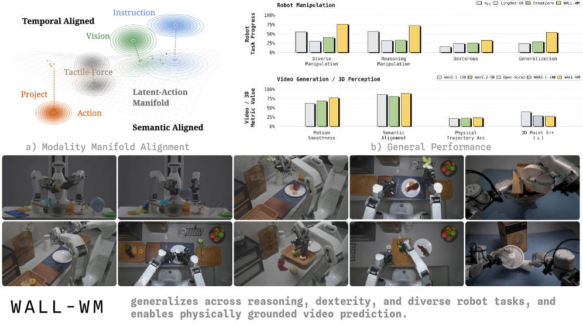
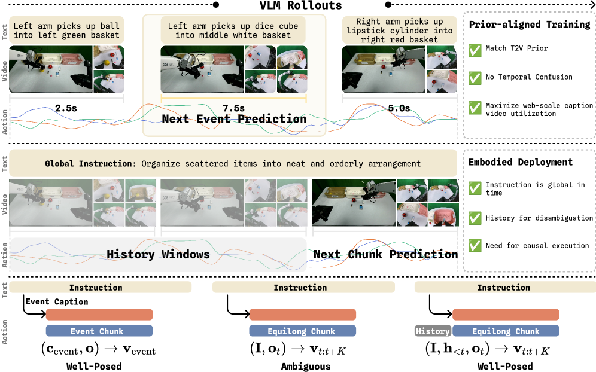
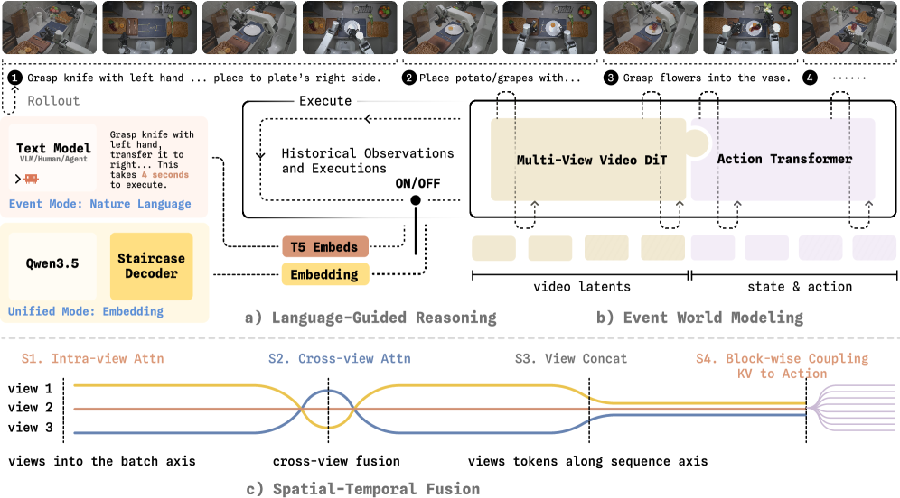
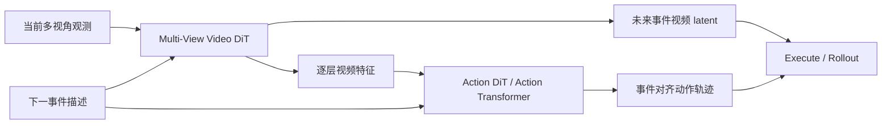
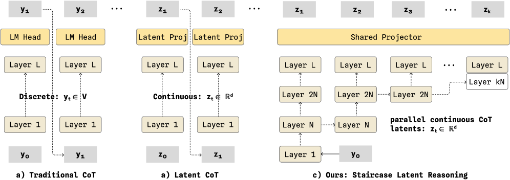
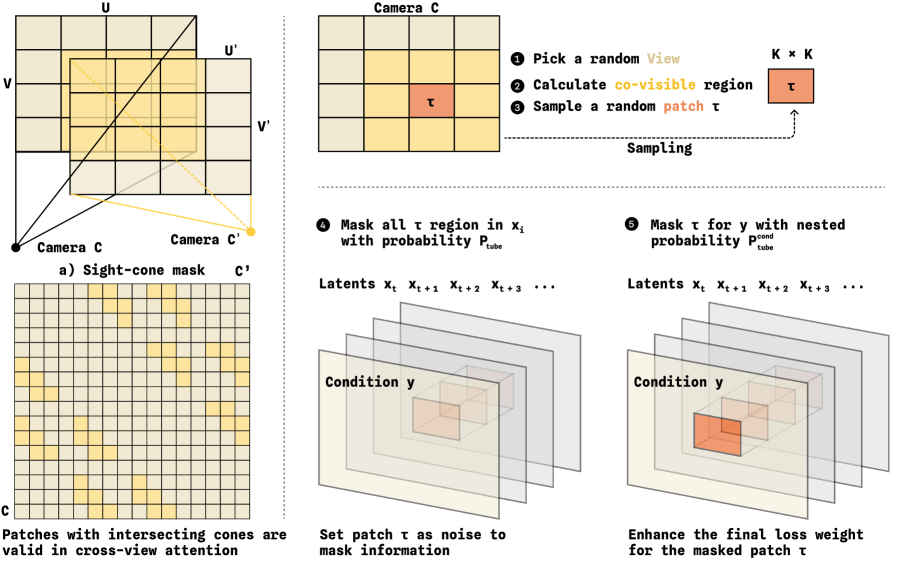
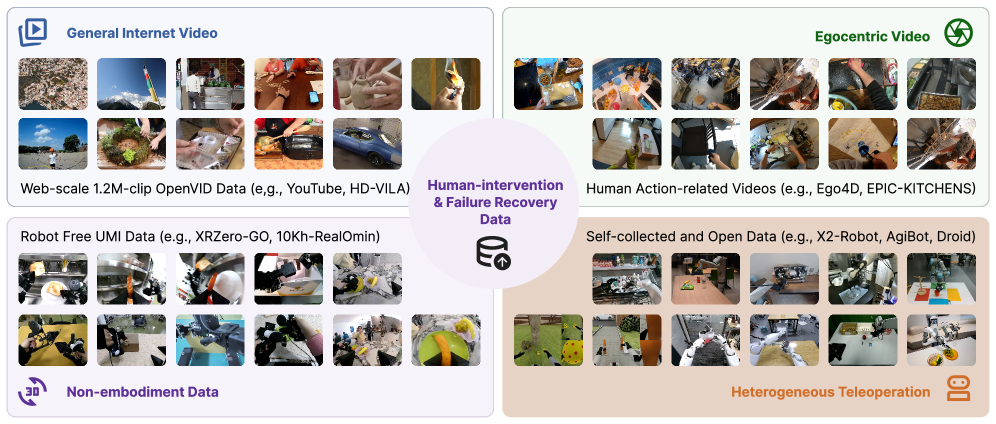
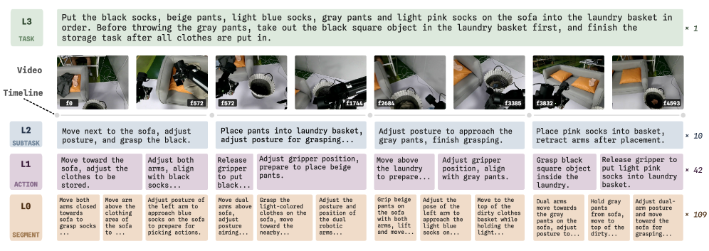

# WALL-WM：按事件边界预演和执行的世界动作模型

WALL-WM 对应论文 **WALL-WM: Carving World Action Modeling at the Event Joints**。它属于 embodied world model / World Action Model 方向，但不是 Dreamer 那种 latent transition model。它的核心是：**把未来视频预测和动作预测绑在一起，并且按语义动作事件而不是固定 action chunk 来训练和执行。**

学完这一节后，大家需要抓住一句话：

> WALL-WM 不是“当前图像直接出动作”的 VLA，而是“当前多视角观测 + 下一事件描述 -> 预演这个事件期间世界怎么变，同时生成对应动作段”。

## 1. 论文和开源状态

| 项目 | 当前状态 |
| :--- | :--- |
| 论文 | [arXiv:2606.01955](https://arxiv.org/abs/2606.01955) |
| 论文 PDF 入口 | WALL-X README 中链接到 `WALL-WM.pdf` |
| 相关代码生态 | [X-Square-Robot/wall-x](https://github.com/X-Square-Robot/wall-x) |
| 相关模型组织页 | [Hugging Face: x-square-robot](https://huggingface.co/x-square-robot) |
| 开源边界 | WALL-X/WALL-OSS 代码和模型可用；暂未看到单独 WALL-WM checkpoint、事件级数据生态和完整训练 recipe 明确放齐 |
| 推荐处理 | 作为世界模型方法导读，不建议当前写成手把手复现教程 |

这里必须讲得很实在：WALL-WM 的论文、PDF 和 WALL 系列工程入口是公开的；但如果从复现实操角度看，当前不能简单写成“WALL-WM 已完整开源，大家可以直接复现论文结果”。教程里最好把它定位成方法导读和后续跟踪入口。

## 2. 为什么它叫 World Action Model

<p align="center">
  
</p>

**图 1 WALL-WM 对世界动作建模的定位。** 论文把语言、视觉、动作放在不同抽象和时空精度层级上：语言有语义但粒度粗，视觉有时空结构，动作需要接触级精度。WALL-WM 的目标是把视频世界建模和动作生成耦合起来。

来源：[WALL-WM arXiv HTML](https://arxiv.org/html/2606.01955v1)。

传统 VLA 常见形式是：

```text
当前观测 + 指令 -> 未来固定长度 action chunk
```

WALL-WM 更像：

```text
当前多视角观测 + 下一事件描述
-> 未来事件视频 latent + 事件对应动作轨迹
-> 执行这一段
-> 重新观察
-> 进入下一个事件
```

它之所以叫 World Action Model，是因为它不只输出动作，还显式建模“如果接下来执行这个语义事件，视觉世界会怎么变化”。动作生成和未来观测建模不是两个独立模块，而是在同一个 denoising 框架里耦合。

## 3. 核心创新：从 fixed chunk 改成 semantic event

<p align="center">
  
</p>

**图 2 next-event training 与等长 chunk 对比。** 这张图是理解 WALL-WM 的关键：event caption、event video、event action 描述的是同一个语义区间；而固定长度 chunk 经常把一个动作事件切碎，或者把多个事件揉在一起。

来源：[WALL-WM arXiv HTML](https://arxiv.org/html/2606.01955v1)。

固定 chunk 的问题在机器人长任务里非常常见。一个“抓起杯子”事件可能需要 18 步，也可能需要 70 步；一个 32 步 chunk 可能只覆盖“靠近”的后半段和“闭合夹爪”的前半段。这会带来粒度错配：

| 模态 | 自然粒度 | 固定 chunk 的问题 |
| :--- | :--- | :--- |
| 语言 | 语义目标和事件 | 一个全局指令无法精确描述当前 chunk |
| 视觉 | 连续世界变化 | 视频变化往往跨越不等长事件 |
| 动作 | 高频控制轨迹 | 固定时间窗可能切断接触或阶段转换 |

WALL-WM 的回答是：用 **action-grounded semantic event** 作为学习单位。这个 event 必须同时满足：

- 语言能描述，例如 “lift the cup”。
- 视频里能看到变化，例如杯子离开桌面。
- 动作能执行，例如末端轨迹从抓取到抬起。

这也是这篇论文最值得借鉴的点：它没有只说“世界模型要预测未来”，而是进一步问“未来应该按什么单位来预测”。

## 4. 总体架构：视频塔和动作塔层级耦合

<p align="center">
  
</p>

**图 3 WALL-WM 总体框架。** 左侧是 instruction 入口，中间是 event-centric world model，右侧展示 unified mode。大家读这张图时要关注：Multi-View Video DiT 负责未来视频 latent，Action Transformer/Action DiT 负责动作轨迹，两者通过层级耦合交换信息。

来源：[WALL-WM arXiv HTML](https://arxiv.org/html/2606.01955v1)。

论文里的架构可以拆成三层：

| 层级 | 模块 | 作用 |
| :--- | :--- | :--- |
| 事件/语言入口 | next-event description、T5 text conditioner、Staircase decoder | 给当前 rollout 提供“下一事件是什么”的条件 |
| 视觉世界模型 | Multi-View Video DiT，继承 Wan 系列视频模型 prior | 预测事件期间多视角未来视频 latent |
| 动作模型 | Action Transformer / Action DiT | 预测对应 end-effector trajectory |

核心不是单独视频生成，也不是单独动作回归，而是 layer-coupled video-action denoising：



动作塔在多层中读取视频塔特征，因此动作不是只从当前图像和语言直接回归，而是受到“预测中的世界变化”约束。这个设计比普通 VLA 更像“先预演，再执行”。

## 5. Event mode 和 Unified mode

WALL-WM 支持两种推理模式。

### 5.1 Event mode

Event mode 是最贴近“先预演，再执行”的模式：

```text
当前观测 + 下一事件描述
-> 生成可变长度 event video/action
-> 执行
-> 重新观察
-> 再生成下一事件
```

下一事件描述可以来自人、上层 agent，或论文中 fine-tune 的 VLM。这意味着 WALL-WM 并不是完全靠底层动作模型自己规划整个长任务；它需要一个上层模块告诉它当前要做哪个 semantic event。

Event mode 的优势是自然支持可变长度动作段，不再被固定 action horizon 硬切。但代价是它需要 next-event instruction。如果上层事件分解错了，底层 world action model 也会被带偏。

### 5.2 Unified mode

Unified mode 更像传统 VLA 固定 chunk 执行。它仍然输出固定长度 chunk，但不是只看全局任务指令，而是通过 VLM 的 Staircase Decoding 生成连续 latent reasoning 来指导动作。

<p align="center">
  
</p>

**图 4 Staircase latent reasoning。** 相比 token-by-token CoT，Staircase 用连续 latent 在不同层级传递推理信息，目标是在保留推理信号的同时减少串行生成开销。

来源：[WALL-WM arXiv HTML](https://arxiv.org/html/2606.01955v1)。

Unified mode 的意义是兼容已有固定 chunk 控制接口。很多机器人系统已经围绕固定频率、固定 horizon 的 action chunk 设计，完全切到 event mode 成本很高。Unified mode 给了一个折中方案：控制接口仍是 chunk，但内部指导信号更接近事件结构。

## 6. 多视角融合：Camera RoPE 与几何 mask

<p align="center">
  
</p>

**图 5 WALL-WM 的 cross-view masking。** Sight-cone mask 让物理上可能共视的 token 才跨视角交互；tube mask 用遮挡窗口逼模型从其他视角补全信息。

来源：[WALL-WM arXiv HTML](https://arxiv.org/html/2606.01955v1)。

机器人操作常常有多个视角：头部相机、侧视相机、腕部相机等。简单 concat 多视角 token 会有两个问题：

- 不同视角的 token 不知道自己来自哪台相机。
- 物理上不可能对应同一区域的 token 也会互相 attention，带来噪声。

WALL-WM 加了两类设计：

| 设计 | 作用 |
| :--- | :--- |
| Camera RoPE | 给 token 注入相机视角相关的旋转位置编码 |
| Sight-cone mask | 只允许视锥有物理交集的跨视角 token 互相注意 |
| Tube patch masking | 在某个视角遮住时空 tube，训练模型利用其他视角补全 |

这说明 WALL-WM 不是只把视频生成模型搬到机器人任务上，而是针对多视角机器人视觉做了结构调整。

## 7. 数据体系：事件级 caption 和长尾采样

<p align="center">
  
</p>

**图 6 WALL-WM 数据源地图。** 数据来自互联网视频、第一视角视频、非具身采集、异构遥操作和公开机器人数据，中间还强调了 human-intervention 和 failure-recovery 数据。

来源：[WALL-WM arXiv HTML](https://arxiv.org/html/2606.01955v1)。

这篇论文不只是模型结构，数据体系也很关键。WALL-WM 希望学习的不只是“成功轨迹”，还包括：

- recovery。
- re-grasp。
- retry。
- contact correction。
- failure intervention。

这些短事件在普通全局 caption 里很容易被淹没，但在 event-level caption 中可以被显式标出来。

<p align="center">
  
</p>

**图 7 四层 caption tracks。** Task、Subtask、Action、Segment 四个层级对齐到同一条视频时间线，让同一 episode 可以在不同语义粒度上训练和采样。

来源：[WALL-WM arXiv HTML](https://arxiv.org/html/2606.01955v1)。

可以把它理解成四层标注：

| 层级 | 例子 | 作用 |
| :--- | :--- | :--- |
| Task | 清理桌面 | 全局任务目标 |
| Subtask | 把杯子放进篮子 | 中层子任务 |
| Action | 抓起杯子 | 动作事件 |
| Segment | 夹爪闭合并接触杯子 | 更细粒度片段 |

这种标注体系让训练不再只依赖固定长度时间窗，而是能按语义边界采样。

## 8. 它到底强在哪里

WALL-WM 的强点主要在三处：

1. **事件粒度正确**：它把语言、视频、动作三者的对齐单位从 fixed chunk 改成 semantic event，确实贴合长时域操作。
2. **视频与动作耦合**：动作塔逐层读视频塔特征，避免“视频预测”和“动作预测”完全脱节。
3. **数据和训练系统完整**：事件 caption、长尾采样、多视角结构、Staircase reasoning、Muon optimizer 基础设施一起组成 scale-up recipe。

但它也有边界：

- 它不是纯粹靠底层模型自主规划长任务，event mode 仍需要 next-event description。
- 它的效果很可能依赖大规模事件级数据和标注体系，普通实验室很难从头复现。
- 细接触、插入、窄容差操作不一定仅靠 event decomposition 就能解决。
- 当前开源状态更适合方法跟踪，不适合直接写完整复现教程。

## 9. 和 RAW-Dream、WoG、EventVLA 的区别

| 方法 | 核心问题 | 是否预测未来 | 关键表示 |
| :--- | :--- | :--- | :--- |
| RAW-Dream | 在任务无关 world model 里强化 VLA | 预测 imagined rollout video | 动作条件视频 world model + VLM reward |
| WoG | 未来观测如何蒸馏成动作有用 condition | 不显式生成未来视频 | condition-space future guidance |
| WALL-WM | 世界动作学习应该按什么粒度组织 | 预测事件视频 latent 和动作轨迹 | semantic event-aligned WAM |
| EventVLA | 中途视觉证据如何不被遗忘 | 不预测未来 | raw keyframe memory |

这张表可以帮助大家把“世界模型”这个词收窄。WALL-WM 更像真正的 World Action Model；WoG 是 condition-space world modeling；EventVLA 则不是世界模型，而是视觉证据记忆。

## 10. 如果大家要跟踪复现，应该看哪里

当前建议大家按下面方式跟踪：

1. 读 [arXiv:2606.01955](https://arxiv.org/abs/2606.01955)，重点看 Figure 2、Figure 3、Figure 6、Figure 8、Figure 12。
2. 关注 [X-Square-Robot/wall-x](https://github.com/X-Square-Robot/wall-x) 的 README、release 和 issue。
3. 关注 [HF x-square-robot](https://huggingface.co/x-square-robot) 是否新增 WALL-WM checkpoint。
4. 如果只是想跑 WALL 系列代码，先走 [WALL-X 工程框架](../../06-策略抓取或抓取VLA/大模型控制、VLA、VLM/08WALL-X开源工程框架导航/README.md) 和 [WALL-OSS 开源 VLA](../../06-策略抓取或抓取VLA/大模型控制、VLA、VLM/07WALL-OSS开源VLA模型导读/README.md)。
5. 如果将来官方放出事件级数据和训练 recipe，再单独写 `WALL-WM复现.md`，而不是把本篇导读改成命令堆。

## 11. 参考资料

- WALL-WM 论文：[WALL-WM: Carving World Action Modeling at the Event Joints](https://arxiv.org/abs/2606.01955)
- WALL-WM arXiv HTML 图文版：[2606.01955v1 HTML](https://arxiv.org/html/2606.01955v1)
- WALL-X 代码：[X-Square-Robot/wall-x](https://github.com/X-Square-Robot/wall-x)
- X Square Robot 研究页：[https://x2robot.com/en/research](https://x2robot.com/en/research)
- Hugging Face 组织页：[x-square-robot](https://huggingface.co/x-square-robot)
