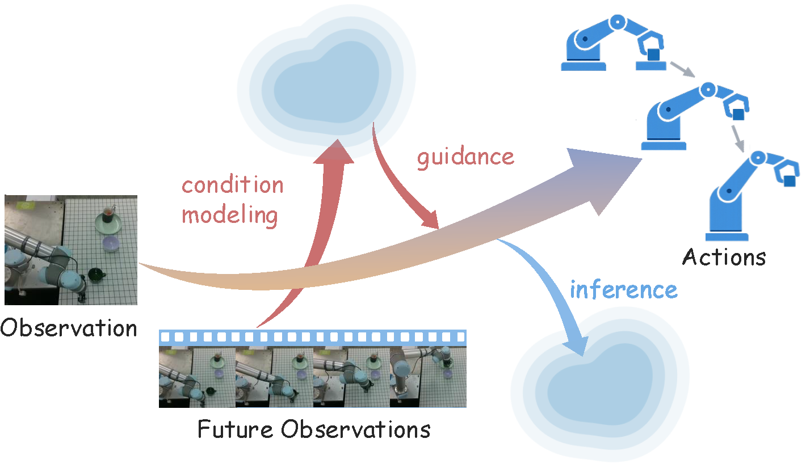
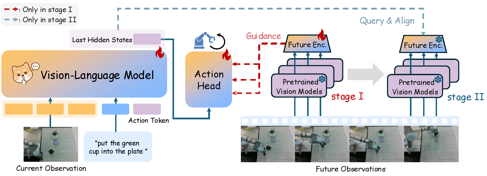
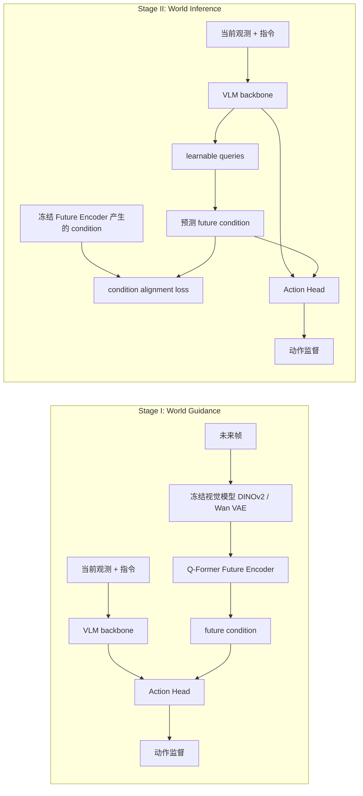
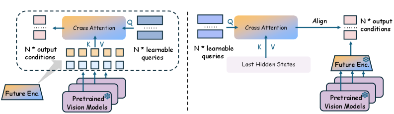
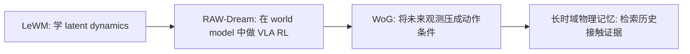
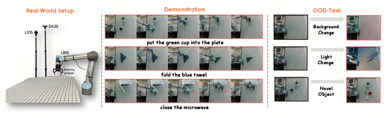
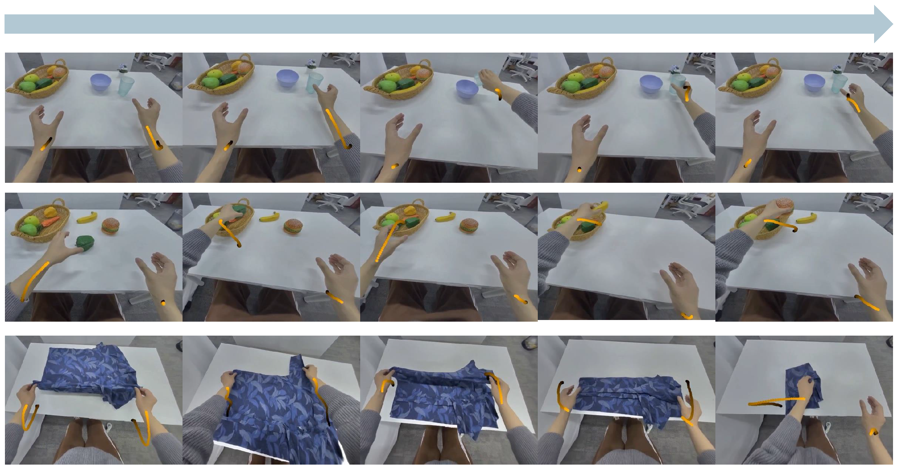

# WoG：条件空间世界模型导读

这篇导读对应论文 **World Guidance: World Modeling in Condition Space for Action Generation**，方法名是 **WoG / World Guidance**，来自 ByteDance Seed 与香港大学团队，arXiv 于 2026-02-25 提交。它适合放在本仓库的 `17-具身世界模型` 章节里，作为 LeWM、RAW-Dream 之后的补充：LeWM 讲 latent world model 如何预测未来状态，RAW-Dream 讲 world model 如何作为 VLA 后训练环境，WoG 则讲另一条路线：**不预测完整未来图像，而是预测一个对动作有用的未来条件向量**。

学完这一节后，大家需要抓住一个核心判断：WoG 很聪明，也很有工程价值，但它不是“机器人脑中可交互 rollout 的世界模拟器”。更准确地说，它是一个 **future observation distillation for action generation** 方法：训练时看未来帧，把未来帧压缩成 action-relevant latent condition；测试时不看未来帧，让 VLA 从当前观测中预测这个 condition，再用它辅助动作生成。

## 1. 论文、项目页和代码状态

| 项目 | 当前状态 |
| :--- | :--- |
| 论文 | [arXiv:2602.22010](https://arxiv.org/abs/2602.22010)，提交于 2026-02-25 |
| 项目页 | [WoG project page](https://selen-suyue.github.io/WoGNet/) |
| 代码入口 | [Selen-Suyue/WoG](https://github.com/Selen-Suyue/WoG) |
| 权重 | GitHub README 指向 [Hugging Face: selensu/WoG](https://huggingface.co/selensu/WoG) |
| 代码备注 | 项目页提供 Code 按钮；仓库 README 当前写的是 “unofficial implementation”，教程里按“开源实现”而不是严格复现实验来处理 |

这篇文章不建议一上来就完整复现。更适合大家先把架构图和两阶段训练吃透，再决定是否投入算力跑 SIMPLER 或真机部署。

## 2. 一句话讲清 WoG 到底在做什么

<p align="center">
  
</p>

**图 1 WoG 的直观想法。** 未来观测帧不是直接拿来重建视频，而是被压缩到一个 condition space；这个 condition 会指导动作生成。训练时可以“偷看未来”，测试时只能从当前观测里预测这个未来条件。

来源：[WoG 官方项目页](https://selen-suyue.github.io/WoGNet/)。

WoG 的核心可以翻译成一句非常直白的话：

> 训练时把未来几帧压成一个对动作有用的小抄；测试时不给未来帧，让 VLA 自己从当前图像和语言里猜这个小抄。

传统 world model 常见目标是预测未来图像、未来状态、未来视频或 latent state transition。WoG 不走这条路。它认为完整未来图像里有大量对控制无用的信息，比如背景纹理、光照变化、桌布细节。机器人真正需要的是“下一段动作要朝哪里走、物体和夹爪会发生什么接触、目标物和容器的关系怎样”。所以 WoG 不预测完整未来，而是学习一个 **action condition space**。

这也是它最容易被误解的地方。它叫 world modeling，但这个 world 不是可视化的完整世界，而是服务动作生成的压缩未来信息。

## 3. 为什么它还敢叫 world model

如果按最严格的定义，世界模型应该学：

```text
p(s_{t+1} | s_t, a_t)
```

或者至少学：

```text
p(o_{t+k} | o_{\le t}, a_{\le t+k})
```

也就是给定当前状态和动作，能 rollout 出下一状态或未来观测。WoG 不满足这个强定义。它不会像 Dreamer 那样在 latent dynamics 里规划，也不会像视频世界模型那样生成可检查的未来视频。

WoG 满足的是一个更弱、更工程化的定义：

```text
当前观测 + 语言 -> 预测未来观测压缩出的动作条件 -> 辅助动作生成
```

所以它更准确的名字可以是：

| 叫法 | 是否贴切 |
| :--- | :--- |
| 传统动力学世界模型 | 不太贴切 |
| 视频预测世界模型 | 不贴切 |
| condition-space world model | 贴切 |
| future-conditioned action representation | 贴切 |
| 未来观测蒸馏辅助动作生成 | 很贴切 |

这并不削弱 WoG 的价值。它的聪明之处恰恰在于：**机器人控制不一定需要预测完整世界，只需要预测足够支撑动作的未来信息**。

## 4. 架构图总览：两阶段训练

<p align="center">
  
</p>

**图 2 WoG 两阶段训练流程。** 红色虚线表示只在 Stage I 使用的未来观测 guidance；蓝色虚线表示 Stage II 的 query & align。大家读这张图时不要从左到右扫一遍就结束，关键是看右侧 Future Encoder 在两个阶段的角色变化。

来源：[WoG 官方项目页](https://selen-suyue.github.io/WoGNet/)。

这张图可以拆成四块：

| 模块 | 输入 | 输出 | 作用 |
| :--- | :--- | :--- | :--- |
| VLM backbone | 当前 RGB 图像 + 指令 | last hidden states | 提供当前观测和语言的语义表示 |
| Frozen vision models | 若干未来帧 | DINOv2 / Wan VAE 等未来视觉特征 | 提供训练时可见的未来信息 |
| Q-Former Future Encoder | 未来视觉特征 | 低维 future condition | 从未来帧里查询动作相关信息 |
| Action head | 当前表示 + future condition | 未来动作序列 | 学会利用 future condition 预测动作 |

### Stage I：World Guidance

Stage I 是“教师阶段”。模型训练时能看到未来帧。WoG 先用冻结视觉模型编码未来帧，再用可训练的 Q-Former Future Encoder 把未来视觉特征压缩成低维 condition，然后把这个 condition 注入 action head，让动作头学习“有未来小抄时怎么产生动作”。

这一步的重点不是让模型预测未来，而是让 Future Encoder 学会把未来帧压缩成一个 **对动作预测有帮助的空间**。如果这个 latent 不能提升动作预测，它就不是好 condition。

### Stage II：World Inference

Stage II 是“学生阶段”。Future Encoder 冻住，它在 Stage I 学到的 condition space 变成监督目标。此时模型不能再依赖未来帧，而是要从当前观测和语言里预测同样的 condition，同时继续预测动作。

测试时真正发生的是 Stage II 的路径：当前 RGB 图像和语言进入 VLM，模型内部预测 future condition，再由 action head 输出动作。未来帧在推理时不存在。



## 5. Future Encoder 到底压缩了什么

<p align="center">
  
</p>

**图 3 Future Encoder 与 Stage II 对齐机制。** 左侧是 Future Encoder：learnable queries 通过 cross-attention 从预训练视觉模型特征中抽取动作相关未来信息；右侧是 Stage II：VLM hidden states 也通过一组 queries 预测同样的 condition，并与冻结 Future Encoder 的目标对齐。

来源：[WoG arXiv HTML](https://arxiv.org/html/2602.22010v1)。

论文附录给了几个关键设计：

- 动作 horizon 默认是 16 步。
- 未来观测按动作序列 1/4 的频率采样，所以默认只取 4 个未来帧。
- Future Encoder 使用 `N=16` 个 learnable query tokens。
- condition space 默认维度是 `D=32`。
- 未来视觉编码来自冻结视觉模型，论文主要讨论 DINOv2、SigLIP、Wan VAE 组合。

这组设计很能说明 WoG 的取向：它不是做高保真视频预测，而是把几帧未来信息压成一个非常小的 latent guidance。这个 latent 可能编码了物体移动趋势、接触时机、夹爪与目标的相对关系、下一段动作的粗方向，但它不会显式告诉大家“杯子坐标是多少、接触力是多少、未来图片长什么样”。

因此，这个 latent 有三个特点：

| 特点 | 含义 |
| :--- | :--- |
| 动作相关 | 它是为了提升 action prediction 学出来的 |
| 不可直接解释 | 不是 RGB、深度、flow，也不是显式状态变量 |
| 不可直接规划 | 不能拿它像 dynamics model 一样 rollout 多步搜索 |

这也是大家判断 WoG 时最重要的边界：它是很好的动作辅助表示，但不是一个显式可规划世界模拟器。

## 6. 核心创新：从“预测世界”改成“预测动作所需的未来条件”

WoG 的创新可以拆成三层。

第一层是目标空间改变。过去很多方法预测 RGB 视频、深度图、flow、DINO/SAM 特征或 latent action。问题是这些空间要么太重，要么带有大量跟动作无关的信息。WoG 的目标空间不是人为指定的视觉模态，而是由“能否提升动作预测”反向筛出来的 condition space。

第二层是训练课程设计。Stage I 允许模型看未来帧，先把未来信息压进 action head 可用的 condition；Stage II 再把未来帧拿掉，让当前观测分支去预测这个 condition。这个过程本质上是把“未来观测中对动作有用的部分”蒸馏回 VLA 内部。

第三层是可扩展到人类视频。因为 Stage II 的 condition prediction 不一定需要动作标签，无动作标注的人类视频也可以参与训练 condition supervision。这点比纯动作监督更容易吃到大规模人类操作视频。

## 7. 它和传统世界模型的差异

| 方法类型 | 预测对象 | 能不能显式 rollout | 对动作的贴近程度 | WoG 的位置 |
| :--- | :--- | :--- | :--- | :--- |
| Dreamer 类 latent world model | latent state transition | 可以 | 中到强 | 不属于 |
| 视频世界模型 | 未来 RGB / 视频 | 可以，至少视觉上可看 | 不一定强 | 不属于 |
| World Action Model | 未来模态或语义特征辅助动作 | 部分可以 | 较强 | 相邻方向 |
| WoG | 未来帧压缩出的 action condition | 基本不能 | 很强 | condition-space world modeling |

所以，如果有人说 WoG “解决了世界模型”，这个说法过头了；如果说它“把未来观测蒸馏成动作相关条件，从而提升 VLA 动作预测”，那就很准确。

对课程学习来说，大家可以把 WoG 放在这样的位置：



WoG 关心的是 **future observation -> action condition**；长时域物理记忆类工作更关心 **history/contact evidence -> action compensation**。两者都反对“为了预测而预测”，都强调表示必须服务动作。

## 8. 实验到底强不强

### SIMPLER 仿真

论文在 SIMPLER 上评估 Google Robot 和 WidowX 两类任务。这里最有代表性的数字如下：

| 场景 | WoG | 对比强基线 | 备注 |
| :--- | ---: | ---: | :--- |
| Google Robot overall | 69.4% | pi0-FAST 60.5% | WoG 在 Pick Coke、Move Near、Drawer 的多数子项更强 |
| WidowX success overall | 63.5% | ViPRA 62.5% | 总成功率略高，但 grasp average 85.4% 明显更高 |
| Google Robot encoder ablation | 70.9% | dino-siglip 69.4% | dino-vae 配置最高 |

这些结果说明它不是只在玩具任务上有效。它和 pi0、pi0-FAST、OpenVLA、GR00T-N1、UniVLA、ViPRA、DeFI 等方法比较，至少在 SIMPLER 这套 real-to-sim proxy 上很有竞争力。

### 真实机器人

<p align="center">
  
</p>

**图 4 真实机器人实验设置。** 作者使用 UR5、Robotiq 夹爪和 RealSense D435，覆盖 microwave、pick-and-place、fold towel，并设置背景、光照、新物体等 OOD 场景。

来源：[WoG arXiv HTML](https://arxiv.org/html/2602.22010v1)。

真实机器人部分更适合看趋势，不适合当成“大规模通用性证明”。论文每个方法每个任务 20 次 trial，核心结果如下：

| 方法 | Microwave ID | P&P ID | Fold ID |
| :--- | ---: | ---: | ---: |
| UniVLA | 80% | 25% | 20% |
| VPP | 90% | 55% | 45% |
| WoG | 100% | 60% | 60% |

OOD 下 WoG 也更稳。例如 P&P 的背景变化从 60% 到 55%，新物体从 60% 到 40%；Fold 在光照变化下从 60% 到 35%，新物体从 60% 到 50%。这些结果支持“condition space 比完整视频预测更贴近动作”的论点，但实验规模仍然是小到中等规模。

### 人类视频和 UMI 数据

<p align="center">
  
</p>

**图 5 人类操作视频数据。** 项目页展示了用 PICO 设备采集的人类操作过程，论文附录说明数据约 1,920 小时，其中 220 小时带动作标注，其余主要用于 condition prediction supervision。

来源：[WoG 官方项目页](https://selen-suyue.github.io/WoGNet/)。

人类视频实验很值得看，但也要降温理解：

- 只加入无动作标注人类视频时，P&P 有提升，但 Fold 这种 deformable task 会下降。
- 加入 220 小时动作标注子集后，P&P 和 Fold 都更稳定。
- UMI 数据用于二阶段微调后，P&P 从 60% 到 85%，Fold 从 60% 到 80%。

这说明 WoG 的 condition prediction 确实给“无动作视频利用”打开了一条路，但跨 embodiment、柔性物体、人手到机器人之间的 gap 仍然存在。

## 9. 这篇到底牛不牛

我的判断是：**WoG 是一篇值得认真读的强工程论文，但不是世界模型终局。**

它牛在三点：

1. 目标空间很聪明：不预测完整未来，而预测动作所需的未来条件。
2. 两阶段训练很清晰：先让未来帧教会 action head，再让当前观测预测这个 future condition。
3. 实验覆盖较完整：SIMPLER、真实机器人、人类视频、UMI 数据都有结果。

它需要降温的地方也很明确：

1. 它不是可交互 rollout 的 dynamics model。
2. latent condition 不可解释，也不能直接拿来做显式规划。
3. 真实机器人规模不大，每任务 20 次 trial。
4. 对强空间约束任务仍有短板，论文结论也提到未来需要处理 strong spatial/action constraints。
5. 人类视频不是全赢，柔性物体和跨 embodiment 仍然有明显难度。

因此，最准确的评价是：

> WoG 不是“机器人真正学会了世界模拟”，而是“把未来观测蒸馏成动作相关 latent condition，再让 VLA 学会预测和使用这个 condition”。这个思路很实用，尤其适合启发 VLA 里的未来表示、记忆表示和动作相关预测目标设计。

## 10. 和本教程其他世界模型文章的关系

| 文章 | 主要问题 | 对大家的启发 |
| :--- | :--- | :--- |
| LeWM | latent world model 如何稳定学预测 | 世界模型本体、表征崩溃、latent dynamics |
| RAW-Dream | 如何用任务无关 world model 做 VLA RL 后训练 | world model 作为虚拟环境、VLM reward、DNV |
| WoG | 如何预测动作相关的未来 condition | 不重建完整未来，只蒸馏对动作有用的信息 |

如果大家做长时域 VLA、接触记忆、物理状态不可见恢复，可以借鉴 WoG 的叙事，但要避免直接说“我们也是 condition space”。更清楚的区分是：

- WoG：未来观测 -> 低维 future condition -> 当前动作预测。
- 长时域物理记忆：历史接触事件 -> 物理证据检索 -> 当前动作补偿。

这个区分能让论文定位更稳：WoG 解决的是未来可由当前观测推断的短到中时域动作趋势；物理记忆解决的是当前画面无法恢复的历史依赖和接触后果。

## 11. 复现和阅读入口

如果大家只想读懂方法，建议按这个顺序：

1. 先看项目页总览图和 `pipe.png`。
2. 再看论文 Section 3 的 Stage I / Stage II。
3. 接着看 Appendix 的 detailed architecture，尤其是 `N=16` query 和 `D=32` condition。
4. 最后看 SIMPLER、真实机器人、人类视频三组实验。

如果大家想尝试代码，建议先从 SIMPLER evaluation 而不是从完整训练开始。仓库 README 给出了训练、SIMPLER、RealWorld、CALVIN 的入口，但完整训练依赖 OXE 数据、OpenVLA 权重、视觉模型权重和多卡资源，门槛不低。

## 12. 参考资料

- WoG 论文：[World Guidance: World Modeling in Condition Space for Action Generation](https://arxiv.org/abs/2602.22010)
- arXiv HTML 图文版：[2602.22010v1 HTML](https://arxiv.org/html/2602.22010v1)
- 项目页：[WoG project page](https://selen-suyue.github.io/WoGNet/)
- 开源实现：[Selen-Suyue/WoG](https://github.com/Selen-Suyue/WoG)
- 模型权重：[selensu/WoG on Hugging Face](https://huggingface.co/selensu/WoG)
- SIMPLER：[project page](https://simpler-env.github.io/) / [code](https://github.com/simpler-env/SimplerEnv)
- Open X-Embodiment：[project page](https://robotics-transformer-x.github.io/)
- OpenVLA：[project page](https://openvla.github.io/) / [code](https://github.com/openvla/openvla)
